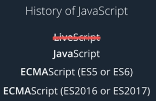

<h1>Intro to JavaScript</h1>


<h2>What is JavaScript</h2>

JavaScript is a programming language created for the web. If you have used HTML and CSS to make webpages, JavaScript is the final component you need to make your websites come to life. But today, JavaScript is used in all sorts of applications, from programming a robot with Arduino to writing a game script in Unity.

HTML and CSS are **markup languages**. Markup languages are used to describe and define elements within a document. JavaScript is a **programming language**. Programming languages are used to communicate instructions to a machine. Programming languages can be used to control the behavior of a machine and to express algorithms.

JavaScript is created in just 10 days by Brendan Eich back in 1995. Prior to Eich's creation of JavaScript, websites just existed as pages of HTML and CSS with the occasional plug in or Java applet. JavaScript was originally called LiveScript and the name was then changed to JavaScript to piggy back from the popularity of Java. A lot of different versions of JavaScript existed so eventually it was taken to ECMA International so that an official standard for the language could be formed.Today, the language itself is still referred to as JavaScript. But recent versions are referenced by their ECMAScript version number like ES5 or ES6. Even more recently, the standards body has transitioned to a year based number like ES2016 or ES2017.



<h3>Developer tools on different browsers</h3>

Every modern browser includes its own set of developer tools to access the JavaScript console. If you know how to find the developer tools in your browser, you can skip to the next topic, console log, if you don't please follow along.

<h4>Google Chrome</h4>

The Chrome DevTools are a set of web authoring and debugging tools built into Google Chrome. Use the DevTools to iterate, debug and profile your site. [Learn more about Chrome DevTools here](https://developers.google.com/web/tools/chrome-devtools/).

To open Chrome DevTools, either right-click on any page element and select `Inspect` or open the Chrome settings menu in the top-right corner of your browser window and select `More Tools > Developer Tools`. Alternatively, you can use the shortcuts:

- `Command + Option + i` (Mac)
- `Ctrl + Shift + i` (Windows/Linux).

<h4>Mozilla Firefox</h4>

Firefox Developer Tools allow you to examine, edit, and debug HTML, CSS, and JavaScript on the desktop and on mobile. Also, you can download a version of of Firefox called Firefox Developer Edition that is tailored for developers, featuring the latest Firefox features and experimental developer tools. [Learn more about Mozilla Firefox DevTools here](https://developer.mozilla.org/en-US/docs/Tools).

To open Firefox Developer Tools, either right-click on any page element and select `Inspect Element` or open the Firefox settings menu in the top-right corner of your browser window and select `Developer`. Alternatively, you can use the shortcuts:

- `Command + Option + i` (Mac)
- `Ctrl + Shift + i` (Windows/Linux).

<h4>Internet Explorer</h4>

If you use Internet Explorer, then you can access F12 developer tools by simply pressing `F12`. The features vary between versions, but starting at Internet Explorer 8 remain pretty consistent. Below, we've linked to documentation for each version, but if you've upgraded to Microsoft Edge, then check the next section.

- [Internet Explorer 9](https://docs.microsoft.com/en-us/previous-versions//dd565628(v=vs.85))
- [Internet Explorer 8](https://docs.microsoft.com/en-us/previous-versions/windows/internet-explorer/ie-developer/samples/gg589512(v=vs.85))
- [Internet Explorer 10](https://docs.microsoft.com/en-us/previous-versions/windows/internet-explorer/ie-developer/dev-guides/hh673549(v=vs.85))
- [Internet Explorer 11](https://docs.microsoft.com/en-us/previous-versions/windows/internet-explorer/ie-developer/dev-guides/bg182636(v=vs.85))

<h4>Microsoft Edge</h4>

Microsoft Edge introduces great new improvements to the F12 developer tools seen in Internet Explorer. The new tools are built in TypeScript, and are always running, so no reloads are required. In addition, F12 developer tools documentation is now fully available on [GitHub](https://github.com/MicrosoftDocs/edge-developer).

Just like Internet Explorer, to open developer tools in Microsoft Edge simply press `F12`.

[Learn more about Microsoft Edge DevTools here](https://docs.microsoft.com/en-us/microsoft-edge/devtools-guide).

<h4>Safari</h4>

For any Mac users, Safari includes Web Inspector, a powerful tool that makes it easy to modify, debug, and optimize a website for peak performance and compatibility on both platforms. [Learn more about Safari Web Inspector here](https://developer.apple.com/safari/tools/).

To access Safari's Web Development Tools, enable the Develop menu in Safari’s Advanced preferences. Once enabled, you can right-click on any page element and select `Inspect Element` to open Web Development Tools or use the shortcut `Command + Option + i`.

<h4>Opera</h4>

Fast, lean and powerful, Opera comes pre-packed with a fully-featured suite of developer tools. Named Opera Dragonfly, it is designed to make your job easier. [Learn more about Opera Dragonfly here](https://www.opera.com/).

Launch Opera Dragonfly with the following keyboard shortcuts:
- `Command + Option + i` (Mac)
- `Ctrl + Shift + i` (Windows/Linux).

Alternatively, you can target a specific element by right-clicking in the page and selecting `Inspect Element`.

<h4>Console Log</h4>

If you are familiar with HTML or CSS you may have used developer tools to experiment with the style of a webpage. But you can also use it with JavaScript. Developer tools are often used as a sandbox. In other words, a place to mess around with any code without any long term consequences. You can use developer tools to debug problem you run into or to test a piece of code you've just learned. If you open any website that uses JavaScript the console will tell you if there are any warnings or errors on the page and will also display any output printed with `console.log`.

console.log is used to display content to the **JavaScript console**. Run the following code in the console:

```javascript
console.log("hi friend!")
```
>_**Prints:** "hi friend!"_

Try the following in the console and see what gets printed:

```javascript
for (let i = 0; i < 5; i++) {
	console.log(i);
}
```

This is called a **loop**.

Based on this loop's settings, any code written inside the curly brackets `{...}` will be repeated 5 times. In this case, `console.log` is printing out the value of `i` each time the loop runs.

<h4>JavaScript Demo</h4>

You saw how to use `console.log` to print a message to the JavaScript console. Now let's see how you can use the console as a sandbox to test a new line of JavaScript in the browser.

Open [the following site](https://daringfireball.net/projects/markdown/) in a new tab and in the tab also open up the developer tools. Then paste the following code and see what happens:

```javascript
document.getElementsByTagName("h1")[0].style.color = "#ff0000";
```

The heading (_Markdown_) color should change to red.

Styling elements on the page is great, but you could also do that by just modifying the CSS. What makes JavaScript so special in this case? Refresh the page, then paste this line of code in the JavaScript console.

```javascript
document.body.addEventListener('click', function() {
	let myParent = document.getElementById("Banner");
	let myImage = document.createElement("img");
	myImage.src = 'https://thecatapi.com/api/images/get?format=src&type=gif';
	myParent.appendChild(myImage);
	myImage.style.marginLeft = "160px";
});
```
If you’re confused because nothing happened. Don’t worry. Click somewhere on the page and an image would be added to the page.

Don't worry if you don't understand how the code actually works, this is just a sneak peak on what you can do with JavaScript, and in the later sections, we will learn how to create such code.
