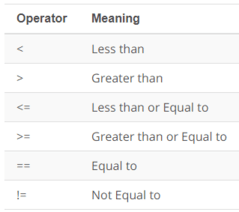
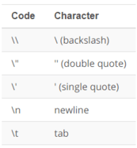

<h1>Intro to JavaScript</h1>


<h2>Data Types & Variables</h2>

__Data__ is everywhere, it helps us understand the world, recognize trends, make educated guesses and inform our future decisions. This is no different in programming. Data and data types are the building blocks of any programming language because they help us organize information and determine how our programs will run. In this section we will start by learning how to define and manipulate the primitive data types of JavaScript: numbers, strings, booleans, undefined and null. Once you are familiar with the data types, you'll see how you can store data into variables so you can reuse and manipulate data throughout your code.

<h3>Numbers</h3>

The __Number__ data type includes any positive or negative integer, as well as decimals. You can also perform calculations with numbers pretty easily. Basically type out an expression the way you would type it in a calculator.

```javascript
3 + 2.1
```
> _**Returns:** 5.1_

Try the following in the JavaScript console and see what you get:

- 2 + 10 - 19 + 4 - 90 + 1
- -20 + -19 - (-10) - (-1) + 24
- (10/5) * 4 - 20
- 4096 % 12
> _**Answers:** -92, -4, -12, 4_

Just like in mathematics, you can compare two numbers to see if one’s greater than, less than, or equal to the other.

```javascript
5 > 10
```
> _**Returns:** false_

Comparisons between numbers will either evaluate to true or false.

Here are some more examples, so you can try it out!



The values `true` and `false` have significant importance in JavaScript. These values are called _**Booleans**_ and are another data type in JavaScript. Later in this lesson, you’ll learn more about why Booleans are so important in programming.

__Rounding:__

One of the most used operations when working with numbers is rounding. There are several built-in functions for rounding:

- `Math.floor`: _Rounds down_: 3.1 becomes 3, and -1.1 becomes -2.
- `Math.ceil`: _Rounds up_: 3.1 becomes 4, and -1.1 becomes -1.
- `Math.round`: _Rounds to the nearest integer_: 3.1 becomes 3, 3.6 becomes 4 and -1.1 becomes -1.
- `Math.trunc` __(not supported by Internet Explorer)__: _Removes anything after the decimal point without rounding_: 3.1 becomes 3, -1.1 becomes -1.

These functions cover all of the possible ways to deal with the decimal part of a number. But what if we’d like to round the number to n-th digit after the decimal?

- `toFixed(n)`: rounds the number to _n_ digits after the point and returns a _string_ representation of the result.

```javascript
let num = 12.34;
console.log(num.toFixed(1));
```
> _**Prints:** "12.3"_

Please note that result of `toFixed` is a string. We can convert it to a number using the unary plus or a `Number()` call: +num.toFixed(1).

__parseInt and parseFloat:__

Numeric conversion using a plus `+` or `Number()` is strict. If a value is not exactly a number, it fails:

```javascript
alert( +"100px" ); // NaN
```

In real life we often have values in units, like "100px" or "12pt" in CSS. Also in many countries the currency symbol goes after the amount, so we have "19€" and would like to extract a numeric value out of that.

That's what `parseInt` and `parseFloat` are for. They “read” a number from a string until they can't. In case of an error, the gathered number is returned. The function `parseInt` returns an integer, whilst `parseFloat` will return a floating-point number:

```javascript
console.log(parseInt('100px')); // 100
console.log(parseFloat('12.5em')); // 12.5

console.log(parseInt('12.3')); // 12, only the integer part is returned
console.log(parseFloat('12.3.4')); // 12.3, the second point stops the reading
```

There are situations when parseInt/parseFloat will return NaN. It happens when no digits could be read:

```javascript
console.log(parseInt('a123')); // NaN, the first symbol stops the process
```

<h3>Comments</h3>

A programming language is used for a computer to understand. But as your code gets more and more complex, it can get harder and harder for you and other humans to read your code and to understand what it does. Comments are often used by developers to help clarify the meaning of your code. In JavaScript, a comment is any text after a double forward slash. Anything written on the same line after the `//` will not be executed or displayed. If you want to write multi line comments you can  enclose your comment inside a star and forward-slash `/* … */`.

```javascript
// this is a single-line comment

/*
This is a
multi line
comment
*/
```

<h3>Quiz: First Expression</h3>

Write an expression that uses at least 3 different arithmetic operators. The expression should equal `42`.

**Hint**: `+, -, *, /`, and `%` are possible arithmetic operators

```javascript
// this expression equals 4, change it to equal 42
console.log(1 + 5 - 2);
```

<h3>Strings</h3>

When you type a message inside `console.log`, that message is actually just a JavaScript __string__. Strings can contain individual letters like `"h"` or even numbers `"123"`. It is correct to either use double `" "` or single `' '` quotes with strings, as long as you're consistent. If you forgot the quotes, the console will log a _ReferenceError_ meaning, it will thing of the word inside console.log, for example `console.log(hello)` as a variable. We will look into variables in the upcoming sections.

For a complete style guide, take a look at [Google JavaScript Style Guide](https://google.github.io/styleguide/jsguide.html).

In JavaScript, adding two strings together is called **concatenating**. Concatenating two strings together is actually pretty simple.

```javascript
"Hello," + " San Francisco"
```
> _**Returns:** "Hello, San Francisco"_

try concatenating this string `"hello" + "world"` and see what you get. The console should return `"helloworld"`. This is because if you want to have a space in between two words, you need to explicitly add a space! It will not be added automatically for you.

What happens if you type `"Hello + 5*10"` into the JavaScript console?
What happens if you type `"Hello" + 5*10` into the JavaScript console?

> _**Answers:** "Hello + 5*10" and "Hello50"

<h3>String Index</h3>

To access an individual character in a string, you can use the the character's location in the string, called its **index**. Just put the index of the character inside square brackets (starting with `[0]` as the first character) immediately after the string. For example:

```javascript
"James"[0]
```
> _**Returns:** "J"_

_Note that in programming, we start counting from zero._

What character will be printed to the JavaScript console after running the following code?

```javascript
let quote = "Stay awhile and listen!";
console.log(quote[6]);
```
> _**Answer:** w_

_Alternatively, you can use the String’s `charAt()` method to access individual characters. For example, `quote.charAt(6)` would also return `"w"`.

<h3>Escaping Strings</h3>

There are some cases where you might want to create a string that contains more than just numbers and letters. For example, what if you want to use quotes in a string?

```javascript
"The man whispered, "please speak to me.""
```
> _**Uncaught SyntaxError:** Unexpected identifier_

This happens because JavaScript looks only for a beginning and end quotes to denote the end of strings so if you want to use quotes inside a string, you can do so by using the backslash character (`\`).

```javascript
"The man whispered, \"please speak to me.\""
```
> _**Returns:** "The man whispered, "please speak to me.""_

__Special characters__

Quotes aren't the only special characters that need to be escaped, there’s actually [quite a few](https://developer.mozilla.org/en-US/docs/Web/JavaScript/Guide/Grammar_and_types#Using_special_characters_in_strings). However, to keep it simple, here’s a list of some common special characters in JavaScript.



Write the string that returns the following output:

> "The file located at "C:\\Desktop\My Documents\Roster\names.txt" contains the names on the roster."

> _**Answer:** "The file located at \"C:\\\\Desktop\\My Documents\\Roster\\names.txt\" contains the names on the roster."

<h3>Comparing Strings</h3>

Another way to work with strings is by comparing them. You've seen the comparison operators `==` and `!=` when you compared numbers for equality. You can also use them with strings

```javascript
"Yes" == "yes"
```
> _**Returns:** false_

For humans "Yes" and "yes" are equal but for a computer, it is not, this is because of the case of the string. While both string use the same letters (and those letters appear in the same order), the first letter in the first string is a capital `Y` while the first letter in the second string is a lowercase `y`.

Try the following in the JavaScript console and see what you get:

- "green" == "blue"
- "green" == "green"
- "green" == "Green"
- "Green" == "green"
- "green" > "blue"
- "green" > "green"
- "green" > "Green"
- "Green" > "green"
> _**Answer:** false, true, false, false, true, false, true, false.

Did you got surprised after seeing `"green">"blue"` as `true`. This happens because JavaScript compares individual characters using a numerical value. Each character is assigned a numerical value that essentially corresponds to the character's location in an ASCII table: http://www.ascii-code.com/

<h3>Template Literals</h3>

__Template literals__ are essentially string literals that include embedded expressions.

Denoted with backticks (` `) instead of single quotes (`''`) or double quotes (`""`), template literals can contain placeholders which are represented using `${expression}`. This makes it much easier to build strings.

Here's an examples using template literals.

```javascript
const student = {
    name: 'Dean Winchester',
    guardian: 'Castiel'
};

const teacher = {
  name: 'Mukesh',
  room: 'N231'
}

let message = `${student.name} please see ${teacher.name} in ${teacher.room} to pick up your report card.`;
console.log(message);
```
> _**Prints:** Dean Winchester please see Mukesh in N231 to pick up your report card._

But what about the multi-line example from before?

```javascript
var note = `${teacher.name},

Please excuse ${student.name}.
He is recovering form the flu.

Thank you,
${student.guardian}`;
console.log(note);
```
> _**Prints:**_
>
> _Mukesh,_
>
> _Please excuse Dean Winchester._
> _He is recovering form the flu._
>
> _Thank you,_
>
> _Castiel_

<h3>Quiz: Build an HTML Fragment</h3>

Modify the `createAnimalTradingCardHTML()` function to use a template literal for `cardHTML`.


```javascript
/*
 * Programming Quiz: Build an HTML Fragment
 */

const cheetah = {
    name: 'Cheetah',
    scientificName: 'Acinonyx jubatus',
    lifespan: '10-12 years',
    speed: '68-75 mph',
    diet: 'carnivore',
    summary: 'Fastest mammal on land, the cheetah can reach speeds of 60 or perhaps even 70 miles (97 or 113 kilometers) an hour over short distances. It usually chases its prey at only about half that speed, however. After a chase, a cheetah needs half an hour to catch its breath before it can eat.',
    fact: 'Cheetahs have “tear marks” that run from the inside corners of their eyes down to the outside edges of their mouth.'
};

// creates an animal trading card
function createAnimalTradingCardHTML(animal) {
    const cardHTML = '<div class="card">' +
        '<h3 class="name">' + animal.name + '</h3>' +
        '' +
        '<div class="description">' +
            '<p class="fact">' + animal.fact + '</p>' +
            '<ul class="details">' +
                '<li><span class="bold">Scientific Name</span>: ' + animal.scientificName + '</li>' +
                '<li><span class="bold">Average Lifespan</span>: ' + animal.lifespan + '</li>' +
                '<li><span class="bold">Average Speed</span>: ' + animal.speed + '</li>' +
                '<li><span class="bold">Diet</span>: ' + animal.diet + '</li>' +
            '</ul>' +
            '<p class="brief">' + animal.summary + '</p>' +
        '</div>' +
    '</div>';

    return cardHTML;
}

console.log(createAnimalTradingCardHTML(cheetah));
```

<h3>Variables</h3>

With __variables__, you no longer need to work with one-time-use data. In the previous section we declared the value of a string, but we didn't have any way to access it or reuse the string later. Storing the value of a string in a variable is like packing it away for later use. We can easily grasp the concept of a variable if we imagine it as a box for data, with a _uniquely named_ sticker on it. We can put any value in the box. We can also change it as many times as we want.

To create a variable in JavaScript, we can use the `let` keyword.

```javascript
let greeting = "Hello";
```
Now, if you want to use "Hello" in a variety of sentences, you don't need to duplicate "Hello" strings. You can just reuse the `greeting` variable.

```javascript
greeting + " World!";
```
> _**Returns:** "Hello World!"_


```javascript
greeting + " Mukesh!";
```
> _**Returns:** "Hello Mukesh!"_

You can also change the start of the greeting by reassigning a new string value to the variable `greeting`.

```javascript
greeting = "Hola";
greeting + " Mukesh!";
```
> _**Returns:** "Hola Mukesh!"_

We can also declare multiple variables in one line:

```javascript
let user = 'Mukesh', age = 25, message = 'Hello';
```

In older scripts, you may also find another keyword: `var` instead of `let`. The `var` keyword is almost the same as `let`. It also declares a variable, but in a slightly different, 'old-school' way. There are subtle differences between `let` and `var`, let's look into it before moving further.

__The "var":__

From the first sight, `var` behaves similar to `let`. That is, declares a variable. But here are the differences.

1. _"var" has no block scope_: Variables, declared with `var`, are either function-wide or global. They are visible through blocks. And we will look more into scopes when we cover functions in the coming days. For instance:

```javascript
if (true) {
	var test = true; // use "var" instead of "let"
}
alert(test); // true, the variable lives after if
```

As `var` ignores code blocks, we’ve got a global variable test. If we used `let` test instead of `var` test, then the variable would only be visible inside if:

```javascript
if (true) {
	let test = true; // use "let"
}
alert(test); // Error: test is not defined
```

The same thing for loops: `var` cannot be block- or loop-local. If a code block is inside a function, then `var` becomes a function-level variable.

2. _"var" declarations are processed at the function start_: `var` declarations are processed when the function starts (or script starts for globals). In other words, `var` variables are defined from the beginning of the function, no matter where the definition is (assuming that the definition is not in the nested function). Take a look at the following code.

```javascript
function getClothing(isCold) {
    if (isCold) {
        var freezing = 'Grab a jacket!';
    } else {
        var hot = 'It’s a shorts kind of day.';
        console.log(freezing);
    }
}
```
> _**Answer:** undefined_

Weird right?

__Hoisting__

Hoisting is a result of how JavaScript is interpreted by your browser. Essentially, before any JavaScript code is executed, all variables are "hoisted", which means they're raised to the top of the function scope.

These differences make `var` worse than `let` most of the time. Block-level variables is such a great thing. That’s why `let` was introduced in the standard. Note, most of the time because there are circumstances where `let` might not work, for example, a limitation of `let` not shared with `var` is that when declared in a `try` block `let` variables are not available (defined) in the corresponding `catch` or `finally`. While that is as it must be for logical consistency, it means that `var` has an indispensable and critical functionality not offered by `let`.

__Naming conventions:__ When you create a variable, you write the name of the variable using camelCase (the first word is lowercase, and all following words are uppercase). Also try to use a variable name that accurately, but succinctly describes what the data is about.

```javascript
let totalAfterTax = 53.03; // uses camelCase if the variable name is multiple words
let tip = 8; // uses lowercase if the variable name is one word
```
Not using camelCase for your variables names is not going to necessarily break anything in JavaScript. But there are recommended style guides used in all programming languages that help keep code consistent, clean, and easy-to-read.

<h3>Quiz: Converting Temperatures</h3>

To convert Celsius to Fahrenheit, you can use the following formula:

$$F = C \times 1.8 + 32$$

__Directions:__ Use this equation and the variables `fahrenheit` and `celsius` to print the Fahrenheit equivalent of 12°C.

```javascript
let celsius = 12;
let fahrenheit =  /* convert celsius to fahrenheit here */
console.log(/* print out result here */)
```

<h3>Constants</h3>

To declare a __constant__ (unchanging) variable, use `const` instead of `let`:

```javascript
const myBirthday = '07.19.1993';
```

Variables declared using const are called “constants”. They cannot be changed. An attempt to do so would cause an error:

```javascript
const myBirthday = '07.19.1993';

myBirthday = '01.01.2001'; // error, can't reassign the constant!
```

When a programmer is sure that a variable will never change, they can declare it with `const` to guarantee and clearly communicate that fact to everyone. There is a widespread practice to use constants as aliases for difficult-to-remember values that are known prior to execution. Such constants are named using capital letters and underscores.

```javascript
const COLOR_RED = "#F00";
const COLOR_ORANGE = "#FF7F00";

// ...when we need to pick a color
let color = COLOR_ORANGE;
alert(color); // #FF7F00
```

__Use cases__

The big question is when should you use `let` and `const`? The general rule of thumb is as follows:

- use `let` when you plan to reassign new values to a variable, and
- use `const` when you don’t plan on reassigning new values to a variable.

Since `const` is the strictest way to declare a variable, we suggest that you always declare variables with `const` because it'll make your code easier to reason about since you know the identifiers won't change throughout the lifetime of your program. If you find that you need to update a variable or change it, then go back and switch it from `const` to `let`.

<h3>Booleans</h3>

When you compare data, the result of the comparison will always be a value of true or false. This is important because our third primitive data type, Booleans, only includes these two values. For example,

```javascript
let nameFieldChecked = true; // yes, name field is checked
let ageFieldChecked = false; // no, age field is not checked
```

<h3>Null, Undefined, and NaN</h3>

`NaN` stands for "Not-A-Number" and it's often returned indicating an error with number operations. For instance, if you wrote some code that performed a math calculation, and the calculation failed to produce a valid number, `NaN` might be returned.

```javascript
// calculating the square root of a negative number will return NaN
Math.sqrt(-10)

// trying to divide a string by 5 will return NaN
"hello"/5
```
> _**Returns:** Nan_

`Undefined` is a datatype that indicates the absence of value.

Try the following in the console:

```javascript
let signedIn;
console.log(signedIn);
```
> _**Returns:** undefined_

The variable `signedIn` was never assigned a value, so it will print out `undefined`.

`Null` is a datatype that has no value, a value of nothing. It's worth noting that `signedIn` could explicitly be assigned the value of `null`.

```javascript
let signedIn = null;
console.log(signedIn);
```
> _**Returns:** null_
