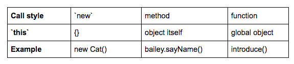

<h1>Object Oriented JavaScript: Classes</h1>


<h2>Functions at Runtime</h2>

<h3>First-Class Functions</h3>

In JavaScript, functions are _first-class_ functions. This means that you can do with a _function_ just about anything that you can do with other elements, such as numbers, strings, objects, arrays, etc. JavaScript functions can:
1. Be stored in variables
2. Be returned from a function.
3. Be passed as arguments into another function.

Note that while we can, say, treat a function as an object, a key difference between a function and an object is that functions can be called (i.e., invoked with `()`), while regular objects _cannot_.

__Functions Can Return Functions:__

Recall that a function must always return a value. Whether the value is explicitly specified in a `return` statement (e.g., returning a string, boolean, array, etc.), or the function implicitly returns `undefined` (e.g., a function that simply logs something to the console), a function will always return just one value.

Since we know that functions are first-class functions, we can treat a _function_ as a value and just as easily return a _function_ from another function! A function that returns another function is known as __higher-order function__. Consider this example:

```javascript
function alertThenReturn() {
    alert('Message 1!');

    return function () {
        alert('Message 2!');
    };
}
```

If `alertThenReturn()` is invoked in a browser, we'll first see an alert message that says `'Message 1!'`, followed by the `alertThenReturn()` function returning an anonymous function. However, we don't actually see an alert that says `'Message 2!'`, since none of the code from the inner function is executed. How do we go about executing the returned function?

Since `alertThenReturn()` returns that inner function, we can assign a variable to that return value:

```javascript
const innerFunction = alertThenReturn();
```

We can then use the innerFunction variable like any other function!

```javascript
innerFunction(); // alerts 'Message 2!'
```

Likewise, this function can be invoked immediately without being stored in a variable. We'll still get the same outcome if we simply add another set of parentheses to the expression `alertThenReturn();`:

```javascript
alertThenReturn()(); // alerts 'Message 1!' then alerts 'Message 2!'
```

<h3>Quiz: First-Class Functions</h3>

```javascript
/*

Declare a function named `higherOrderFunction` that takes no arguments,
and returns an anonymous function.

The returned function itself takes no arguments as well, and simply
returns the number 8.

*/

// Your code goes here
```

<h3>Callbacks</h3>

A function that is passed as an argument into another function is called a __callback__ function. Callback functions are great because they can delegate calling functions to other functions. They allow you to build your applications with _composition_, leading to cleaner and more efficient code.

Consider the following two functions. What is outputted to the console?

```javascript
function each(array, callback) {
    for (let i = 0; i < array.length; i++) {
    if (callback(array[i])) {
        console.log(array[i]);
        }
    };
};

function isPositive(n) {
    return n > 0;
};

each([-2, 7, 11, -4, -10], isPositive);
```
> _**Answer:** 7, 11_

<h3>Scope</h3>

In our previous sections we looked into __block scope__ and __function scope__. These determine where a variable can be seen in some code. Computer scientists call this __lexical scope__. There also exists another kind of scope called __runtime scope__. When a function is run, it creates a new runtime scope. This scope represents the _context_ of the function, or more specifically, the set of variables available for the function to use.

A function's runtime scope describes the variables available for use inside a given function. The code inside a function has access to:

1. The function's arguments.
2. Local variables declared within the function.
3. Variables from its parent function's scope.
4. Global variables.

You may be wondering why scope is so heavily associated with _functions_ in JavaScript. Especially if you've had past experience in another programming language, this might seem a bit unusual (e.g., _blocks_ in Ruby have their own scope)!

This is all because variables in JavaScript are traditionally defined in the scope of a _function_, rather than in the scope of a _block_. Since entering a function will change scope, any variables defined inside that function are not available outside of that function. On the other hand, if there are any variables defined inside a _block_ (e.g., within an `if` statement), those variables are available outside of that block.

Whenever your code attempts to access a variable during a function call, the JavaScript interpreter will always start off by looking within its own local variables. If the variable isn't found, the search will continue looking up what is called the __scope chain__.

__Variable Shadowing:__

What happens when you create a variable with the same name as another variable somewhere in the scope chain?

JavaScript won't throw an error or otherwise prevent you from creating that extra variable. In fact, the variable with local scope will just temporarily "shadow" the variable in the outer scope. This is called __variable shadowing__.

<h3>Closures</h3>

Identifier lookup and the scope chain are really powerful tools for a function to access identifiers in the code. In fact, this lets you do something really interesting: create a function now, package it up with some variables, and save it to run later. If you have five buttons on the screen, you could write five different click handler functions, or you could use the same code five times with different saved values.

Let's check out an example of a function retaining access to its scope. Consider the `remember()` function below:

```javascript
function remember(number) {
    return function() {
        return number;
    }
}

const returnedFunction = remember(5);
console.log( returnedFunction() );
```
> _**Prints:** 5_


When the JavaScript engine enters `remember()`, it creates a new execution scope that points back to the prior execution scope. This new scope includes a reference to the `number` parameter (an immutable `Number` with the value `5`). When the engine reaches the inner function (a function expression), it attaches a link to the current execution scope.

This process of a function retaining access to its scope is called a __closure__. In this example, the inner function "closes over" `number`. A closure can capture any number of parameters and variables that it needs.

When a function is declared, it locks onto the scope chain. You might think this is pretty straightforward since we just looked at that in the previous section. What's really interesting about a function, though, is that it will retain this scope chain even if it is invoked in a location other than where it was declared. This is all due to the closure!

Every time a function is defined, closure is created for that function. Strictly speaking, then, every function has closure! This is because functions close over at least one other context along the scope chain: the global scope. However, the capabilities of closures really shine when working with a nested function (i.e., a function defined within another function).

Recall that a nested function has access to variables outside of it. From what we have learned about the scope chain, this includes the variables from the outer, enclosing function itself (i.e., the parent function)! These nested functions close over (i.e., capture) variables that aren't passed in as arguments nor defined locally, otherwise known as __free variables__.

<h3>Quiz: Closures</h3>

```javascript
/*
Quiz: Closures

Declare a function named `expandArray()` that:

- Takes no arguments
- Contains a single local variable, `myArray`, which points to [1, 1, 1]
- Returns an anonymous function that directly modifies `myArray` by appending another `1` into it
- The returned function then returns the value of `myArray`

*/

// Your code goes here
```

<h3>Immediately-Invoked Function Expressions (IIFE)</h3>

A function _declaration_ defines a function and does not require a variable to be assigned to it. It simply declares a function, and doesn't itself return a value. Here's an example:

```javascript
function returnHello() {
    return 'Hello!';
}
```

On the other hand, a function _expression_ does return a value. Function expressions can be anonymous or named, and are part of another expression's syntax. They're commonly assigned to variables, as well. Here's the same function as a function expression:

```javascript
// anonymous
const myFunction = function () {
  return 'Hello!';
};

// named
const myFunction = function returnHello() {
  return 'Hello!';
};
```

__Immediately-Invoked Function Expressions: Structure and Syntax__

An immediately-invoked function expression, or IIFE (pronounced iffy), is a function that is called immediately after it is defined. Check out the following example:

```javascript
(function sayHi(){
    alert('Hi there!');
    }
)();

// alerts 'Hi there!'
```

The syntax might seem a bit odd, but all we're doing is wrapping a function in parentheses, then adding a pair of parentheses at the end of that to invoke it!

__Passing Arguments into IIFE's:__

Let's look into how we can go about passing arguments into IIFE's. Consider the following example of an anonymous function expression that takes in a single argument:

```javascript
(function (name){
    alert(`Hi, ${name}`);
  }
)('Andrew');

// alerts 'Hi, Andrew'
```

The second pair of parentheses not only immediately executes the function preceding it -- it's also the place to put any arguments that the function may need!

__IIFE's and Private Scope:__

One of the primary uses for IIFE's is to create private scope (i.e., private state). Recall that variables in JavaScript are traditionally scoped to a function. Knowing this, we can leverage the behavior of closures to protect variables or methods from being accessed. Consider the following example of a simple closure within an IIFE, referenced by `myFunction`:

```javascript
const myFunction = (
  function () {
    const hi = 'Hi!';
    return function () {
        console.log(hi);
    }
  }
)();
```

Note that the function that is being returned closes over (i.e., _captures_) the `hi` variable. This allows `myFunction` to maintain a private, mutable state that cannot be accessed outside the function! What's more: because the function expressed is called immediately, the IIFE wraps up the code nicely so that we don't pollute the global scope.

__Alternative Syntax for IIFE's:__

There's also another way we can write this to achieve the same results! The first set of parentheses can wrap around the entire expression. That is, we can move the first closing parenthesis to the very end:

```javascript
(function sayHi(){
    alert('Hi there!');
}());

// alerts 'Hi there!'
```

__Benefits of Immediately-Invoked Function Expressions:__

We've seen how using an immediately-invoked function expression creates a private scope that protects variables or methods from being accessed. IIFE's ultimately use the returned functions to access private data within the closure. This works out very well: while these returned functions are publicly-accessible, they still maintain privacy for the variables defined within them!

Another great opportunity to use an IFFE is when you want to execute some code without creating extra global variables. However, note that an IIFE is only intended to be invoked once, to create a unique execution context. If you have some code that is expected to be re-used (e.g., a function meant to be executed more than once in the application), declaring the function and then invoking it might be a better option.

All in all, if you simply have a one-time task (e.g., initializing an application), an IIFE is a great way to get something done without polluting your the global environment with extra variables. Cleaning up the global namespace decreases the chance of collisions with duplicate variable names, after all.


<h2>Classes and Objects</h2>

We've been using __properties__ and __methods__ all up to this point, and in the next section you'll bring your knowledge of object-oriented programming to another level of sophistication by creating __classes__ (i.e., _categories_) of objects!

Since an object can represent _data_ and _functionality_, we can use an object to express real-life things (i.e., someone or something) in code.

If you've had experience with object-oriented programming in other languages (e.g., Ruby, Python, etc.), you may be surprised to learn that JavaScript does not have a traditional class system (namely, one where the compiler does a lot of organizing out of sight). Instead, the class system is built directly using functions and objects. So rather than using a special class syntax, in JavaScript we define __constructor functions__.

<h3>Constructor Functions</h3>

Previously, we have created objects using the object literal notation. Likewise, we can even write functions that return objects. There is yet another way for us to create objects, and it is the foundation of object-oriented JavaScript: the __constructor function__.

To instantiate (i.e., create) a new object, we use the new operator to invoke the function:

```javascript
new SoftwareDeveloper();
```

__Constructor Functions: Structure and Syntax__

This is what the internals of a constructor function looks like:

```javascript
function SoftwareDeveloper () {
    this.favoriteLanguage = 'JavaScript';
}
```

First, rather than declaring local variables, constructor functions persist data with the `this` keyword. The above function will add a `favoriteLanguage` property to any object that it creates, and assigns it a default value of `'JavaScript'`. `this` refers to the new object that was created by using the `new` keyword in front of the constructor function.

One last thing that might seem unusual is that this function doesn't seem to return anything! Constructor functions in JavaScript _should not_ have an explicit return value (i.e., there should _not_ be `return` statement).

__Creating Multiple Objects:__

We can even use the same constructor function to create as many objects as we'd like!

```javascript
let engineer = new SoftwareDeveloper();
let programmer = new SoftwareDeveloper();

console.log(engineer);
// SoftwareDeveloper { favoriteLanguage: 'JavaScript' }

console.log(programmer);
// SoftwareDeveloper { favoriteLanguage: 'JavaScript' }
```

__Constructor Functions Can Have Parameters:__

Just like regular functions, one benefit of using constructor functions is that they can also accept arguments.

```javascript
function SoftwareDeveloper(name) {
    this.favoriteLanguage = 'JavaScript';
    this.name = name;
}
```

In the updated `SoftwareDeveloper()` function, whatever value is passed into the function will be the value of the object's `name` property. Let's check it out:

```javascript
let instructor = new SoftwareDeveloper('Andrew');

console.log(instructor);
```
> _**Returns:** SoftwareDeveloper { favoriteLanguage: 'JavaScript', name: 'Andrew' }_

What if we want to see if an object was created with a constructor function in the first place? We can use the `instanceof` (which returns a boolean) to give us some insight.

<h3>The `this` Keyword</h3>

```javascript
function Cat(name) {
    this.name = name;
    this.sayName = function () {
        console.log(`Meow! My name is ${this.name}`);
    };
}

const bailey = new Cat('Bailey');
```

When invoking a constructor function with the `new` operator, `this` gets set to the newly-created object! Let's check out what the new `bailey` object looks like:

```javascript
{
    name: 'Bailey',
    sayName: function () {
        console.log(`Meow! My name is ${this.name}`);
    }
}
```

When you say `this` in a method, what you're really saying is "this object" or "the object at hand." As a result, the `sayName()` method can use `this` to access the `name` property of that object

__When is this Assigned?__

A common misconception is that `this` refers to the object _where it is defined_. This is not the case!

The value of `this` is actually not assigned to anything until an object calls the method where this is used. In other words, the value assigned to `this` is based on _the object that invokes the method where `this` is defined_.

Consider the following constructor function, `City`:

```javascript
function City(name, population) {
    this.name = name;
    this.population = population;

    this.identify = function () {
        console.log(`${this.name}'s population is ${this.population}.`);
    };
}
```

The following is executed:

```javascript
const sanFrancisco = new City('San Francisco', 870000);
```

What is the value of `this`?
> _**Answer:** The newly-created object, referenced by `sanFrancisco`_

__What Does `this` Get Set To?__

At this point, we've seen `this` in many different contexts, such as within a method, or referenced by a constructor function. Let's now organize our thoughts and bring it all together!

There are four ways to call functions, and each way sets `this` differently.

- First, calling a constructor function with the `new` keyword sets `this` to a newly-created object.

- On the other hand, calling a function that belongs to an object (i.e., a _method_) sets `this` to the object itself.

- Third, calling a function on its own (i.e., simply invoking a regular function) will set `this` to `window`, which is the global object if the host environment is the browser.

```javascript
function funFunction() {
    return this;
}

funFunction();
// (returns the global object, `window`)
```
> _**Returns:** Global object `Window`_

- The fourth way to call functions allows us to set this ourselves.



Functions, objects, and `this` are all interconnected. When invoking constructor functions with the `new` operator, a `this` variable is set to the newly-created object. When invoking a method on an object, `this` is set to that object itself. And when invoking a function in a browser environment, `this` is set to `window`, otherwise known as the global object.

Along with all this, there is yet one more set of ways to invoke functions: with `apply()`, and with `call()`. Both methods share quite a few similarities, and they each allow us to specify how we want to set `this`.

<h3>Setting Our Own `this`</h3>

__call()__

`call()` is a method directly invoked onto a function. We first pass into it a single value to set as the value of `this`; then we pass in any of the receiving function's arguments one-by-one, separated by commas.

Consider the following function, `multiply()`, which simply returns the product of its two arguments:

```javascript
function multiply(n1, n2) {
    return n1 * n2;
}

// Let's use the call() method to invoke the function
multiply.call(window, 3, 4);
```
> _**Returns:** 12_

We first invoke the `call()` method directly onto the `multiply()` function. Note that the `multiply` preceding `.call(window, 3, 4)` is not followed by any parentheses. `call()` will be handling the invocation and the `multiply()` function's arguments itself!

Along with invoking regular functions, how do we go upon invoking _functions attached to objects_ (i.e., methods)? This is where the power of `call()` really shines. Using `call()` to invoke a method allows us to "borrow" a method from one object then use it for another object!

Check out the following object, `mockingbird`:

```javascript
const mockingbird = {
    title: 'To Kill a Mockingbird',
    describe: function () {
        console.log(`${this.title} is a classic novel`);
    }
};

const pride = {
    title: 'Pride and Prejudice'
};

mockingbird.describe.call(pride);
```
> _**Returns:** "Pride and Prejudice is a classic novel"_

First, the `call()` method is invoked onto `mockingbird.describe` (which points to a function). Then, the value of `this` is passed into the `call()` method: `pride`.

Since `mockingbird`'s `describe()` method references `this.title`, we need to access the `title` property of the object that `this` refers to. But since we've set our own value of `this`, the value of `this.title` will be accessed from the `pride` object.

`call()` is very effective if you're looking to invoke a function in the scope of the first argument passed into it. Likewise, we can leverage the `apply()` method to do the same, albeit with differences in how arguments are passed into it.

__apply()__

Just like `call()`, the `apply()` method is called on a function to not only invoke that function, but also to associate with it a specific value of `this`. However, rather than passing arguments one-by-one, separated by commas -- `apply()` takes the function's arguments in an array.

```javascript
mockingbird.describe.apply(pride);
```

__Choosing One Method Over the Other:__

Both `call()` and `apply()` invoke a function in the scope of the first argument passed in them (i.e., the object to be the value of `this`). So when would you choose `call()` over `apply()`, or vice versa?

`call()` may be limited if you don't know ahead of time the number of arguments that the function needs. In this case, `apply()` would be a better option, since it simply takes an array of arguments, then unpacks them to pass along to the function. Keep in mind that the unpacking comes at a minor performance cost, but it shouldn't be much of an issue.

Consider the following `dave` object, and the `sayHello()` function. Let's say you want the message `'Hello, Dave. You're looking well today.'` printed to the console. How would you do it?

```javascript
const dave = {
    name: 'Dave'
};

function sayHello(message) {
    console.log(`${message}, ${this.name}. You're looking well today.`);
}
```
> _**Answer:** sayHello.apply(dave, ['Hello']); sayHello.call(dave, 'Hello');_

__Callbacks and `this`:__ The value of `this` has some potential scope issues when _callback functions_ are involved, and things can get a bit tricky.

__Saving this with `bind()`:__

Similar to `call()` and `apply()`, the `bind()` method allows us to directly define a value for this. `bind()` is a method that is also called on a function, but unlike `call()` or `apply()`, which both invoke the function right away `bind()` returns a new function that, when called, has `this` set to the value we give it.

<h3>Prototypal Inheritance</h3>

In JavaScript, __inheritance__ is when one object is based on another object. This is called _inheriting_ or _extending_.

Recall that objects contain data (i.e., properties), as well as the means to manipulate that data (i.e., methods). Earlier in this Lesson, we simply added methods directly into the constructor function itself:

```javascript
function Cat(name) {
    this.lives = 9;
    this.name = name;

    this.sayName = function () {
        console.log(`Meow! My name is ${this.name}`);
    };
}
```

This works just fine, but what if we want to instantiate more and more `Cat` objects with this constructor? You'll create a new function every single time for that `Cat` object's `sayName`.

To save memory and keep things DRY, we can add methods to the constructor function's `prototype` property. The prototype is just an object, and all objects created by a constructor function keep a reference to the prototype. Those objects can even use the `prototype`'s properties as their own!

JavaScript leverages this secret link between an object and its prototype to implement inheritance.

Recall that each function has a prototype property, which is really just an object. When this function is invoked as a constructor using the `new` operator, it creates and returns a new object. This object is secretly linked to its constructor's `prototype`, and this secret link allows the object to access the `prototype`'s properties and methods as if it were its own!

Since we know that the `prototype` property just points to a regular object, that object itself also has a secret link to its prototype. And that prototype object also has reference to its own prototype and so on. This is how the __prototype chain__ is formed.

For example,

```javascript
function Dog(age, weight, name) {
    this.age = age;
    this.weight = weight;
    this.name = name;
}

// we add the the bark method to Dog object using prototype
Dog.prototype.bark = function () {
    console.log(`${this.name} says woof!`);
};

dog1 = new Dog(2, 60, 'Java');
dog2 = new Dog(4, 55, 'Jodi');

dog1.bark();
// Java says woof!

dog2.bark();
// Jodi says woof!
```

__Checking an Object's Properties:__

- `hasOwnProperty()` allows you to find the origin of a particular property. Upon passing in a string of the property name you're looking for, the method will return a boolean indicating whether or not the property belongs to the object itself (i.e., that property was not inherited).

```javascript
function Phone() {
    this.operatingSystem = 'Android';
}

Phone.prototype.screenSize = 6;

const myPhone = new Phone();

// check whether operatingSystem is its own property, meaning that it was not inherited from its prototype
const own = myPhone.hasOwnProperty('operatingSystem');
console.log(own);
// true

// Check for screen size
const inherited = myPhone.hasOwnProperty('screenSize');
console.log(inherited);
// false
```

- Objects also have access to the `isPrototypeOf()` method, which checks whether or not an object exists in another object's prototype chain. Using this method, you can confirm if a particular object serves as the prototype of another object.

```javascript
const rodent = {
    favoriteFood: 'cheese',
    hasTail: true
};

function Mouse() {
    this.favoriteFood = 'cheese';
}

Mouse.prototype = rodent;

const ralph = new Mouse();
const result = rodent.isPrototypeOf(ralph);
console.log(result);
// true
```

- `isPrototypeOf()` works well, but keep in mind that in order to use it, you must have that prototype object at hand in the first place! What if you're not sure what a certain object's prototype is? `Object.getPrototypeOf()` can help with just that!

```javascript
const myPrototype = Object.getPrototypeOf(ralph);

console.log(myPrototype);
// { favoriteFood: 'cheese', hasTail: true }
```

- Each time an object is created, a special property is assigned to it under the hood: `constructor`. Accessing an object's `constructor` property returns a reference to the constructor function that created that object in the first place! Here's a simple `Longboard` constructor function. We'll also go ahead and make a new object, then save it to a `board` variable:

```javascript
function Longboard() {
    this.material = 'bamboo';
}

const board = new Longboard();
console.log(board.constructor);

// function Longboard() {
//   this.material = 'bamboo';
// }
```

<h3>Prototypal Inheritance: Subclasses</h3>

One of the benefits of implementing inheritance is that it allows you to reuse existing code. By establishing inheritance, we can __subclass__, that is, have a "child" object take on most or all of a "parent" object's properties while retaining unique properties of its own.

__Inheritance Via Prototypes:__

When calling any property on any object, the JavaScript engine will first look for the property in the object itself (i.e., the object's own, non-inherited properties). If the property is not found, JavaScript will then look at the object's prototype. If the property still isn't found in the object's prototype, JavaScript will continue the search up the __prototype chain__.

Again, inheritance in JavaScript is all about setting up this chain!

__Object.create():__

At this point, we've reached a few roadblocks when it comes to inheritance. First, even though `__proto__` can access the prototype of the object it is called on, using it in any code you write is not good practice.

What's more: we also shouldn't inherit only the prototype; this doesn't set up the prototype chain, and any changes that we made to a child object will also be reflected in a parent object.

So how should we move forward?

There's actually a way for us to set up the prototype of an object ourselves: using `Object.create()`. And best of all, this approach lets us manage inheritance without altering the prototype!

`Object.create()` takes in a single object as an argument, and returns a new object with its `__proto__` property set to what argument is passed into it. From that point, you simply set the returned object to be the prototype of the child object's constructor function.

`Object.create()` gives us a clean method of establishing prototypal inheritance in JavaScript. We can easily extend the prototype chain this way, and we can have objects inherit from just about any object we want!
