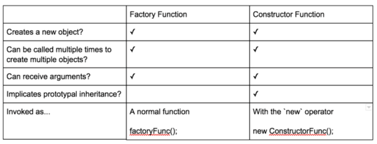

<h1>Object Oriented JavaScript: Classes</h1>


<h3>JavaScript Classes</h3>

Since ES6 classes are just a mirage and hide the fact that prototypal inheritance is actually going on under the hood, let's quickly look at how to create a "class" with ES5 code:

```javascript
function Plane(numEngines) {
    this.numEngines = numEngines;
    this.enginesActive = false;
}

// methods "inherited" by all instances
Plane.prototype.startEngines = function () {
    console.log('starting engines...');
    this.enginesActive = true;
};

var richardsPlane = new Plane(1);
richardsPlane.startEngines();

var jamesPlane = new Plane(4);
jamesPlane.startEngines();
```

In the code above, the `Plane` function is a _constructor function_ that will create new Plane objects. The data for a specific Plane object is passed to the `Plane` function and is set on the object. Methods that are "inherited" by each Plane object are placed on the `Plane.prototype` object. Then `richardsPlane` is created with one engine while `jamesPlane` is created with 4 engines. Both objects, however, use the same `startEngines` method to activate their respective engines.

Things to note:
- the constructor function is called with the new keyword
- the constructor function, by convention, starts with a capital letter
- the constructor function controls the setting of data on the objects that will be created
- "inherited" methods are placed on the constructor function's prototype object

Keep these in mind as we look at how classes work because, remember, ES6 classes set up all of this for you under the hood.

Here's what that same `Plane` class would look like if it were written using the new class syntax:

```javascript
class Plane {
    constructor(numEngines) {
        this.numEngines = numEngines;
        this.enginesActive = false;
    }

    startEngines() {
        console.log('starting engines…');
        this.enginesActive = true;
    }
}

var richardsPlane = new Plane(1);
richardsPlane.startEngines();

var jamesPlane = new Plane(4);
jamesPlane.startEngines();
```

__Static methods:__

To add a static method, the keyword `static` is placed in front of the method name. Look at the `badWeather()` method in the code below.

```javascript
class Plane {
    constructor(numEngines) {
        this.numEngines = numEngines;
        this.enginesActive = false;
    }

    static badWeather(planes) {
        for (plane of planes) {
            plane.enginesActive = false;
        }
    }

    startEngines() {
        console.log('starting engines…');
        this.enginesActive = true;
    }
}
```

See how `badWeather()` has the word `static` in front of it while `startEngines()` doesn't? That makes `badWeather()` a method that's accessed directly on the `Plane` class, so you can call it like this:

```javascript
Plane.badWeather([plane1, plane2, plane3]);
```

<h3>Super and Extends</h3>

Now that we've looked at creating classes in JavaScript. Let's use the new `super` and `extends` keywords to extend a class.

```javascript
class Tree {
    constructor(size = '10', leaves = {spring: 'green', summer: 'green', fall: 'orange', winter: null}) {
        this.size = size;
        this.leaves = leaves;
        this.leafColor = null;
    }

    changeSeason(season) {
    this.leafColor = this.leaves[season];
        if (season === 'spring') {
            this.size += 1;
        }
    }
}

class Maple extends Tree {
    constructor(syrupQty = 15, size, leaves) {
        super(size, leaves);
        this.syrupQty = syrupQty;
    }

    changeSeason(season) {
        super.changeSeason(season);
        if (season === 'spring') {
            this.syrupQty += 1;
        }
    }

  gatherSyrup() {
    this.syrupQty -= 3;
  }
}

const myMaple = new Maple(15, 5);
myMaple.changeSeason('fall');
myMaple.gatherSyrup();
myMaple.changeSeason('spring');
```

Both `Tree` and `Maple` are JavaScript classes. The `Maple` class is a "subclass" of `Tree` and uses the `extends` keyword to set itself as a "subclass". To get from the "subclass" to the parent class, the `super` keyword is used. Did you notice that `super` was used in two different ways? In `Maple`'s constructor method, `super` is used as a function. In `Maple`'s `changeSeason()` method, `super` is used as an object!

<h3>Working with JavaScript Subclasses</h3>

Like most of the new additions, there's a lot less setup code and it's a lot cleaner syntax to create a subclass using `class`, `super`, and `extends`. Just remember that, under the hood, the same connections are made between functions and prototypes.

In a subclass constructor function, before `this` can be used, a call to the super class must be made.

```javascript
class Apple {}
class GrannySmith extends Apple {
    constructor(tartnessLevel, energy) {
        this.tartnessLevel = tartnessLevel; // `this` before `super` will throw an error!
        super(energy);
    }
}
```

<h3>Quiz: Building Classes and Subclasses</h3>

__Directions:__ Create a `Bicycle` subclass that extends the `Vehicle` class. The `Bicycle` subclass should override `Vehicle`'s constructor function by changing the default values for `wheels` from `4` to `2` and `horn` from `'beep beep'` to `'honk honk'`.

```javascript
/*
Programming Quiz: Building Classes and Subclasses
*/

class Vehicle {
	constructor(color = 'blue', wheels = 4, horn = 'beep beep') {
		this.color = color;
		this.wheels = wheels;
		this.horn = horn;
	}

	honkHorn() {
		console.log(this.horn);
	}
}

// your code goes here

/* tests
const myVehicle = new Vehicle();
myVehicle.honkHorn(); // beep beep
const myBike = new Bicycle();
myBike.honkHorn(); // honk honk
*/
```


<h2>Object-Oriented Design Patterns</h2>

__Mixins / Extending Object Functionality with Mixins:__

Recall that an object's `.prototype` property points to just one object. This is because JavaScript only supports single inheritance. If there is an object A and an object B, object C can only be prototype-linked to either A or B.

A JavaScript object can be prototyped linked to just one object. Now the question is, can we inherit data and functionality from outside the prototype chain? In JavaScript we can use a __mixin__ to accomplish this. A mixin is a technique that takes the properties and methods from one object and copies them over to another object.

__Object.assign()__

The simplest way to implement the mixin pattern is to use `Object.assign()`. `Object.assign()` is a method that copies an object's own (non-inherited) properties from one or more _source_ objects into a target object, then returns the updated target object. In other words, `Object.assign()` adds to the target object by _merging_ in the source object(s). Consider the following:

```javascript
let target = {};
let source = { number: 7 };

Object.assign(target, source);
console.log(target);
```
> _**Prints:** { number: 7 }_

__Multiple Source Objects:__

`Object.assign()` can even take in multiple different source objects. Let's create a platypus object by mixing in properties from other animals:

```javascript
const duck = {
    hasBill: true,
    feet: 'orange'
};
const beaver = {
    hasTail: true
};
const otter = {
    hasFur: true,
    feet: 'webbed'
};

// We start with an empty {} because platypus is where the properties are going to copied into
const platypus = Object.assign({}, duck, beaver, otter);
console.log(platypus);
```
> _**Returns:** { hasBill: true, feet: "webbed", hasTail: true, hasFur: true }_

Great! After merging an empty target object (i.e., an object without properties of its own) with the properties from `duck`, `beaver`, and `otter`, the target object is returned with all four properties. Also, note that `feet: "webbed"` instead of `"orange"` even though we declare that first. This is because of the order of `Object.assign()`, if you switch otter and duck, the `feet` will change its value.

It is important to note that the `platypus` object is not prototype-linked to the three other objects! That is, `platypus` doesn't exist in any of the three source objects' prototype chains, and vice versa.

`Object.assign()` is a great way to copy properties own properties into a given object. Keep in mind that since it was introduced to the official specification in ES2015 (ES6), you may need to review [browser compatibility](https://developer.mozilla.org/en-US/docs/Web/JavaScript/Reference/Global_Objects/Object/assign#Browser_compatibility) to make sure it'll work in your environment.

What is true after the following?

```javascript
const duck = {
    hasBill: true
};
const beaver = {
    hasTail: true
};
const otter = {
    hasFur: true,
    feet: 'webbed'
};

const platypus = Object.assign(duck, beaver, otter);
```
> _**Returns:** platypus === duck and they both have four properties_


<h3>Functional Mixins</h3>

A __factory function__ is a function that returns an object, but isn't itself a class or constructor. As such, we invoke a factory function as a normal function without using the new operator. Using a factory function, we can easily create object instances without the complexity of classes and constructors!

For example,

```javascript
function Basketball(color) {
    return {
        color: color,
        numDots: 35000
    };
}

// A factory function has its name because, just like a chair factory can produce chair after chair after chair,
// a factory function can be used over and over to create any number of objects:
const myBB = Basketball('blue and green');
const yourBB = Basketball('purple');
const bouncy = Basketball('neon pink');
```

Let's summarize the differences between a factory function and a constructor function:



In the previous section, we used __mixins__ to add features into a composite object. We also just leveraged __factory functions__ to create objects without using the `new` operator or messing with prototypal inheritance. Let's combine what we've learned from mixins and factory functions and take things a step further with __functional mixins__!

A functional mixin is a composable factory function that receives a _mixin_ as an argument, copies properties and methods from that mixin, and returns a new object. Check out the following example: `CoffeeMaker()`:

```javascript
function CoffeeMaker(object) {
    let needsRefill = false;

    return Object.assign({}, object, {
        pourAll: function () {
            needsRefill = true;
            },
        isEmpty: function () {
            return needsRefill;
            }
    });
}
```

Note that unlike a standard factory function, which takes in individual property values as arguments  the functional mixin actually takes in an object itself! Whichever object is passed in to the function, is merged with other objects passed into `Object.assign()`.

Let's pass the following `percolator` object into `CoffeeMaker()` and view the results:

```javascript
const mixedCoffeeMaker = CoffeeMaker({ style: 'percolator' });

// The returned mixedCoffeeMaker object now looks like:

{
    style: 'percolator',
    pourAll: function () {
        needsRefill = true;
    },
    isEmpty: function () {
        return needsRefill;
    }
}
```

Now, one of the great things about functional mixins is that they are _composable_; we can use them as individual pieces of code that add specific properties like an assembly line.

<h3>The Module Pattern</h3>

__Private Properties: Literal__

By default, most things are publicly accessible in JavaScript. We can use closure to make certain parts of an app private, but what if we want to prevent access to a property directly? That is, how would we make a property or method private so it's inaccessible from the outside world?

__No Private Properties__

Since JavaScript has _no_ concept of private properties out-of-the-box, there is no special syntax or keyword we can use to protect certain properties from being accessed.

However, there is hope! Recall from earlier lessons that we can use __scope__ and __closures__ to create a private state. So, closure provides a way to create private data. How can we leverage these same techniques with scope and closures to create private properties and methods in an object?

Rather than using an object literal or simple function to create privacy, we can leverage a larger unit of organization called a module to achieve true privacy. This has become a common technique and is known as the __module pattern__. The module pattern leverages what we already know about scope and closures to protect variables from external access.

Consider the following. When `sodiumChloride.getProperties();` is executed, what is logged to the console?

```javascript
let sodiumChloride = (function(){
    let chemicalFormula = 'NaCl';
    let molarMass = 58.44;

    return {
    getProperties: function(){
        console.log(`Formula: ${chemicalFormula}`);
        console.log(`Molar Mass: ${molarMass} g/mol`);
        }
    };
})();
```
> _**Answer:** Two strings: `'Formula: NaCl'` and `'Molar Mass: 58.44 g/mol'`_

__Other Benefits of the Module Pattern:__

The Module Pattern is commonly used to create private properties in JavaScript, but there are quite a few other benefits of incorporating the Module Pattern in code that you write as well. For one: organization. Modules are a larger unit of organization than, say, functions or objects. This helps partition code and provide structure as an application scales.

Keep in mind, however, that you generally use the Module Pattern when you just want one "version" of an object. If you're looking to instantiate unique objects that follow a certain blueprint, you can always still write and invoke a constructor function!

<h3>The Revealing Module Pattern</h3>

The reveal module pattern is a slight variation to the module pattern. The underlying philosophy is the same, we use it to maintain encapsulation. But with the revealing module pattern all data and functions are private and only the ones that developer wants to be public are revealed. The key ingredients to the Revealing Module Pattern are:

1. An IIFE (wrapper)
2. The module content (variables, methods, objects, etc.)
3. A returned object literal

To bring it all home, let's check out a more complex example:

```javascript
let person = (function () {
    let privateAge = 0;
    let privateName = 'Andrew';

    function privateAgeOneYear() {
        privateAge += 1;
        console.log(`One year has passed! Current age is ${privateAge}`);
    }

    function displayName() {
        console.log(`My name is: ${privateName}`);
    }

    function ageOneYear() {
        privateAgeOneYear();
    }

    return {
    name: displayName,
    age: ageOneYear
    };
})();
```

In the above snippet, the IIFE has some private data: `privateAge`, `privateName`, and `privateAgeOneYear()`. The returned object is stored in `person` and provides a public interface through which we can access this data!

Let's first check out what the returned `person` looks like:

```javascript
{
    name: displayName,
    age: ageOneYear
};
```

Note that the `name()` method reveals the otherwise private `displayName()` function:

```javascript
console.log(person.name());
```
> _**Prints:** "My name is Andrew"_

However, what happens if we try to access and mutate `privateName`?

```javascript
person.privateName = 'Richard';

console.log(person.name());
```
> _**Prints:** "My name is Andrew"_

`person.name()` still produces the string `My name is Andrew`! Why don't we see the string `'Richard'` in the returned string?

Pay close attention to what the first line of code is actually doing: it simply adds a `privateName` property to the `person` object. It has no effect on the `privateName` variable that exists inside the IIFE itself! If we look at the `person.name()` function, it is using the `privateName` variable that exists inside the IIFE. So even if we add a `person.privateName` property, the `person.name()` method doesn't ever try to access it.

Note that accessing `displayName()` directly won't be effective, either! This should come as now surprise, since `displayName()` is just a function defined inside the IIFE (i.e., `displayName()` is not a property in the returned object).

```javascript
console.log(person.displayName());
```
> _**Returns:** undefined_
