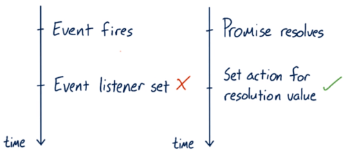

<h1>JavaScript Promises</h1>


<h2>Promises</h2>

A JavaScript Promise is created with the new Promise constructor function - `new Promise()`. A promise will let you start some work that will be done __asynchronously__ and let you get back to your regular work. When you create the promise, you must give it the code that will be run asynchronously. You provide this code as the argument of the constructor function:

```javascript
new Promise(function () {
    window.setTimeout(function createSundae(flavor = 'chocolate') {
        const sundae = {};
        // request ice cream
        // get cone
        // warm up ice cream scoop
        // scoop generous portion into cone!
    }, Math.random() * 2000);
});
```

This code creates a promise that will start in a few seconds after I make the request. Then there are a number of steps that need to be made in the `createSundae` function.

But once that's all done, how does JavaScript notify us that it's finished and ready for us to pick back up? It does that by passing two functions into our initial function. Typically we call these `resolve` and `reject`.

The function gets passed to the function we provide the Promise constructor - typically the word "resolve" is used to indicate that this function should be called when the request completes successfully. Notice the `resolve` on the first line:

```javascript
new Promise(function (resolve, reject) {
    window.setTimeout(function createSundae(flavor = 'chocolate') {
        const sundae = {};
        // request ice cream
        // get cone
        // warm up ice cream scoop
        // scoop generous portion into cone!
        resolve(sundae);
    }, Math.random() * 2000);
});
```

Now when the sundae has been successfully created, it calls the `resolve` method and passes it the data we want to return - in this case the data that's being returned is the completed sundae. So the `resolve` method is used to indicate that the request is complete and that it completed successfully.

If there is a problem with the request and it couldn't be completed, then we could use the second function that's passed to the function. Typically, this function is stored in an identifier called "reject" to indicate that this function should be used if the request fails for some reason. Check out the `reject` on the first line:

```javascript
new Promise(function (resolve, reject) {
    window.setTimeout(function createSundae(flavor = 'chocolate') {
        const sundae = {};
        // request ice cream
        // get cone
        // warm up ice cream scoop
        // scoop generous portion into cone!
        if ( /* iceCreamConeIsEmpty(flavor) */ ) {
            reject(`Sorry, we're out of that flavor :-(`);
        }
        resolve(sundae);
    }, Math.random() * 2000);
});
```

So the `reject` method is used when the request _could not be completed_. Notice that even though the request fails, we can still return data - in this case we're just returning text that says we don't have the desired ice cream flavor.

A Promise constructor takes a function that will run and then, after some amount of time, will either complete successfully (using the `resolve` method) or unsuccessfully (using the `reject` method). When the outcome has been finalized (the request has either completed successfully or unsuccessfully), the promise is now _fulfilled_ and will notify us so we can decide what to do with the response.

The first thing to understand is that a Promise will immediately return an object.

```javascript
const myPromiseObj = new Promise(function (resolve, reject) {
    // sundae creation code
});
```

That object has a `.then()` method on it that we can use to have it notify us if the request we made in the promise was either successful or failed. The `.then()` method takes two functions:
1. the function to run if the request completed successfully
2. the function to run if the request failed to complete

```javascript
mySundae.then(function(sundae) {
    console.log(`Time to eat my delicious ${sundae}`);
}, function(msg) {
    console.log(msg);
    self.goCry(); // not a real method
});
```

As you can see, the first function that's passed to `.then()` will be called and passed the data that the Promise's `resolve` function used. In this case, the function would receive the `sundae` object. The second function will be called and passed the data that the Promise's `reject` function was called with. In this case, the function receives the error message "Sorry, we're out of that flavor :-(" that the `reject` function was called with in the Promise code above.


<h2>Creating Promises</h2>

Every web developer needs to be able to handle asynchronous work with confidence and ease, and that's why you're here. There are many methods to handle asynchronous work already and promises are the recommended option, because they give you flexibility, intuitive syntax, and easy error handling.

<h3>Callbacks vs Promises</h3>

What is _asynchronous_ work? Asynchronous work happens at an unknown or unpredictable time. Normally code is _synchronous_. One statement executes and there's a guarantee that the next statement executes immediately afterwards. Threading on processors doesn't necessarily guarantee that, however, the JavaScript threading model ensures that for all intents and purposes, JavaScript runs in a single timeline. Unlike synchronous code, asynchronous code is not guaranteed to execute in a single unbroken timeline. In fact, you should assume that you have no idea when asynchronous operations will complete. Any code that relies on processes with some kind of unknowable finishing time are asynchronous.

<h3>Callbacks vs Thens</h3>

Callbacks are the default JavaScript technique for asynchronous work. Pass the function to another function, and then call the callback function at some later time when some conditions have been met. For example,

```javascript
function loadImage(src, parent, callback) {
    var img = document.createElement('img');
    img.src = src;
    img.onload = callback;
    parent.appendChild(img);
}
```

This works well but there are some questions without obvious answers. For instance, how do you handle errors? It's best practice to assume that any operation could fail at any time. It's doubly important to assume so with network requests. If an error occurs here, should you still execute the call back? There's a lot more questions and there's no clear answer. Node basically makes error first callbacks mandatory but that doesn't really solve the problem. It's still basically your job to define, and implement an error handling strategy.

What if this callback is also an asynchronous operation and you need something else to happen afterwards? Do you pass another function with another callback here? This is one scenario that leads to something called the Pyramid of Doom. A dreadful situation where there are nasty, nasty nested callbacks within call backs, within callbacks. This looks ugly and it's hard to write, but the real sin is that it is incredibly frustrating to debug. So, we write the code with promises as belows:

```javascript
var sequence = get('example.json');
.then(doSomething)
.then(doSomethingElse);
```

You'll be learning all about the beauty of `.then` later in this course.

<h3>Promise Timeline</h3>

Imagine a situation like this, where you're setting an Event listener after the event has already fired. What happens? Nothing, if this event doesn't fire again, then this Event listener never gets called. Now imagine you're using promises and you set an action to occur when a Promise resolves here which is after the promise has already resolved. Guess what? This will execute.



For example,

```javascript
new Promise(function(resolve, reject) {
    resolve("hi"); // works
    resolve("bye"); // can't happen a second time
});
```

This is a __promise constructor__, and you'll be learning more about this in the next sections. This methods __resolve__ settles the promise. A promise can only settle once. So in this scenario, the second resolve is doing nothing. This is because an event can fire many times, but a promise can only settle once.

Promises execute in the main thread, which means that they are still potentially blocking. If the work that happens inside the promise takes a long time, there's still a chance it could block the work the browser needs to do to render the page. If so, the frame rate of your app is going to suffer, and you'll probably hear your users complain about jank.

Promises are not a pass for safely executing long running operations. They're simply a technique for deciding what will happen when an asynchronous task settles. Think of them as try catch wrappers around asynchronous work.

<h3>Syntax</h3>

A promise is a try catch wrapper around code that will finish at an unpredictable time. For example,

```javascript
var promise = new Promise(function(resolve) {
    console.log('first');
    resolve();
    console.log('second');
})
.then(function() {
console.log('third');
});
```

`Promise` is a constructor. You can either store a promise as a variable or you can simply work on it as soon as you create it. Either way works just fine.

You pass a function to the promise with two arguments, __resolve__ and __reject__. Resolve and reject are two callbacks that you use to specify when a promise has either fulfilled, because something worked, or rejected because something went wrong.

Let me show you what this actually looks like.

```javascript
new Promise(function (resolve, reject) {
    var img = document.createElement('img');
    img.src = 'image.jpg';
    img.onload = resolve;
    img.onerror = reject;
    document.body.appendChild(img);
})
.then(finishLoading);
.catch(showAlternateImage);
```

In this example, I'm wrapping an image tag loader in a `promise` because I want to do some work after the image loads on a page. I'm using the image tag's `onload` handler to specify success. `Onload` calls `resolve`, which queues up the function, passed to `then` to execute after this function finishes executing. Note, the JavaScript engine does not immediately stop executing this function upon calling resolve.

Being able to call `resolve` and `reject` is important. This is what gives you the flexibility to explicitly say what constitutes fulfillment and what constitutes rejection for the promise. When either `resolve` or `reject` has been called, the `promise` has been settled, and then at that point, the next part of the chain. Usually, a `.then`, or it could be a `.catch` is then executed.

<h3>Quiz 1: Write Your First Promise</h3>

__Instructions__

1. Review the file named __exercise.html__ in the `Exercise_1` folder.
2. Wrap `setTimeout` in a `Promise` inside the `wait()` function. `resolve()` in setTimeout's callback.
3. `console.log(this)` inside the Promise and observe the results.
4. Make sure `wait()` returns the Promise too!
5. When complete, feel free to check out the implementation in the __solution.html__ file.

<h3>Quiz 2: Wrapping readyState</h3>

__Instructions__

1. Review the files in the `Exercise_2` folder.
2. Set network throttling so that the page isn't ready instantly. (Also, it's generally a good practice to have some throttling when testing sites. It'll help you see your site's performance from your users' perspectives.)
3. Wrap an event listener for `readystatechange` in a Promise.
4. If `document.readyState` is not `'loading'`, `resolve()`.
5. Test by chaining `wrapperResolved()`. If all goes well, you should see "Resolved" on the page!


<h2>Chaining Promises</h2>

Promise chaining looks as belows:

```javascript
new Promise(function(resolve, reject) {
    setTimeout(() => resolve(1), 1000); // (*)

}).then(function(result) { // (**)
    alert(result); // 1
    return result * 2;

}).then(function(result) { // (***)
    alert(result); // 2
    return result * 2;

}).then(function(result) {
    alert(result); // 4
    return result * 2;
});
```

The idea is that the result is passed through the chain of `.then` handlers.

Here the flow is:
- The initial promise resolves in 1 second `(*)`,
- Then the `.then` handler is called `(**)`.
- The value that it returns is passed to the next .then handler `(***)`
- …and so on.

The whole thing works, because a call to `promise.then` returns a promise, so that we can call the next `.then` on it. When a handler returns a value, it becomes the result of that promise, so the next `.then` is called with it.

Normally, a value returned by a `.then` handler is immediately passed to the next handler. But there’s an exception. If the returned value is a promise, then the further execution is suspended until it settles. After that, the result of that promise is given to the next `.then` handler.

__Thenables:__

To be precise, `.then` may return a so-called “thenable” object – an arbitrary object that has method `.then`, and it will be treated the same way as a promise.

The idea is that 3rd-party libraries may implement “promise-compatible” objects of their own. They can have extended set of methods, but also be compatible with native promises, because they implement `.then`.

Here’s an example of a thenable object:

```javascript
class Thenable {
    constructor(num) {
        this.num = num;
    }
    then(resolve, reject) {
        alert(resolve); // function() { native code }
        // resolve with this.num*2 after the 1 second
        setTimeout(() => resolve(this.num * 2), 1000); // (**)
    }
}

new Promise(resolve => resolve(1))
    .then(result => {
        return new Thenable(result); // (*)
    })
    .then(alert); // shows 2 after 1000ms
```

JavaScript checks the object returned by `.then` handler in the line `(*)`: if it has a callable method named `then`, then it calls that method providing native functions `resolve`, `reject` as arguments (similar to executor) and waits until one of them is called. In the example above `resolve(2)` is called after 1 second `(**)`. Then the result is passed further down the chain.

This feature allows to integrate custom objects with promise chains without having to inherit from `Promise`.

__Fetch:__

We looked at _fetch_ yesterday and let's look into it in light of _promises_. In frontend programming promises are often used for network requests. So let’s see an extended example of that.

We'll use the fetch method to load the information about the user from the remote server. It has a lot of optional parameters covered in separate chapters, but the basic syntax is quite simple:

```javascript
let promise = fetch(url);
```

This makes a network request to the `url` and returns a promise. The promise resolves with a `response` object when the remote server responds with headers, but _before the full response is downloaded._

To read the full response, we should call a method `response.text()`: it returns a promise that resolves when the full text downloaded from the remote server, with that text as a result.

The code below makes a request to `user.json` and loads its text from the server:

```javascript
fetch('/promise-chaining/user.json')
    // .then below runs when the remote server responds
    .then(function(response) {
        // response.text() returns a new promise that resolves with the full response text
        // when we finish downloading it
        return response.text();
    })
    .then(function(text) {
        // ...and here's the content of the remote file
        alert(text); // {"name": "Mukesh", isAdmin: true}
    });
```

There is also a method `response.json()` that reads the remote data and parses it as JSON. In our case that’s even more convenient, so let’s switch to it.

We’ll also use arrow functions for brevity:

```javascript
// same as above, but response.json() parses the remote content as JSON
fetch('/promise-chaining/user.json')
    .then(response => response.json())
    .then(user => alert(user.name)); // Mukesh
```

<h2>Error handling with promises</h2>

Asynchronous actions may sometimes fail: in case of an error the corresponding promise becomes rejected. For instance, `fetch` fails if the remote server is not available. We can use `.catch` to handle errors (rejections).

Promise chaining is great at that aspect. When a promise rejects, the control jumps to the closest rejection handler down the chain. That’s very convenient in practice.

For instance, in the code below the URL is wrong (no such site) and `.catch` handles the error:

```javascript
fetch('https://no-such-server.blabla') // rejects
    .then(response => response.json())
    .catch(err => alert(err)) // TypeError: failed to fetch (the text may vary)
```

Or, maybe, everything is all right with the site, but the response is not valid JSON:

```javascript
fetch('/') // fetch works fine now, the server responds with the HTML page
    .then(response => response.json()) // rejects: the page is HTML, not a valid json
    .catch(err => alert(err)) // SyntaxError: Unexpected token < in JSON at position 0
```

The easiest way to catch all errors is to append `.catch` to the end of chain:

```javascript
fetch('/article/promise-chaining/user.json')
    .then(response => response.json())
    .then(user => fetch(`https://api.github.com/users/${user.name}`))
    .then(response => response.json())
    .then(githubUser => new Promise((resolve, reject) => {
        let img = document.createElement('img');
        img.src = githubUser.avatar_url;
        img.className = "promise-avatar-example";
        document.body.append(img);

        setTimeout(() => {
            img.remove();
            resolve(githubUser);
        }, 3000);
    }))
    .catch(error => alert(error.message));
```

Normally, `.catch` doesn’t trigger at all, because there are no errors. But if any of the promises above rejects (a network problem or invalid json or whatever), then it would catch it.

__Implicit try…catch:__

The code of a promise executor and promise handlers has an "invisible `try..catch`" around it. If an exception happens, it gets caught and treated as a rejection.

For instance, this code:

```javascript
new Promise((resolve, reject) => {
    throw new Error("Whoops!");
}).catch(alert); // Error: Whoops!
```

…Works exactly the same as this:

```javascript
new Promise((resolve, reject) => {
    reject(new Error("Whoops!"));
}).catch(alert); // Error: Whoops!
```

The "invisible `try..catch`" around the executor automatically catches the error and treats it as a rejection.

This happens not only in the executor, but in its handlers as well. If we `throw` inside a `.then` handler, that means a rejected promise, so the control jumps to the nearest error handler.

Here's an example:

```javascript
new Promise((resolve, reject) => {
    resolve("ok");
}).then((result) => {
    throw new Error("Whoops!"); // rejects the promise
}).catch(alert); // Error: Whoops!
```

This happens for all errors, not just those caused by the `throw` statement.

__Rethrowing:__

As we already noticed, `.catch` behaves like `try..catch`. We may have as many `.then` handlers as we want, and then use a single `.catch` at the end to handle errors in all of them.

In a regular `try..catch` we can analyze the error and maybe rethrow it if can’t handle. The same thing is possible for promises.

If we `throw` inside `.catch`, then the control goes to the next closest error handler. And if we handle the error and finish normally, then it continues to the closest successful `.then` handler.

In the example below the `.catch` successfully handles the error:

```javascript
// the execution: catch -> then
new Promise((resolve, reject) => {
    throw new Error("Whoops!");
}).catch(function(error) {
    alert("The error is handled, continue normally");
}).then(() => alert("Next successful handler runs"));
```

Here the `.catch` block finishes normally. So the next successful `.then` handler is called.
