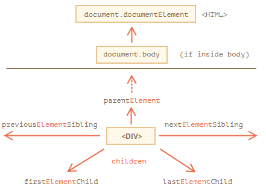
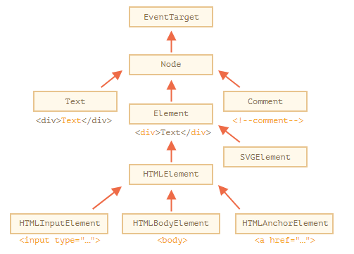
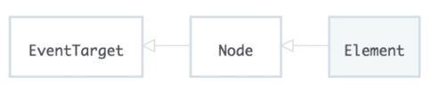

<h1>JavaScript and the DOM</h1>


<h2>The Document Object Model</h2>

The __Document Object Model (DOM)__ is a programming API for HTML and XML documents. It defines the logical structure of documents and the way a document is accessed and manipulated.

The HTML specification contains a set of rules for how we should process the received data. So, what happens with the HTML page after you request the website?

The following steps happen:
- HTML is received
- HTML tags are converted to tokens
- tokens are converted to Nodes
- Nodes are converted to the DOM

When you request a website, no matter what backend language is powering that website, it will respond with HTML. The browser receives a stream of HTML. The bytes are run through a complicated (but fully documented) parsing process that determines the different characters (e.g. the start tag character `<`, an attribute like `href`, a closing angle bracket like `>`). After parsing has occurred, a process called __tokenization__. Tokenization takes one character at a time and builds up __tokens__.

The tokens are:
- DOCTYPE
- start tag
- end tag
- comment
- character
- end-of-file

Let's take a break for a second. At this state, the browser has received the bytes that have been sent by a server. The browser has converted the bytes to tags and has read through the tags to create a list of tokens.

This list of tokens then goes through the tree construction stage. The output of this stage is a tree-like structure - this is the DOM! So the DOM is a model (representation) of the relationships and attributes of the HTML document that was received. Remember that DOM stands for "Document Object Model".

Remember that a JavaScript object is a tree-like structure that has properties and values. So the DOM can be accessed using a special object provided by the browser: `document`.

The `document` object is provided by the browser and is a representation of the HTML document. This object is not provided by the JavaScript language. ECMAScript is the language specification that JavaScript is based on, and it only references the document object model in one place, in its "Global Object" section:

> _In addition to the properties defined in this specification the global object may have additional host defined properties. This may include a property whose value is the global object itself; for example, in the HTML document object model the window property of the global object is the global object itself._

Basically, this says that the `document` object is not part of JavaScript, but is expected to _already exist_ and be freely accessible to JavaScript code.

The DOM is standardized by the W3C. There are a number of specifications that make up the DOM, here are few:
- Core Specification
- Events Specification
- Style Specification
- Validation Specification
- Load and Save Specification

To see the full list of DOM specs, check out the standard at: https://www.w3.org/standards/techs/dom#w3c_all

__Select An Element By ID__

Let's take a look at how we can use JavaScript and the DOM to gain access to specific elements using their ID attribute. Remember the `document` object is an object, just like a JavaScript object. This means it has key/value pairs. Some of the values are just pieces of data, while others are functions (also known as __methods__!) that provide some type of functionality. The first DOM method that we'll be looking at is the `.getElementById()` method. We use this by passing in a string to `.getElementById()` of the ID of the element that we want it to find and subsequently return to us:

```javascript
document.getElementById('footer');
```

One thing to notice right off the bat, is that we're passing `'footer'`, not `'#footer'`. It already knows that it's searching for an ID (its name is `"getElementById"`, for a reason 😉). But if you pass some ID that doesn't actually exist in the HTML page to the `getElementById()`, it will return `null`.

__Select Page Elements By Class Or Tag__

The first method we'll look at is `.getElementsByClassName()`. Just like `.getElementById()`, `.getElementsByClassName()` is expecting that we call it with a string of the class we want it to search for/return:

```javascript
document.getElementsByClassName('brand-color');
```

I know we haven't looked at `.getElementsByTagName()` just yet, but there's something different about `.getElementById()` compared with both `.getElementsByClassName()` and `.getElementsByTagName()` that I want to point out because it can be easy to miss; both `.getElementsByClassName()` and `.getElementsByTagName()` have an extra "s" in their name.

After looking at both `.getElementById()` and `.getElementsByClassName()`, the new `.getElementsByTagName()` method should seem quite easy on the eyes:

```javascript
document.getElementsByTagName('p');
```

We learned two ways to select multiple DOM elements:
- `.getElementsByClassName()`
- `.getElementsByTagName()`

There are a few important things to keep in mind about these two methods:
- both methods use the `document` object
- both return multiple items
- the list that's returned is not an array

<h3>Walking the DOM</h3>

The DOM allows us to do anything with elements and their contents, but first we need to reach the corresponding DOM object.

All operations on the DOM start with the document object. That’s the main “entry point” to DOM. From it we can access any node.

Here’s a picture of links that allow for travel between DOM nodes:


__On top: documentElement and body__

The topmost tree nodes are available directly as document properties:
- `<html>` = `document.documentElement`: The topmost document node is `document.documentElement`. That’s DOM node of `<html>` tag.
- `<body>` = `document.body`: Another widely used DOM node is the `<body>` element – `document.body`.
- `<head>` = `document.head`: The `<head>` tag is available as `document.head`.

__Children: childNodes, firstChild, lastChild__

There are two terms that we’ll use from now on:

- Child nodes (or children) – elements that are direct children. In other words, they are nested exactly in the given one. For instance, `<head>` and `<body>` are children of `<html>` element.
- Descendants – all elements that are nested in the given one, including children, their children and so on.

For instance, here `<body>` has children `<div>` and `<ul>` (and few blank text nodes):

```html
<html>
<body>
    <div>Begin</div>

    <ul>
<       <li>
            <b>Information</b>
        </li>
    </ul>
</body>
</html>
```

And descendants of `<body>` are not only direct children `<div>`, `<ul>` but also more deeply nested elements, such as `<li>` (a child of `<ul>`) and `<b>` (a child of `<li>`) – the entire subtree.

__Siblings and the parent__

_Siblings_ are nodes that are children of the same parent. For instance, here `<head>` and `<body>` are siblings:

```html
<html>
    <head>...</head><body>...</body>
</html>
```

- `<body>` is said to be the “next” or “right” sibling of `<head>`,
- `<head>` is said to be the “previous” or “left” sibling of `<body>`.
The next sibling is in `nextSibling` property, and the previous one – in `previousSibling`.

The parent is available as `parentNode`.

__Element-only navigation__

Navigation properties listed above refer to _all_ nodes. For instance, in `childNodes` we can see both text nodes, element nodes, and even comment nodes if there exist.

But for many tasks we don’t want text or comment nodes. We want to manipulate element nodes that represent tags and form the structure of the page.

So let’s see more navigation links that only take _element nodes_ into account:



The links are similar to those given above, just with `Element` word inside:
- `children` – only those children that are element nodes.
- `firstElementChild`, `lastElementChild` – first and last element children.
- `previousElementSibling`, `nextElementSibling` – neighbor elements.
- `parentElement` – parent element.

<h2>Nodes and Elements</h2>

Different DOM nodes may have different properties. For instance, an element node corresponding to tag `<a>` has link-related properties, and the one corresponding to `<input>` has input-related properties and so on. Text nodes are not the same as element nodes. But there are also common properties and methods between all of them, because all classes of DOM nodes form a single hierarchy.

Each DOM node belongs to the corresponding built-in class.

The root of the hierarchy is _EventTarget_, that is inherited by _Node_, and other DOM nodes inherit from it.



The classes are:
- __EventTarget__ – is the root “abstract” class. Objects of that class are never created. It serves as a base, so that all DOM nodes support so-called “events”, we’ll study them later.

- __Node__ – is also an “abstract” class, serving as a base for DOM nodes. It provides the core tree functionality: `parentNode`, `nextSibling`, `childNodes` and so on (they are getters). Objects of `Node` class are never created. But there are concrete node classes that inherit from it, namely: `Text` for text nodes, `Element` for element nodes and more exotic ones like `Comment` for comment nodes.

- __Element__ – is a base class for DOM elements. It provides element-level navigation like `nextElementSibling`, `children` and searching methods like `getElementsByTagName`, `querySelector`. A browser supports not only HTML, but also XML and SVG. The `Element` class serves as a base for more specific classes: `SVGElement`, `XMLElement` and `HTMLElement`.

- __HTMLElement__ – is finally the basic class for all HTML elements. It is inherited by concrete HTML elements:
    - __HTMLInputElement__ – the class for `<input>` elements,
    - __HTMLBodyElement__ – the class for `<body>` elements,
    - __HTMLAnchorElement__ – the class for `<a>` elements,

So, the full set of properties and methods of a given node comes as the result of the inheritance.

For example, let’s consider the DOM object for an `<input>` element. It belongs to `HTMLInputElement` class.

It gets properties and methods as a superposition of (listed in inheritance order):
- `HTMLInputElement` – this class provides input-specific properties,
- `HTMLElement` – it provides common HTML element methods (and getters/setters),
- `Element` – provides generic element methods,
- `Node` – provides common DOM node properties,.
- `EventTarget` – gives the support for events (to be covered),
- Finally it inherits from `Object`, so “plain object” methods like `hasOwnProperty` are also available.

We also can use `instanceof` to check the inheritance:

```javascript
console.log(document.body instanceof HTMLBodyElement); // true
console.log(document.body instanceof HTMLElement); // true
console.log(document.body instanceof Element); // true
```

<h3>Nodes</h3>

Node (with a capital "N"!) is a blueprint that contains information about all of the properties and methods for real nodes (with a lowercase "n"!). If you're not used to them, the words "__interface__", "__property__", and "__method__" can be kind of cryptic at first. Just remember that:
- interface = blueprint
- properties = data
- methods = functionality

So the Node Interface is a blueprint for all of the properties (data) and methods (functionality) that every real node has after it's been created. Just like "blueprint for a Building" is not as specific as "blueprint for a house" or "blueprint for a skyscraper". These are more-specific blueprints. And these more-specific blueprints would probably have their own properties and methods that are specific to just houses or just skyscrapers.

__The “nodeType” property__

The `nodeType` property provides one more, “old-fashioned” way to get the “type” of a DOM node.

It has a numeric value:
- `elem.nodeType == 1` for element nodes,
- `elem.nodeType == 3` for text nodes,
- `elem.nodeType == 9` for the document object,

there are few other values in the [specification](https://dom.spec.whatwg.org/#node).

<h3>Elements</h3>

Just like the _Node Interface_, the _Element Interface_ is a blueprint for creating elements. One really important thing about the Element Interface is that it is a descendent of the Node Interface.



Since Element is pointing at Node, this indicates that the Element Interface inherits all of the Node Interface's properties and methods. This means that any element (lowercase "e"!) that was created from the Element Interface is also a descendent from the Node Interface...which means the element (lowercase "e"!) is also a node (lowercase "n"!).

Do you remember the `.getElementsByClassName()` method on the `document` object that we looked at previously? While reviewing the Element interface, you might've noticed that it also has a `.getElementsByClassName()` method! The Element Interface inherits from the Node Interface, not the Document Interface (yep, there's a Document Interface!). The Element Interface has its own `.getElementsByClassName()` that does the exact same thing as the one on the `document` object.

This means that you can use the `document` object to select an element, then you can call `.getElementsByClassName()` on that element to receive a list of elements with the class name that are descendants of that specific element!

```javascript
// selects the DOM element with an ID of "sidebar"
const sidebarElement = document.getElementById('sidebar');

// searches within the "sidebar" element for any elements with a class of "sub-heading"
const subHeadingList = sidebarElement.getElementsByClassName('sub-heading');
```

<h3>More Ways To Access Elements</h3>

Now these DOM methods are standardized. However, not all browsers support every standard. They do now, for the three methods we looked at, but there are hundreds of other methods with varying levels of support. That's why almost every method on [MDN](https://developer.mozilla.org/en-US/docs/Web) has a Browser compatibility table that lists when each browser started supporting that specific method.

You've already learned the DOM methods to select by ID, class, and tag, too:
- `.document.getElementById()`
- `.document.getElementsByClassName()`
- `.document.getElementsByTagName()`

Three different methods that do almost the exact same thing. Wouldn't it be awesome if there were a way to do element selecting similar to how CSS does it?

__The querySelector Method__

We can use the `.querySelector()` method to select elements just like we do with CSS. We use the `.querySelector()` method and pass it a string that's just like a CSS selector:

```javascript
// find and return the element with an ID of "header"
document.querySelector('#header');

// find and return the first element with the class "header"
document.querySelector('.header');

// find and return the first <header> element
document.querySelector('header');
```

I want to point out one potentially tricky thing - the `.querySelector()` method only returns one element. This makes sense if you use it to search for an element by ID. However, even though `.getElementsByClassName()` and `.getElementsByTagName()` both return a list of multiple elements, using `.querySelector()` with a class selector or a tag selector will still only return the first item it finds.

__The querySelectorAll Method__

The `.querySelector()` method returns only one element from the DOM (if it exists). However, there are definitely times when you will want to get a list of all elements with a certain class or all of one type of element (e.g. all `<tr>` tags). We can use the `.querySelectorAll()` method to do this!

```javascript
// find and return a list of elements with the class "header"
document.querySelectorAll('.header');

// find and return a list of <header> elements
document.querySelectorAll('header');
```

<h2>Attributes and properties</h2>

When the browser loads the page, it “reads” (another word: “parses”) the HTML and generates DOM objects from it. For element nodes, most standard HTML attributes automatically become properties of DOM objects. For instance, if the tag is `<body id="page">`, then the DOM object has `body.id="page"`.

But the attribute-property mapping is not one-to-one! In this chapter we’ll pay attention to separate these two notions, to see how to work with them, when they are the same, and when they are different.

<h3>DOM properties</h3>

We’ve already seen built-in DOM properties. There’s a lot. But technically no one limits us, and if it’s not enough – we can add our own.

DOM nodes are regular JavaScript objects. We can alter them.

For instance, let’s create a new property in document.body:

```javascript
document.body.myData = {
    name: 'Caesar',
    title: 'Imperator'
};

console.log(document.body.myData.title);
```
> **_Returns:** Imperator_

We can add a method as well:

```javascript
document.body.sayTagName = function() {
    console.log(this.tagName);
};

document.body.sayTagName();
```
> **_Returns:** BODY_

We can also modify built-in prototypes like Element.prototype and add new methods to all elements:

```javascript
Element.prototype.sayHi = function() {
    console.log(`Hello, I'm ${this.tagName}`);
};

document.documentElement.sayHi(); // Hello, I'm HTML
document.body.sayHi(); // Hello, I'm BODY
```

So, DOM properties and methods behave just like those of regular JavaScript objects:
- They can have any value.
- They are case-sensitive (write `elem.nodeType`, not `elem.NoDeTyPe`).

<h3>HTML attributes</h3>

In HTML, tags may have attributes. When the browser parses the HTML to create DOM objects for tags, it recognizes _standard_ attributes and creates DOM properties from them. So when an element has `id` or another _standard_ attribute, the corresponding property gets created. But that doesn’t happen if the attribute is non-standard.

Please note that a standard attribute for one element can be unknown for another one. For instance, `"type"` is standard for `<input>` (HTMLInputElement), but not for `<body>` (HTMLBodyElement). Standard attributes are described in the specification for the corresponding element class.

So, if an attribute is non-standard, there won’t be a DOM-property for it. Is there a way to access such attributes?

Sure. All attributes are accessible by using the following methods:
- `elem.hasAttribute(name)` – checks for existence.
- `elem.getAttribute(name)` – gets the value.
- `elem.setAttribute(name, value)` – sets the value.
- `elem.removeAttribute(name)` – removes the attribute.

These methods operate exactly with what’s written in HTML.

Also one can read all attributes using `elem.attributes`: a collection of objects that belong to a built-in Attr class, with `name` and `value` properties.

HTML attributes have the following features:
- Their name is case-insensitive (`id` is same as `ID`).
- Their values are always strings.

__Property-attribute synchronization__

When a standard attribute changes, the corresponding property is auto-updated, and (with some exceptions) vice versa. But there are exclusions, for instance `input.value` synchronizes only from attribute → to property, but not back.

__DOM properties are typed__

DOM properties are not always strings. For instance, the `input.checked` property (for checkboxes) is a boolean:

```html
<input id="input" type="checkbox" checked> checkbox

<script>
    console.log(input.getAttribute('checked')); // the attribute value is: empty string
    console.log(input.checked); // the property value is: true
</script>
```

There are other examples. The style attribute is a string, but the style property is an object:

```html
<div id="div" style="color:red;font-size:120%">Hello</div>

<script>
    // string
    console.log(div.getAttribute('style')); // color:red;font-size:120%

    // object
    console.log(div.style); // [object CSSStyleDeclaration]
    console.log(div.style.color); // red
</script>
```

Quite rarely, even if a DOM property type is a string, it may differ from the attribute. For instance, the `href` DOM property is always a _full_ URL, even if the attribute contains a relative URL or just a `#hash`. If we need the value of `href` or any other attribute exactly as written in the HTML, we can use `getAttribute`.

<h3>Non-standard attributes, dataset</h3>

When writing HTML, we use a lot of standard attributes. But what about non-standard, custom ones? First, let’s see whether they are useful or not? What for?

Sometimes non-standard attributes are used to pass custom data from HTML to JavaScript, or to “mark” HTML-elements for JavaScript.

Like this:

```html
<!-- mark the div to show "name" here -->
<div show-info="name"></div>
<!-- and age here -->
<div show-info="age"></div>

<script>
  // the code finds an element with the mark and shows what's requested
    let user = {
        name: "Pete",
        age: 25
    };

    for(let div of document.querySelectorAll('[show-info]')) {
        // insert the corresponding info into the field
        let field = div.getAttribute('show-info');
        div.innerHTML = user[field]; // first Pete into "name", then 25 into "age"
    }
</script>
```

Also they can be used to style an element. For instance, here for the order state the attribute `order-state` is used:

```html
<style>
    /* styles rely on the custom attribute "order-state" */
    .order[order-state="new"] {
        color: green;
    }

    .order[order-state="pending"] {
        color: blue;
    }

    .order[order-state="canceled"] {
        color: red;
    }
</style>

<div class="order" order-state="new">
    A new order.
</div>

<div class="order" order-state="pending">
    A pending order.
</div>

<div class="order" order-state="canceled">
    A canceled order.
</div>
```

Why the attribute may be preferable to classes like `.order-state-new`, `.order-state-pending`, `order-state-canceled`? That’s because an attribute is more convenient to manage. The state can be changed as easy as:

```javascript
// a bit simpler than removing old/adding a new class
div.setAttribute('order-state', 'canceled');
```

But there may be a possible problem with custom attributes. What if we use a non-standard attribute for our purposes and later the standard introduces it and makes it do something? The HTML language is alive, it grows, more attributes appear to suit the needs of developers. There may be unexpected effects in such case.

To avoid conflicts, there exist `data-*` attributes. _All attributes starting with “data-” are reserved for programmers’ use. They are available in the `dataset` property_. For instance, if an `elem` has an attribute named `"data-about"`, it’s available as `elem.dataset.about`. Multiword attributes like `data-order-state` become camel-cased: `dataset.orderState`.

Here’s a rewritten “order state” example:

```html
<style>
    .order[data-order-state="new"] {
        color: green;
    }

    .order[data-order-state="pending"] {
        color: blue;
    }

    .order[data-order-state="canceled"] {
        color: red;
    }
</style>

<div id="order" class="order" data-order-state="new">
    A new order.
</div>

<script>
    // read
    alert(order.dataset.orderState); // new

    // modify
    order.dataset.orderState = "pending"; // (*)
</script>
```

Using `data-*` attributes is a valid, safe way to pass custom data. Please note that we can not only read, but also modify data-attributes. Then CSS updates the view accordingly: in the example above the last line `(*)` changes the color to blue.
