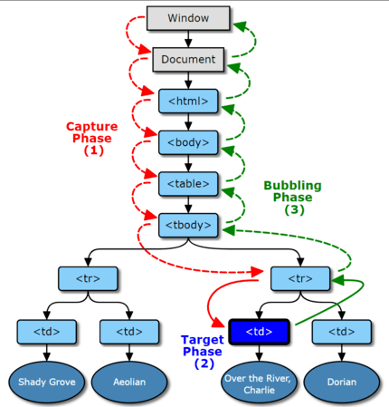
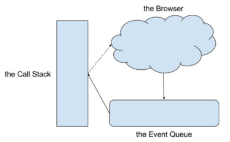

<h1>JavaScript and the DOM</h1>


<h2>Working with Browser Events</h2>

An __event__ is like an announcement, when something happens in the browser, the browser will make an announcement and we can use JavaScript to listen for the announcement and respond. There is a hidden world of events going on when a page loads. It's really hard to actually see into this hidden world, though.

Fortunately, the Chrome browser has a special `monitorEvents()` function that will let us see different events as they are occurring. The monitorEvents function will keep spitting out all of the events that are happening on the targeted element until the end of time or until you refresh the page. Alternatively, the Chrome browser does offer an `unmonitorEvents()` function that will turn off the announcing of events for the targeted element.

```javascript
// start displaying all events on the document object
monitorEvents(document);

// turn off the displaying of all events on the document object.
unmonitorEvents(document);
```

One last little bit of info on `monitorEvents` is that this is for development/testing purposes only. It's not supposed to be used for production code.

<h3>Respond to Events</h3>

Do you remember the Node Interface and the Element interface from the first lesson? Do you remember how the Element Interface is a descendant of the Node Interface, and therefore inherits all of Node's properties and methods?

Well there was one piece that I totally skipped over then but am addressing now. The Node Interface inherits from the `EventTarget` Interface. Both the Element Interface and the Document Interface inherit from the EventTarget Interface. This means that it does not inherit any properties or methods from any other interfaces.

The EventTarget is an interface implemented by objects that can receive events and may have listeners for them. Element, document, and window are the most common event targets, but other objects can be event targets too. If you take a look at the EventTarget Interface, you'll notice that it doesn't have any properties and only three methods! These methods are:
- `.addEventListener()`
- `.removeEventListener()`
- `.dispatchEvent()`

__Adding An Event Listener:__

`.addEventListener()` method will let us listen for events and respond to them. I just said _"listen for events"_. There are several ways to "phrase" this, so I want to give some examples:
- listen for an event
- listen to an event
- hook into an event
- respond to an event

```javascript
<event-target>.addEventListener(<event-to-listen-for>, <function-to-run-when-an-event-happens>);
```

So an event listener needs three things:
- an event target - this is called the __target__
- the type of event to listen for - this is called the __type__
- a function to run when the event occurs - this is called the __listener__

The `<event-target>` (i.e. the _target_) goes right back to what we just looked at: everything on the web is an event target (e.g. the `document` object, a `<p>` element, etc.).

The `<event-to-listen-for>` (i.e. the _type_) is the event we want to respond to. It could be a click, a double click, the pressing of a key on the keyboard, the scrolling of the mouse wheel, the submitting of a form...the list goes on!

The `<function-to-run-when-an-event-happens>` (i.e. the _listener_) is a function to run when the event actually occurs.

Let's transform the pseudo-code to a real example of an event listener:

```javascript
document.addEventListener('click', function () {
    console.log("The page was clicked!");
});

// The above code can be written as an Arrow function
document.addEventListener('click', () =>  console.log("The page was clicked!"));
```

So far, we've only looked at the `"click"` event, but there are a lot of other events. To see a full list of all of the possible events you can listen for, check out the Events documentation: [list of events](https://developer.mozilla.org/en-US/docs/Web/Events).

<h3>Remove an Event Listener</h3>

We say that we can use an event target's `.addEventListener()` method to start listening for specific events and respond to them. Let's say you only want to listen for just the first click event, respond to it, and ignore all other click events. The `.addEventListener()` event will listen for and respond to all click events.

(The newest version of the `.addEventListener()` specification does allow for an object to be passed as a third parameter. This object can be used to configure how the `.addEventListener()` method behaves. Of note, there is an option to listen for only a single event. However, this configuration object is not widely supported just yet).

To remove an event listener, we use the `.removeEventListener()` method. It sounds straightforward enough, right? However, before we look at `.removeEventListener()`, we need to take a brief review of object equality. It seems like an odd jump, but it'll make sense in just a moment.

__Are Objects Equal in JavaScript:__

Equality is a common task in most programming languages, but in JavaScript, it can be a little bit tricky because JavaScript does this thing called type coercion where it will try to convert the items being compared into the same type. (e.g. string, number,). JavaScript has the double equality (`==`) operator that _will allow type coercion_. It also has the triple equality (`===`) symbol that will prevent type coercion when comparing.

Will the following equality test result in true or false?

```javascript
{ name: 'Richard' } === { name: 'Richard' }
```
> _**Answer:** false_

See, if you got this wrong, let me explain, even though two objects look exactly the same, that doesn't mean they are identical. So the information does not indicate equality. When working with JavaScript objects and equality you need to think about, are they two separate objects, or are they different names referring to the same object?

Ok, so why do we care about any of this object/function equality? The reason is that the `.removeEventListener()` method requires you to pass _the same exact listener function_ to it as the one you passed to `.addEventListener()`.

Let's see some pseudo-code for the `.removeEventListener()`:

```javascript
<event-target>.removeEventListener(<event-to-listen-for>, <function-to-remove>);
```

For example, this code will successfully add and then remove an event listener:

```javascript
function myEventListeningFunction() {
    console.log('howdy');
}

// adds a listener for clicks, to run the `myEventListeningFunction` function
document.addEventListener('click', myEventListeningFunction);

// immediately removes the click listener that should run the `myEventListeningFunction` function
document.removeEventListener('click', myEventListeningFunction);
```

Now, why does this work? It works because both `.addEventListener()` and `.removeEventListener`:
- have the same _target_
- have the same _type_
- and pass the exact _same listener_

Now let's look at an example that would not work (it does not remove the event listener):

```javascript
// adds a listener for clicks, to run the `myEventListeningFunction` function
document.addEventListener('click', myEventListeningFunction => (console.log('howdy')));

// immediately removes the click listener that should run the `myEventListeningFunction` function
document.removeEventListener('click', myEventListeningFunction => (console.log('howdy')));
```

This code _does not_ successfully remove the event listener. Again, why does this not work?
- both `.addEventListener()` and `.removeEventListener` have the same _target_
- both `.addEventListener()` and `.removeEventListener` have the same _type_
- `.addEventListener()` and `.removeEventListener` have their own _distinct listener_ functions (__this is the reason the event listener removal fails!__)

<h3>Phases of an Event</h3>

There are three different phases during the life cycle of an event. They are:
1. the __capturing__ phase
2. the __at target__ phase
3. and the __bubbling__ phase

Most event handlers run during the __at target__ phase, such as when you attach a click event handler to the button. The event arrives at the button (its __target__), and there's only a handler for it right there, so the event handler gets run.

But sometimes you have a collection of items -- such as a list -- and want to have one handler cover every item (and still have the option of individual handlers for some items.) By default, if you click on a child item and a handler doesn't intercept the click, the event will "bubble" upward to the parent, and keep bubbling until something handles it or it hits the document.

Capturing, on the other hand, lets the parent intercept an event before it reaches a child.



So of the three phases in an event, which one does the `.addEventListener()` method actually use? And, how can we change it?

Up until this point, we've only seen the `.addEventListener()` method called with two arguments, the:
- event _type_
- and the _listener_

There's actually a _third_ argument to the `.addEventListener()` method; the _useCapture_ argument. From it's name, you'd think that if this argument were left out, `.addEventListener()` would default to using the _capturing_ phase. This is an incorrect assumption! __By default, when `.addEventListener()` is called with only two arguments, the method defaults to using the bubbling phase.__

In this code, `.addEventListener()` is called with _three arguments_ with the third argument being `true` (meaning it _should invoke the listener earlier, during the capturing phase_!).

```javascript
document.addEventListener('click', function () {
    console.log('The document was clicked');
}, true);
```

__The Event Object:__

When an event occurs, the browser includes an __event object__. This is just a regular JavaScript object that includes a ton of information about the event itself.

Up until this point, I've been writing all of the _listener_ functions without any parameter to store this event object. Let's add a parameter so we can store this important information:

```javascript
document.addEventListener('click', function (event) {
    console.log('The document was clicked');
});
```

Notice the new `event` parameter that's been added to the listener function. Now when the listener function is called, it is able to store the event data that's passed to it!

<h3>Event Delegation</h3>

The event object has a `.target` property. This property references the target of the event. Remember the capturing, at target, and bubbling phases?

Let's say that you click on a paragraph element. Here's roughly the process that happens:
1. a paragraph element is clicked
2. the event goes through the capturing phase
3. it reaches the target
4. it switches to the bubbling phase and starts going up the DOM tree
5. when it hits the `<div>` element, it runs the listener function
6. inside the listener function, `event.target` is the element that was clicked

So `event.target` gives us direct access to the paragraph element that was clicked. Because we have access to the element directly, we can access its `.textContent`, modify its styles, update the classes it has - we can do anything we want to it! For example,

```javascript
const myCustomDiv = document.createElement('div');

function respondToTheClick(evt) {
    console.log('A paragraph was clicked: ' + evt.target.textContent);
}

for (let i = 1; i <= 200; i++) {
    const newElement = document.createElement('p');
    newElement.textContent = 'This is paragraph number ' + i;

    myCustomDiv.append(newElement);
}

document.body.append(myCustomDiv);
myCustomDiv.addEventListener('click', respondToTheClick);
```

In the code snippet we used above, we added the event _listener+ directly to the `<div>` element. The listener function logs a message saying that a paragraph element was clicked (and then the text of the target element). This works perfectly! However, there is nothing to _ensure_ that it was actually a `<p>` tag that was clicked before running that message. In this snippet, the `<p>` tags were direct children of the `<div>` element, but what happens if we had the following HTML:

```html
<article id="content">
    <p>Brownie lollipop <span>carrot cake</span> gummies lemon drops sweet roll dessert tiramisu. Pudding muffin <span>cotton candy</span> croissant fruitcake tootsie roll. Jelly jujubes brownie. Marshmallow jujubes topping sugar plum jelly jujubes chocolate.</p>

    <p>Tart bonbon soufflé gummi bears. Donut marshmallow <span>gingerbread cupcake</span> macaroon jujubes muffin. Soufflé candy caramels tootsie roll powder sweet roll brownie <span>apple pie</span> gummies. Fruitcake danish chocolate tootsie roll macaroon.</p>
</article>
```

In this filler text, notice that there are some `<span>` tags. If we want to listen to the `<article>` for a click on a `<span>`, you might think that this could would work:

```javascript
document.querySelector('#content').addEventListener('click', function (evt) {
    console.log('A span was clicked with text ' + evt.target.textContent);
});
```

This will work, but there's a major flaw. The listener function will still fire when either one of the paragraph elements is clicked, too! In other words, this listener function is not verifying that the target of the event is actually a `<span>` element. Let's add in this check:

```javascript
document.querySelector('#content').addEventListener('click', function (evt) {
    if (evt.target.nodeName === 'SPAN') {  // ← verifies target is desired element
        console.log('A span was clicked with text ' + evt.target.textContent);
    }
});
```

Remember that every element inherits properties from the Node Interface. One of the properties of the Node Interface that is inherited is `.nodeName`. We can use this property to verify that the target element is actually the element we're looking for. When a `<span>` element is clicked, it will have a `.nodeName` property of `"SPAN"`, so the check will pass and the message will be logged. However, if a `<p>` element is clicked, it will have a `.nodeName` property of `"P"`, so the check will fail and the message will not be logged.

The `.nodeName` property will return a _capital_ string, not a _lowercase_ one. So when you perform your check make sure to either:
- check for capital letters
- convert the `.nodeName` to lowercase

<h3>Preventing browser actions</h3>

There are two ways to tell the browser we don’t want it to act:
- The main way is to use the `event` object. There’s a method `event.preventDefault()`.
- If the handler is assigned using `on<event>` (not by `addEventListener`), then we can also return `false` from it.

__The “passive” handler option__

The optional `passive: true` option of `addEventListener` signals the browser that the handler is not going to call `preventDefault()`. Why that may be needed?

There are some events like `touchmove` on mobile devices (when the user moves their finger across the screen), that cause scrolling by default, but that scrolling can be prevented using `preventDefault()` in the handler. So when the browser detects such event, it has first to process all handlers, and then if `preventDefault` is not called anywhere, it can proceed with scrolling. That may cause unnecessary delays and “jitters” in the UI.

The `passive: true` options tells the browser that the handler is not going to cancel scrolling. Then browser scrolls immediately providing a maximally fluent experience, and the event is handled by the way. For some browsers (Firefox, Chrome), `passive` is `true` by default for `touchstart` and `touchmove` events.

The property `event.defaultPrevented` is `true` if the default action was prevented, and `false` otherwise.


<h1>JavaScript and the DOM</h1>


<h2>Performance</h2>

<h3>Add Page Content Efficiently</h3>

__Using A Loop To Add Content:__

In the last section, we used a for loop to create two hundred paragraphs, add event listeners to them, and add them to the page. Let's take another look at the for loop, but this time without all of the event listener stuff:

```javascript
for (let i = 1; i <= 200; i++) {
    const newElement = document.createElement('p');
    newElement.textContent = 'This is paragraph number ' + i;
    document.body.appendChild(newElement);
}
```

This code:
- creates a paragraph element
- adds some text to the paragraph
- adds the paragraph to the page
...and it does this two hundred times.

Since we want two hundred things done, the best way to do this is with a `for` loop, so that code is inescapable. However, the code _inside the `for` loop_ is not all that efficient, and there are quite a few things we could do to improve this code. We could:
- create some parent container element _outside of the loop_
- we could append all new paragraph elements to this parent container
- we append this parent container to the `<body>` element instead of appending each time through the loop

Let's see all of these changes:

```javascript
const myCustomDiv = document.createElement('div');

for (let i = 1; i <= 200; i++) {
    const newElement = document.createElement('p');
    newElement.innerText = 'This is paragraph number ' + i;
    myCustomDiv.appendChild(newElement);
}

document.body.appendChild(myCustomDiv);
```

This looks a lot better, right? But how do we know it is? How can we prove it's better?

__Testing Code Performance:__

The standard way to measure how long it takes code to run is by using `performance.now()`. `performance.now()` returns a timestamp that is measured in milliseconds, so it's extremely accurate.

These are the steps to use `performance.now()` to measure the speed of your code:
- use `performance.now()` to get the an initial start time for the code
- run the code you want to test
- execute `performance.now()` to get another time measurement
- subtract the initial time from the final time

Adding two hundred paragraphs to the page is actually going to be relatively quick, so let's slow things down by using a set of nested `for` loops that just count from one to a hundred one hundred times!

```javascript
const startTime = performance.now();

for (i = 0; i <= 100; i++) {
    for (j = 0; j <= 100; j++) {
        console.log(`i and j are: ${i}, ${j}`)
    }
}

const endTime = performance.now();
console.log(`This code took ${endingTime - startingTime} milliseconds.`)
```

__Using a Document Fragment:__

So far, we've made a number of improvements to the code. However, there is still one thing that seems not so great; we have to create a extraneous `<div>` element _just to hold all the `<p>` tags so we can add them all at once_ and then we append this `<div>` to the `<body>` element. So in the end, we have an extra `<div>` that isn't really needed. It was just around because we wanted to add each new `<p>` to it instead of to the `<body>`.

Why are we doing this? The browser is constantly working to make the screen match the DOM. When we add a new element, the browser has to run through a `reflow` calculation (to determine the new screen layout) and then `repaint` the screen. This takes time.

If we had added each new paragraph to the body element, then the code would've been a lot slower, because this would cause the browser to go through the reflow and repaint process _for each paragraph_. We really only want the browser to do this once, so we need to attach each new paragraph to something, but we don't want to have an extra, unneeded element to get added to the DOM.

This is exactly why we have the __DocumentFragment__! A DocumentFragment _represents a minimal document object that has no parent. It is used as a lightweight version of Document that stores a segment of a document structure comprised of nodes just like a standard document_.

So it's like creating another lightweight DOM tree. But the key difference is that because the document fragment isn't part of the active document tree structure, changes made to the fragment don't affect the document, cause reflow, or incur any performance impact that can occur when changes are made.

We can use the `.createDocumentFragment()` method to create an empty DocumentFragment object.

```javascript
const myDocFrag = document.createDocumentFragment();
```

Let's rewrite our code to use a DocumentFragment instead of the `<div>`.

```javascript
const fragment = document.createDocumentFragment();

for (let i = 0; i < 200; i++) {
    const newElement = document.createElement('p');
    newElement.innerText = 'This is paragraph number ' + i;
    fragment.appendChild(newElement);
}

document.body.appendChild(fragment);
```

<h3>Reflow & Repaint</h3>

__Reflow__ is the process of the browser laying out the page. It happens when you first display the DOM (generally after the DOM and CSS have been loaded), and happens again every time something could change the layout. This is a fairly expensive (slow) process.

__Repaint__ happens after reflow as the browser draws the new layout to the screen. This is fairly quick, but you still want to limit how often it happens.

<h3>The Call Stack</h3>

__Single Threading:__

JavaScript can "process" one command at a time. We're going to take a look at JavaScript's single-threaded model and how/why we should write our code to take advantage of it.

```javascript
function addParagraph() {
    const para = document.createElement('p');
    para.textContent = 'JavaScript is single threaded!';
    document.body.appendChild(para);
}

function appendNewMessage() {
    const para = document.createElement('p');
    para.textContent = "Isn't that cool?";
    document.body.appendChild(para);
}

addParagraph();
appendNewMessage();
```

Keeping JavaScript's single-threaded nature in mind (meaning it can only perform one task at a time), let's break down this code into the order it will run:

- the `addParagraph()` function is declared on line 1
- the `appendNewMessage()` function is declared on line 6
- `addParagraph()` is called on line 13
    -execution moves into the function and executes all three lines in order
    -now that the function is finished, execution returns to where it was called
- the `appendNewMessage()` function is called on line 14
    -execution moves into the function and executes all three lines in order
    -now that the function is finished, execution returns to where it was called
- the program ends because all lines of code have been executed

Hopefully, the order that this code executed in wasn't surprising. There are a couple of things I particularly want you to pay attention to. First, is the run-to-completion nature of the code. When `addParagraph()` is invoked on line 13, _all of the code in the function gets executed_: it doesn't just execute some lines and leave other lines to be executed later. The entire block of code is run. A second thing I want to point out is that `addParagraph()` is invoked, runs, and finishes before `appendNewMessage()` is invoked (including a possible reflow and repaint); JavaScript doesn't execute multiple lines/functions at the same time.

__The Call Stack:__

The JavaScript engine keeps a call stack (basically a list) of the functions that are running. When a function is invoked, it is added to the list. When all of the code inside a function has been run, then the function is removed from the call stack. The cool part about a call stack is that a function doesn't have to complete before another function is added to the call stack.

<h3>The Event Loop</h3>

__Code Synchronicity:__

__Synchronous__ by definition means existing or occurring at the same time. All of the code we've been looking at runs in order, at the same time. Functions are added to the call stack, and then removed from the call stack when they've completed. However, there is some code that is not synchronous - meaning that the code is written just like any other code, but it is executed at some later point in time. Let's look at this code snippet:

```javascript
console.log('howdy');
document.addEventListener('click', function numbers() {
    console.log('123');
});
console.log('ice cream is tasty');
```

The code will run in this order:
1. `'howdy'` will be logged to the console
2. `'ice cream is tasty'` will be logged to the console

The string `'123'` will only be logged if there's a click. If the page is never clicked, then this code might not ever run! But where is it? Where did the `numbers` function holding the `console.log('123');` code go?

It goes to the __Event Loop__!

__The JavaScript Event Loop:__

The simplest explanation of JavaScript's _concurrency model_ uses two rules: If some JavaScript is running, let it run until it is finished ("run-to-completion"). If no JavaScript is running, run any pending event handlers.

Since most JavaScript is run in response to an event, this is known as an event loop: Pick up the next event, run its handler, and repeat.

There are three parts you have to think about around the event loop:
- the Call Stack
- Web APIs/the browser
- an Event Queue



Not all of the code that we write is 100% _JavaScript_ code. Some of the code is interacting with the Web APIs (also known as "browser APIs"). There are many more examples, but both `.addEventListener()` and `setTimeout()` are Web APIs.

Let's look at this code:

```javascript
console.log('howdy'); // 1
document.addEventListener('click', // 2
    function numbers() {
        console.log('123');
});
console.log('ice cream is tasty'); // 3
```

First, the browser runs this block of code to completion -- that is, steps 1, 2, and 3. Step 2 passes an event handler (`numbers`) to the browser for future use: the browser will hold this function until there's a click event.

What happens if someone clicks before this block of code is done? When there is a click event and there is code already running, the `numbers` function can't just be added directly to the Call Stack because of JavaScript's run-to-completion nature; we can't interrupt any code that might currently be happening. So the function is placed in the Queue. When all of the functions in the Call Stack have finished (also known as _idle time_), then the Queue is checked to see if anything is waiting. If something is in the Queue, then it's run, creating an entry on the call stack.

__IMPORTANT__: The key things to remember here are
1) current synchronous code runs to completion, and
2) events are processed when the browser isn't busy. Asynchronous code (such as loading an image) runs outside of this loop and sends an event when it is done.

<h3>setTimeout</h3>

Similarly to `.addEventListener()` code being run at some later point, there is the `setTimeout()` function that will run code at a point later in time. The `setTimeout()` function takes:

- a function to run at some later time
- the number of milliseconds the code should wait before running the function

Let's check out an example:

```javascript
setTimeout(function sayHi() {
    console.log('Howdy');
}, 1000);
```

If we ran this code, the string `'Howdy'` would appear in the console in about 1,000 milliseconds or in just about 1 second.

Since `setTimeout()` is an API provided by the browser, the call to `setTimeout()` gives the `sayHi()` function over to the browser which it starts a timer. After the timer is finished, the `sayHi()` function moves to the Queue. If the Call Stack is empty, then the `sayHi()` function is moved to the Call Stack and executed.

__Break Up Long-Running Code:__

Do you remember back to a previous section when we wrote JavaScript code to add two hundred paragraphs to the page? Now, instead of adding two hundred paragraphs to the page, what if we added _twenty thousand_? That's a lot of elements to create, append, and insert into the page!

Now keep in mind how reflow and repaint affect an app's performance. We want to write our JavaScript code to take into consideration reflow and repaint and to cause the fewest number of these.

However, we also want to make sure our app is responsive to user interaction. While JavaScript is running, the page is "busy" and the user won't be able to interact with the page (e.g. clicking a button, filling out a form). Remember that this is because JavaScript runs _synchronously_. So it will run to completion (creating, appending, and inserting all twenty thousand elements), and it does this before it is able to respond to any actions the user has taken. The function creates all of these elements and adds the to the page will be in the Call Stack until it's completely finished.

One way to give the user a chance to interact with the page is to break up the adding of the content into chunks. Let's do this with `setTimeout()`:

```javascript
let count = 1

function generateParagraphs() {
    const fragment = document.createDocumentFragment();

    for (let i = 1; i <= 500; i++) {
        const newElement = document.createElement('p');
        newElement.textContent = 'This is paragraph number ' + count;
        count = count + 1;

        fragment.appendChild(newElement);
    }

    document.body.appendChild(fragment);

    if (count < 20000) {
        setTimeout(generateParagraphs, 0);
    }
}

generateParagraphs();
```

This code starts off by setting a `count` variable to `1`. This will keep track of the number of paragraphs that have been added. The `generateParagraphs()` function will add 500 paragraphs to the page each time it's invoked. The interesting thing is that there's a `setTimeout()` call at the end of the `generateParagraphs()` function. If there less than twenty thousand elements, then it `setTimeout()` will be used to call the `generateParagraphs()` function.

If you try running this code on a page, you can still interact with the page while the code is running. It doesn't lock up or freeze the page. And it doesn't lock up or freeze because of the `setTimeout()` calls.
