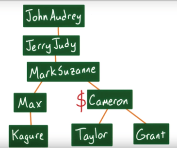

<h1>Intro to jQuery</h1>


<h2>The DOM and Selectors</h2>

jQuery is just a JavaScript library. It's not a language on its own nor is it fundamentally different than the thousands of other JavaScript libraries available. jQuery exists largely because manipulating the DOM with vanilla JavaScript isn't always easy. For instance, inserting a new DOM node with JavaScript means creating an element, setting attributes and content of the new node, selecting the soon-to-be parent of the new node, and then finally inserting the new node as a child of the parent node. For example,

```javascript
var div = document.createNode('div');
div.innerHTML = "Hello World";

var parent = document.querySelector('#parent');
parent.appendChild(div);
```

But with jQuery, all of that is simplified to one simple function.

```javascript
$('#parent').append("<div>Hello World</div>");
```

JavaScript is a function that takes in a couple of parameters and returns something. Incidentally, JavaScript functions are also objects.

With jQuery, you'll be seeing the dollar sign `($)` a lot. But what is the dollar sign? The jQuery object and the dollar sign are mapped to the exact same thing and it is a character like any other. We could even reassign it as variable to something else if we wanted to. For example,

```javascript
var $ = "James";
console.log($)
```
> _**Prints:** James_

With jQuery the dollar sign is just a pointer to the same JavaScript object we saw before. jQuery uses the dollar sign because because it's faster and easier to type than the whole word jQuery. In fact, some other JavaScript libraries use the dollar sign as well. For instance, the MooTools library also maps the dollar sign to a variable.

So, the dollar sign is just a function. But, now, what can you do with it? jQuery returns an array-like object which we call a jQuery collection. The reason we say it's an array-like object is that it's an object that looks and behaves like an array, but also includes some additional methods.

You could pass strings into the jQuery object and a jQuery collection of DOM elements will be returned. You can pass functions into jQuery. You could pass a DOM element into the jQuery object as well, if you want to call some jQuery methods on it. You can call methods directly on the jQuery object, like `$.ajax`. `$.ajax` subtracts away all the annoying nuances of ajax into a simple method called on the jQuery object. We will look into Ajax tomorrow.

Notice that I'm just talking about normal JavaScript operations. It's worth repeating that jQuery is just a JavaScript library. It's not a language. The jQuery function takes in some parameters. It returns an object and even has some methods attached to it, just like any other JavaScript object.

You can use jQuery to select a collection of DOM elements based on tag name (`$('tag')`), class name (`$('.class')`), or id (`$('#id')`). Passing the string of the tag, class or id name will result in a jQuery collection of all the elements of a certain tag, class or id. This string that you're passing in looks a lot like a CSS selector, and that's because it is. In fact, any valid CSS selector is also valid in jQuery.

With the help of jQuery selectors, you can select specific elements of the DOM. But, what if you wanted all the children of a div? How would you find them? Alternatively, what if you selected a div, but you wanted to inspect its parent element? How would you find it? jQuery gives us DOM traversal methods for moving around the DOM tree. For example,



```javascript
$('#Cameron').parent() // Select my immediate parent
$('#Cameron').parents() // Select my parents, my grandparents, and my great grandparents.
$('#Cameron').parents('#JerryJudy') // If I just wanted my grandparent `JerryJudy`
$('#Cameron').children() // Go down the DOM and select all of my immediate children
$('#Cameron').find('#Grant') // If I wanted my children's children `Grant` I would have to use .find
$('#Cameron').siblings() // Returns a jQuery collection of all of my siblings
```

I will open your favorite webpage, find an id and try these methods to see how it works.


<h2>The Tricks: DOM Manipulation</h2>

In this section, we will work with a custom `index.html` in the Exercises folder to manipulate the DOM, so go ahead and open `index.html` in the browser and open the `developer tools`.

<h3>Quiz: .toggleClass()</h3>

Use the [Documentation on .toggleClass()](https://api.jquery.com/toggleclass/) to solve the quiz. You can try it out in the browser.

```javascript
/*
For this quiz, use a jQuery class selector and featuredArticle variable to toggle the 'featured' class!
*/

// Your code starts here!
```

<h3>Quiz: Toggling Classes</h3>

[Documentation on .next()](https://api.jquery.com/next/)

```javascript
/*
For this quiz, remove the class 'featured' from Article #2 and add it to Article #3!

You must use jQuery's toggleClass method!
*/

// Your code starts here!
```

<h3>Quiz: Changing Attributes</h3>

[Documentation on .attr()](https://api.jquery.com/attr/)

```javascript
/*
For this quiz, set the href of the <a> in the first nav item to "#1".

You must use jQuery's attr() method!
*/

// Your code goes here!
```

<h3>Quiz: Modifying CSS</h3>

[Documentation on .css()](https://api.jquery.com/css/)

```javascript
/*
For this quiz, change the font-size of all the article-items to 20px!

You must use jQuery's css() method!
*/

// Your code goes here!
```

<h3>Pulling HTML and Text</h3>

Up to now you've selected elements and learned about the data inside HTML tags. But what about the data held between tags, can you grab that with jQuery too? Yep. The two best options for finding all of the data between tags are `.html()` and `.text()`.

If you run `.html()` in an element, you'll see the HTML of everything inside the element including all of the tags, classes, and attributes. But if you run `.text()` on a selection you'll see that jQuery has stripped out all of the HTML tags, and only return the text contained within.

<h3>Quiz: Collecting Values</h3>

[Documentation on .val()](https://api.jquery.com/val/)

[Documentation on .html()](https://api.jquery.com/html/)

[Documentation on .text()](https://api.jquery.com/text/)

[Documentation on events](https://api.jquery.com/category/events/)

```javascript
/*
For this quiz, use jQuery's val method to make live changes to the 'Cool Articles' <h1>!

The starter code below creates an event listener that will run any time the input changes.
For more on events, check the instructor notes.
*/


$('#input').on('change', function() {
    // Your code goes here!
    var val = ;
});
```

<h3>Quiz: Removing DOM Elements</h3>

[Documentation on .remove()](https://api.jquery.com/remove/)

```javascript
/*
For this quiz, remove the <ul> from the first article item!

You must use jQuery's remove() method.
*/

// Your code goes here!
var articleItems = ;
```

<h3>Adding DOM Elements</h3>

It can be tricky to add elements to the DOM with plain old JavaScript because you first have to create a DOM node, add data to it, find a parent for it, and then finally add that node as a child to that parent. And each step happens pretty much independently. With jQuery, you can create new DOM nodes and simultaneously add them to the document with one simple method. There are four different methods for creating and adding new DOM nodes. `.append()`, `.prepend()`, `.insertBefore()`, and `.insertAfter()` give you four different places to add new DOM elements.

I can call `.append` or `.prepend`, and this new element will be added as a child. `.append` adds a new element as the last child of the selected item, while `.prepend` adds a new element as the first child of the selected item. But what if I wanted this element to have a sibling? For that, I'll use `.insertBefore` or `.insertAfter`. As you may guess, `.insertBefore` adds a sibling before the current element, and `.insertAfter` adds a sibling after the current element.

<h3>Quiz: Iterating with Each</h3>

[Documentation on .each()](https://api.jquery.com/each/)

```javascript
 /*
For this quiz, use jQuery's each() method to iterate through the <p>s,
calculate the length of each one, and add each length to the end of each <p>.

Also, make sure you don't change the text inside each <p> except to add the length, otherwise your
length numbers won't be correct!
*/

// Your code goes here!
```


<h2>Event Listeners with jQuery</h2>

We already looked into Event Listeners in the previous sections, so here we will skip the basics and just focus on using Event Listeners with jQuery.

There are three items you need in order to listen for events and react to them. You need the target element to listen to, the event we want to react to, and the actions to take in response. For example,

```javascript
$('#input').on('keypress', function () {
    console.log("The event has happened");
});
```

I need the target element that jQuery will be listening to for events, so I'll use jQuery to select the `input` field. Next, I call the `on` method. This `on` method is where the magic happens. It's the primary way the jQuery uses to set up event listeners. The first argument to the on method is the event I want to listen for. In this example, it's `keypress`. But it could also be `click`, `change`, and `mouseover` to name a few. And finally, I need to pass a function with the actions I want to happen in response. This function is called the `callback`. The `callback` function being passed to the `on` method, is just a regular JavaScript function. And therefore, can contain any JavaScript code you want, from altering page content to analytics code.

<h3>Quiz: jQuery Event Listener</h3>

```javascript
/*
For this quiz, use jQuery to set up an event listener. Your event listener must:
    1. listen to the #my-button element
    2. listen for a `click` event
    3. perform the following actions when the button is clicked:
        a. remove the #my-button element from the DOM
        b. add the `success` class to the body
*/

// Your code goes here!
```

<h3>The Event Object</h3>

Reacting to events often requires knowledge about the event itself, so this is a quick breakdown of the event object which gets passed to an event listener’s callback.

Remember that the target element calls the callback function when the event occurs. When this function is called, jQuery passes an event object to it containing information about the event. This object holds a ton of useful information that can be used in the body of the function. This object, which is usually referenced in JavaScript as `e`, `evt`, or `event`, has several properties that you can use to determine the flow of your code. Try logging the object to see what's available. You can try the following by opening the `index.html` file in the browser and running the commands below in the `developer tools`:

```javascript
$('.article').on('click', function( evt ) {
    console.log(evt);
});
```

You should notice a `target` property. The `target` property holds the page element that is the target of the event. This can be extremely useful if an event listener has been set up for a number of elements:

```javascript
$('.article').on('click', function(evt) {
    $(evt.target).css('background', 'red');
});
```

In the example above, an event listener is set up for every `article` element on the page. When an `article` is clicked an object containing information about the event is passed to the callback. The `evt.target` property can be used to access just the clicked on element! jQuery is used to select just that one element from the DOM and update its background to red.

The event object also comes in handy when you want to prevent the default action that the browser would perform. For example, setting up a `click` event listener on an anchor link:

```javascript
$('#myAnchor').on('click', function(evt) {
    console.log('You clicked a link!');
});
```

Clicking on the `#myAnchor` link will log the message to the console, but it will also navigate to that element's `href` attribute - potentially redirecting to a new page. The event object can be used to prevent the default action:

```javascript
$('#myAnchor').on('click', function(evt) {
    evt.preventDefault();
    console.log('You clicked a link!');
});
```

In the code above, the `evt.preventDefault();` line instructs the browser not to perform the default action.

Other uses include:
- `event.keyCode` to learn what key was pressed - invaluable if you need to listen for a specific key
- `event.pageX` and `event.pageY` to know where on the page the click occurred - helpful for analytics tracking
- `event.type` to find what event happened - useful if listening to a target for multiple events

<h3>The Convenience Method</h3>

You have been setting up event listeners using jQuery's on method. Now this works really well, but jQuery also has some convenience methods that you can use. Let's take a look. This is how we would set up an event listener for a keypress on every input field.

```javascript
$('input').on('keypress', function () {
    // ....
});
```

We could rewrite this using jQuery's convenience method by replacing the `on` with the `keypress`.

```javascript
$('input').keypress(function () {
    // ....
});
```

And now we don't have to specify the event type because the convenience method implies it.

<h3>Event Delegation</h3>

The jQuery event listener examples we've been looking at so far select the target item(s) using jQuery and then attach an event listener to that target directly. But what about when the target doesn't exist yet? This can happen in a lot of situations. For example, if you have a list of items, and you want to listen to clicks on any of them, what happens if you add an extra list item after your page is done?

Be careful when setting up an event listener and then creating the target item afterwards. For example:

```javascript
$('article').on('click', function() {
    $('body').addClass('selected');
});

$('body').append('<article> <h1>Appended Article</h1> <p>Content for the new article </p> </article>');
```

Clicking on the "appended" article will not add a class to the body because the "appended" article was created after the event listeners were set up. When we targeted the 'article', it didn't exist yet, so jQuery added the click listener to all ZERO of our articles!

But there is a way to make this scenario work by using Event Delegation. We'll listen to events that hit a parent element, and pay attention to the target of those events. Event Delegation with jQuery uses the same code we've been using, but passes an additional argument to the "on" method.

```javascript
$('.container').on('click', 'article', function() { … });
```

This code tells jQuery to watch the `.container` element for clicks, and then if there are any, check if the click event's target is an `article` element.

Another advantage in using Event Delegation is that you can use it to consolidate the number of event listeners. For example, what if you had 1,000 list items on a page:

```html
<ul id="rooms">
    <li>Room 1</li>
    <li>Room 2</li>
            .
            .
            .
    <li>Room 999</li>
    <li>Room 1000</li>
</ul>
```

The following code would set up an event listener for each 1,000 event listeners - one for each list item...that's 1,000 event listeners!

```javascript
$('#rooms li').on('click', function() {
    // ...
});
```

Alternatively, we can use jQuery's event delegation to set the event listener on just one element (the ul#rooms) and check if the target element is a list item;

```javascript
$('#rooms').on('click', 'li', function() {
    // ...
});
```
