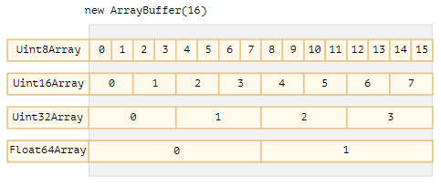
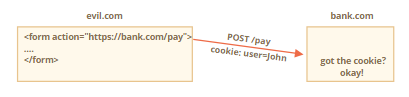

<h1>Bonus Topics</h1>

<h2>User Interface Events</h2>


<h3>Mouse event types</h3>

We can split mouse events into two categories: “simple” and “complex”

__Simple events__

The most used simple events are:
- `mousedown/mouseup`: Mouse button is clicked/released over an element.
- `mouseover/mouseout`: Mouse pointer comes over/out from an element.
- `mousemove`: Every mouse move over an element triggers that event.

There are several other event types too, we’ll cover them later.

__Complex events__

- `click`: Triggers after `mousedown` and then `mouseup` over the same element if the left mouse button was used.
- `contextmenu`: Triggers after `mousedown` if the right mouse button was used.
- `dblclick`: Triggers after a double click over an element.

Complex events are made of simple ones, so in theory we could live without them. But they exist, and that’s good, because they are convenient.

<h3>Modifiers: shift, alt, ctrl and meta</h3>

All mouse events include the information about pressed modifier keys.

Event properties:
- `shiftKey`: Shift
- `altKey`: Alt (or Opt for Mac)
- `ctrlKey`: Ctrl
- `metaKey`: Cmd for Mac

They are `true` if the corresponding key was pressed during the event. For instance, the button below only works on Alt+Shift+click:

```html
<button id="button">Alt+Shift+Click on me!</button>

<script>
    button.onclick = function(event) {
        if (event.altKey && event.shiftKey) {
            console.log('Hooray!');
        }
    };
</script>
```


<h3>Moving the mouse</h3>

The `mouseover` event occurs when a mouse pointer comes over an element, and `mouseout` – when it leaves. These events are special, because they have property `relatedTarget`. This property complements `target`. When a mouse leaves one element for another, one of them becomes `target`, and the other one – `relatedTarget`.

For `mouseover`:
- `event.target` – is the element where the mouse came over.
- `event.relatedTarget` – is the element from which the mouse came (`relatedTarget` → `target`).

For `mouseout` the reverse:
- `event.target` – is the element that the mouse left.
- `event.relatedTarget` – is the new under-the-pointer element, that mouse left for (`target` → `relatedTarget`).

<h3>Events mouseenter and mouseleave</h3>

Events `mouseenter`/`mouseleave` are like `mouseover`/`mouseout`. They trigger when the mouse pointer enters/leaves the element.

But there are two important differences:
1. Transitions inside the element, to/from descendants, are not counted.
2. Events `mouseenter`/`mouseleave` do not bubble.

These events are extremely simple. When the pointer enters an element – `mouseenter` triggers. The exact location of the pointer inside the element or its descendants doesn’t matter. When the pointer leaves an element – `mouseleave` triggers.

<h3>Drag'n'Drop with mouse events</h3>

Drag'n'Drop is a great interface solution. Taking something, dragging and dropping is a clear and simple way to do many things, from copying and moving documents (as in file managers) to ordering (drop into cart).

In the modern HTML standard there’s a section about Drag and Drop with special events such as dragstart, dragend and so on.

They are interesting because they allow to solve simple tasks easily, and also allow to handle drag'n'drop of “external” files into the browser. So we can take a file in the OS file-manager and drop it into the browser window. Then JavaScript gains access to its contents.

But native Drag Events also have limitations. For instance, we can’t limit dragging by a certain area. Also we can’t make it “horizontal” or “vertical” only. There are other drag'n'drop tasks that can’t be done using that API.

__Drag'n'Drop algorithm__

The basic Drag’n’Drop algorithm looks like this:
1. On `mousedown` – prepare the element for moving, if needed (maybe create a copy of it).
2. Then on `mousemove` move it by changing `left/top` and `position:absolute`.
3. On `mouseup` – perform all actions related to a finished Drag'n'Drop.

These are the basics. Later we can extend it, for instance, by highlighting droppable (available for the drop) elements when hovering over them.

The key components:
1. Events flow: `ball.mousedown` → `document.mousemove` → `ball.mouseup` (don’t forget to cancel native `ondragstart`).
2. At the drag start – remember the initial shift of the pointer relative to the element: `shiftX/shiftY` and keep it during the dragging.
3. Detect droppable elements under the pointer using `document.elementFromPoint`.

<h3>Keyboard: keydown and keyup</h3>

Keyboard events should be used when we want to handle keyboard actions (virtual keyboard also counts). For instance, to react on arrow keys Up and Down or hotkeys (including combinations of keys).

The `keydown` events happens when a key is pressed down, and then `keyup` – when it’s released.

__event.code and event.key__

The `key` property of the event object allows to get the character, while the `code` property of the event object allows to get the “physical key code”. For instance, the same key Z can be pressed with or without Shift. That gives us two different characters: lowercase `z` and uppercase `Z`. The event.key is exactly the character, and it will be different. But `event.code` is the same.

Please note that `event.code` specifies exactly which key is pressed. For instance, most keyboards have two Shift keys: on the left and on the right side. The `event.code` tells us exactly which one was pressed, and `event.key` is responsible for the “meaning” of the key: what it is (a “Shift”).

Let’s say, we want to handle a hotkey: Ctrl+Z (or Cmd+Z for Mac). Most text editors hook the “Undo” action on it. We can set a listener on `keydown` and check which key is pressed.

On one hand, the value of `event.key` is a character, it changes depending on the language. If the visitor has several languages in OS and switches between them, the same key gives different characters. So it makes sense to check `event.code`, it’s always the same.

On the other hand, there’s a problem with `event.code`. For different keyboard layouts, the same key may have different characters.

So, `event.code` may match a wrong character for unexpected layout. Same letters in different layouts may map to different physical keys, leading to different codes. Luckily, that happens only with several codes, e.g. `keyA`, `keyQ`, `keyZ` (as we’ve seen), and doesn’t happen with special keys such as `Shift`. You can find the list in the [specification](https://www.w3.org/TR/uievents-code/#table-key-code-alphanumeric-writing-system).

<h3>Scrolling</h3>

The `scroll` event allows to react on a page or element scrolling. There are quite a few good things we can do here.

For instance:
- Show/hide additional controls or information depending on where in the document the user is.
- Load more data when the user scrolls down till the end of the page.

Here’s a small function to show the current scroll:

```javascript
window.addEventListener('scroll', function() {
    document.getElementById('showScroll').innerHTML = pageYOffset + 'px';
});
```

In action:
Current scroll = _scroll the window_

The `scroll` event works both on the `window` and on scrollable elements.

__Prevent scrolling__

How do we make something unscrollable?

We can’t prevent scrolling by using `event.preventDefault()` in `onscroll` listener, because it triggers _after_ the scroll has already happened.

But we can prevent scrolling by `event.preventDefault()` on an event that causes the scroll, for instance `keydown` event for pageUp and pageDown. If we add an event handler to these events and `event.preventDefault()` in it, then the scroll won’t start. There are many ways to initiate a scroll, so it’s more reliable to use CSS, `overflow` property.


<h2>Forms, controls</h2>

<h3>Form properties and methods</h3>

Forms and control elements, such as `<input>` have a lot of special properties and events.

__Navigation: form and elements__

Document forms are members of the special collection `document.forms`. That’s a so-called “named collection”: it’s both named and ordered. We can use both the name or the number in the document to get the form.

```javascript
document.forms.my - the form with name="my"
document.forms[0] - the first form in the document
```

When we have a form, then any element is available in the named collection `form.elements`. For example,

```html
<form name="my">
    <input name="one" value="1">
    <input name="two" value="2">
</form>

<script>
    // get the form
    let form = document.forms.my; // <form name="my"> element

    // get the element
    let elem = form.elements.one; // <input name="one"> element
    console.log(elem.value); // 1
</script>
```

There may be multiple elements with the same name, that’s often the case with radio buttons. In that case `form.elements[name]` is a collection, for instance:

```html
<form>
    <input type="radio" name="age" value="10">
    <input type="radio" name="age" value="20">
</form>

<script>
    let form = document.forms[0];
    let ageElems = form.elements.age;
    console.log(ageElems[0].value); // 10, the value of the first input name="age"
</script>
```

These navigation properties do not depend on the tag structure. All control elements, no matter how deep they are in the form, are available in `form.elements`.

<h3>Form elements</h3>

Let’s talk about form controls, pay attention to their specific features.

__input and textarea__

We can access their value as `input.value` (string) or `input.checked` (boolean) for checkboxes.

Please note that even though `<textarea>...</textarea>` holds its value as nested HTML, we should never use `textarea.innerHTML`. It stores only the HTML that was initially on the page, not the current value.

__select and option__

A `<select>` element has 3 important properties:
- `select.options` – the collection of `<option>` elements,
- `select.value` – the value of the currently selected option,
- `select.selectedIndex` – the number of the currently selected option.

So we have three ways to set the value of a `<select>`:
- Find the needed `<option>` and set `option.selected` to `true`.
- Set `select.value` to the value.
- Set `select.selectedIndex` to the number of the option.

The first way is the most obvious, but (2) and (3) are usually more convenient.

__new Option__

This is rarely used on its own. But there’s still an interesting thing. In the specification of the option element there’s a nice short syntax to create `<option>` elements:

```javascript
option = new Option(text, value, defaultSelected, selected);
```

Parameters:
- `text` – the text inside the option,
- `value` – the option value,
- `defaultSelected` – if `true`, then `selected` HTML-attribute is created,
- `selected` – if `true`, then the option is selected.

For example,

```javascript
let option = new Option("Text", "value");
// creates <option value="value">Text</option>
```

<h3>Focusing: focus/blur</h3>

An element receives a focus when the user either clicks on it or uses the Tab key on the keyboard. There’s also an `autofocus` HTML attribute that puts the focus into an element by default when a page loads and other means of getting a focus.

Focusing on an element generally means: “prepare to accept the data here”, so that’s the moment when we can run the code to initialize the required functionality.

The moment of losing the focus (“blur”) can be even more important. That’s when a user clicks somewhere else or presses Tab to go to the next form field, or there are other means as well.

Losing the focus generally means: “the data has been entered”, so we can run the code to check it or even to save it to the server and so on.

__Events focus/blur__

The `focus` event is called on focusing, and `blur` – when the element loses the focus.

__Methods focus/blur__

Methods `elem.focus()` and `elem.blur()` set/unset the focus on the element. If we enter something into the input and then try to use Tab or click away from the `<input>`, then `onblur` returns the focus back.

Please note that we can’t “prevent losing focus” by calling `event.preventDefault()` in `onblur`, because `onblur` works after the element lost the focus.

__Allow focusing on any element: tabindex__

By default many elements do not support focusing. The list varies between browsers, but one thing is always correct: `focus/blur` support is guaranteed for elements that a visitor can interact with: `<button>`, `<input>`, `<select>`, `<a>` and so on.

From the other hand, elements that exist to format something like `<div>`, `<span>`, `<table>` – are unfocusable by default. The method `elem.focus()` doesn’t work on them, and `focus/blur` events are never triggered.

This can be changed using HTML-attribute `tabindex`. The purpose of this attribute is to specify the order number of the element when Tab is used to switch between them.

That is: if we have two elements, the first has `tabindex="1"`, and the second has `tabindex="2"`, then pressing Tab while in the first element – moves us to the second one.

There are two special values:
- `tabindex="0"` makes the element the last one.
- `tabindex="-1"` means that Tab should ignore that element.


<h2>Mutation observer</h2>

`MutationObserver` is a built-in object that observes a DOM element and fires a callback in case of changes.

<h3>Syntax</h3>

`MutationObserver` is easy to use. First, we create an observer with a callback-function:

```javascript
let observer = new MutationObserver(callback);
```

And then attach it to a DOM node:

```javascript
observer.observe(node, config);
```

`config` is an object with boolean options “what kind of changes to react on”:
- `childList` – changes in the direct children of `node`,
- `subtree` – in all descendants of `node`,
- `attributes` – attributes of `node`,
- `attributeFilter` – an array of attribute names, to observe only selected ones.
- `characterData` – whether to observe `node.data` (text content),

Few other options:
- `attributeOldValue` – if `true`, pass both the old and the new value of attribute to callback (see below), otherwise only the new one (needs `attributes` option),
- `characterDataOldValue` – if `true`, pass both the old and the new value of `node.data` to callback (see below), otherwise only the new one (needs `characterData` option).

Then after any changes, the callback is executed: changes are passed in the first argument as a list of `MutationRecord` objects, and the observer itself as the second argument.

MutationRecord objects have properties:
- `type` – mutation type, one of
    - `"attributes"`: attribute modified
    - `"characterData"`: data modified, used for text nodes,
    - `"childList"`: child elements added/removed,
- `target` – where the change occurred: an element for `"attributes"`, or text node for `"characterData"`, or an element for a `"childList"` mutation,
- `addedNodes/removedNodes` – nodes that were added/removed,
- `previousSibling/nextSibling` – the previous and next sibling to added/removed nodes,
- `attributeName/attributeNamespace` – the name/namespace (for XML) of the changed attribute,
- `oldValue` – the previous value, only for attribute or text changes, if the corresponding option is set `attributeOldValue/characterDataOldValue`.

<h3>Usage for integration</h3>

When such thing may be useful?

Imagine the situation when you attach a third-party script that adds useful functionality on the page, but also does something unwanted, e.g. shows ads `<div class="ads">Unwanted ads</div>`.

Naturally, the third-party script provides no mechanisms to remove it.

Using `MutationObserver`, we can detect when such element appears in our DOM and remove it. While leaving the useful functionality intact. Surely though, creators of that script won’t be happy that you took their useful stuff and removed the ads.

There are other situations when a third-party script adds something into our document, and we’d like to detect, when it happens, to adapt our page, dynamically resize something etc. MutationObserver can easily handle this.


<h2>The clickjacking attack</h2>

The “clickjacking” attack allows an evil page to click on a “victim site” on _behalf of the visitor_. Many sites were hacked this way, including Twitter, Facebook, Paypal and other sites. They have all been fixed, of course.

The idea is very simple.

Here’s how clickjacking was done with Facebook:
1. A visitor is lured to the evil page. It doesn’t matter how.
2. The page has a harmless-looking link on it (like “get rich now” or “click here, very funny”).
3. Over that link the evil page positions a transparent `<iframe>` with `src` from facebook.com, in such a way that the “Like” button is right above that link. Usually that’s done with `z-index`.
4. In attempting to click the link, the visitor in fact clicks the button.

The attack only affects mouse actions (or similar, like taps on mobile). Keyboard input is much difficult to redirect. Technically, if we have a text field to hack, then we can position an iframe in such a way that text fields overlap each other. So when a visitor tries to focus on the input they see on the page, they actually focus on the input inside the iframe. But then there’s a problem. Everything that the visitor types will be hidden, because the iframe is not visible. People will usually stop typing when they can’t see their new characters printing on the screen.

<h3>Old-school defences (weak)</h3>

The oldest defence is a bit of JavaScript which forbids opening the page in a frame (so-called “framebusting”).

That looks like this:

```javascript
if (top != window) {
    top.location = window.location;
}
```

That is: if the window finds out that it’s not on top, then it automatically makes itself the top. This not a reliable defence, because there are many ways to hack around it. Let’s cover a few.

__Blocking top-navigation__

We can block the transition caused by changing `top.location` in `beforeunload` event handler. The top page (enclosing one, belonging to the hacker) sets a preventing handler to it, like this:

```javascript
window.onbeforeunload = function() {
    return false;
};
```

When the `iframe` tries to change `top.location`, the visitor gets a message asking them whether they want to leave. In most cases the visitor would answer negatively because they don’t know about the iframe – all they can see is the top page, there’s no reason to leave. So `top.location` won’t change!

__Sandbox attribute__

One of the things restricted by the `sandbox` attribute is navigation. A sandboxed iframe may not change `top.location`. So we can add the iframe with `sandbox="allow-scripts allow-forms"`. That would relax the restrictions, permitting scripts and forms. But we omit `allow-top-navigation` so that changing `top.location` is forbidden.

Here’s the code:

```javascript
<iframe sandbox="allow-scripts allow-forms" src="facebook.html"></iframe>
```

There are other ways to work around that simple protection too.

<h3>X-Frame-Options</h3>

The server-side header `X-Frame-Options` can permit or forbid displaying the page inside a frame. It must be sent exactly as HTTP-header: the browser will ignore it if found in HTML `<meta>` tag. So, `<meta http-equiv="X-Frame-Options"...>` won’t do anything.

The header may have 3 values:
`DENY` - Never ever show the page inside a frame.
``SAMEORIGIN` - Allow inside a frame if the parent document comes from the same origin.
`ALLOW-FROM domain` - Allow inside a frame if the parent document is from the given domain.

<h3>Showing with disabled functionality</h3>

The `X-Frame-Options` header has a side-effect. Other sites won’t be able to show our page in a frame, even if they have good reasons to do so.

So there are other solutions… For instance, we can “cover” the page with a `<div>` with styles `height: 100%; width: 100%;`, so that it will intercept all clicks. That `<div>` is to be removed if `window == top` or if we figure out that we don’t need the protection.

<h3>Samesite cookie attribute</h3>

The `samesite` cookie attribute can also prevent clickjacking attacks. A cookie with such attribute is only sent to a website if it’s opened directly, not via a frame, or otherwise. If the site, such as Facebook, had `samesite` attribute on its authentication cookie, like this:

```javascript
Set-Cookie: authorization=secret; samesite
```

Then such cookie wouldn’t be sent when Facebook is open in iframe from another site. So the attack would fail. The `samesite` cookie attribute will not have an effect when cookies are not used. This may allow other websites to easily show our public, unauthenticated pages in iframes.

However, this may also allow clickjacking attacks to work in a few limited cases. An anonymous polling website that prevents duplicate voting by checking IP addresses, for example, would still be vulnerable to clickjacking because it does not authenticate users using cookies.


<h2>Binary data, files</h2>

<h3>ArrayBuffer</h3>

In web-development we meet binary data mostly while dealing with files (create, upload, download). Another typical use case is image processing. That’s all possible in JavaScript, and binary operations are high-performant.

Although, there’s a bit of confusion, because there are many classes. To name a few:
- `ArrayBuffer`, `Uint8Array`, `DataView`, `Blob`, `File`, etc.

Binary data in JavaScript is implemented in a non-standard way, compared to other languages. But when we sort things out, everything becomes fairly simple.

__The basic binary object is `ArrayBuffer` – a reference to a fixed-length contiguous memory area__.

Let’s eliminate a possible source of confusion. `ArrayBuffer` has nothing in common with `Array`:
- It has a fixed length, we can’t increase or decrease it.
- It takes exactly that much space in the memory.
- To access individual bytes, another “view” object is needed, not `buffer[index]`.

__To manipulate an `ArrayBuffer`, we need to use a “view” object__.

A view object does not store anything on it’s own. It’s the “eyeglasses” that give an interpretation of the bytes stored in the `ArrayBuffer`.

For instance:
- `Uint8Array` – treats each byte in `ArrayBuffer` as a separate number, with possible values are from 0 to 255 (a byte is 8-bit, so it can hold only that much). Such value is called a “8-bit unsigned integer”.
- `Uint16Array` – treats every 2 bytes as an integer, with possible values from 0 to 65535. That’s called a “16-bit unsigned integer”.
- `Uint32Array` – treats every 4 bytes as an integer, with possible values from 0 to 4294967295. That’s called a “32-bit unsigned integer”.
- `Float64Array` – treats every 8 bytes as a floating point number with possible values from $5.0 \times 10^{324}$ to $1.8 \times 10^{308}$.

So, the binary data in an `ArrayBuffer` of 16 bytes can be interpreted as 16 “tiny numbers”, or 8 bigger numbers (2 bytes each), or 4 even bigger (4 bytes each), or 2 floating-point values with high precision (8 bytes each).



`ArrayBuffer` is the core object, the root of everything, the raw binary data.

<h3>TypedArray</h3>

The common term for all these views (`Uint8Array`, `Uint32Array`, etc) is TypedArray. They share the same set of methods and properities.

They are much more like regular arrays: have indexes and iterable. A typed array constructor (be it `Int8Array` or `Float64Array`, doesn’t matter) behaves differently depending on argument types.

There are 5 variants of arguments:

```javascript
new TypedArray(buffer, [byteOffset], [length]);
new TypedArray(object);
new TypedArray(typedArray);
new TypedArray(length);
new TypedArray();
```

1. If an `ArrayBuffer` argument is supplied, the view is created over it. We used that syntax already. Optionally we can provide `byteOffset` to start from (0 by default) and the `length` (till the end of the buffer by default), then the view will cover only a part of the `buffer`.

2. If an `Array`, or any array-like object is given, it creates a typed array of the same length and copies the content. We can use it to pre-fill the array with the data:

```javascript
let arr = new Uint8Array([0, 1, 2, 3]);
alert(arr.length); // 4, created binary array of the same length
alert(arr[1]); // 1, filled with 4 bytes (unsigned 8-bit integers) with given values
```

3. If another `TypedArray` is supplied, it does the same: creates a typed array of the same length and copies values. Values are converted to the new type in the process, if needed.

```javascript
let arr16 = new Uint16Array([1, 1000]);
let arr8 = new Uint8Array(arr16);
alert(arr8[0]); // 1
alert(arr8[1]); // 232, tried to copy 1000, but can't fit 1000 into 8 bits (explanations below)
```

4. For a numeric argument `length` – creates the typed array to contain that many elements. Its byte length will be `length` multiplied by the number of bytes in a single item `TypedArray.BYTES_PER_ELEMENT`:

```javascript
let arr = new Uint16Array(4); // create typed array for 4 integers
alert( Uint16Array.BYTES_PER_ELEMENT ); // 2 bytes per integer
alert( arr.byteLength ); // 8 (size in bytes)
```

5. Without arguments, creates an zero-length typed array.

We can create a `TypedArray` directly, without mentioning `ArrayBuffer`. But a view cannot exist without an underlying `ArrayBuffer`, so gets created automatically in all these cases except the first one (when provided).

To access the `ArrayBuffer`, there are properties:
- `arr.buffer` – references the `ArrayBuffer`.
- `arr.byteLength` – the length of the `ArrayBuffer`.

So, we can always move from one view to another:

```javascript
let arr8 = new Uint8Array([0, 1, 2, 3]);

// another view on the same data
let arr16 = new Uint16Array(arr8.buffer);
```

Here’s the list of typed arrays:

- `Uint8Array`, `Uint16Array`, `Uint32Array` – for integer numbers of 8, 16 and 32 bits.
    - `Uint8ClampedArray` – for 8-bit integers, “clamps” them on assignment (see below).
- `Int8Array`, `Int16Array`, `Int32Array` – for signed integer numbers (can be negative).
- `Float32Array`, `Float64Array` – for signed floating-point numbers of 32 and 64 bits.

<h3>TypedArray methods</h3>

`TypedArray` has regular Array methods, with notable exceptions. We can iterate, `map`, `slice`, `find`, `reduce` etc.

There are few things we can’t do though:
- No `splice` – we can’t “delete” a value, because typed arrays are views on a buffer, and these are fixed, contiguous areas of memory. All we can do is to assign a zero.
- No `concat` method.

There are two additional methods:
- `arr.set(fromArr, [offset])` copies all elements from `fromArr` to the `arr`, starting at position `offset` (0 by default).
- `arr.subarray([begin, end])` creates a new view of the same type from `begin` to `end` (exclusive). That’s similar to `slice` method (that’s also supported), but doesn’t copy anything – just creates a new view, to operate on the given piece of data.

These methods allow us to copy typed arrays, mix them, create new arrays from existing ones, and so on.

<h3>Data View</h3>

DataView is a special super-flexible “untyped” view over `ArrayBuffer`. It allows to access the data on any offset in any format.
- For typed arrays, the constructor dictates what the format is. The whole array is supposed to be uniform. The i-th number is `arr[i]`.
- With `DataView` we access the data with methods like `.getUint8(i)` or `.getUint16(i)`. We choose the format at method call time instead of the construction time.

The syntax:

```javascript
new DataView(buffer, [byteOffset], [byteLength])
```

- `buffer` – the underlying `ArrayBuffer`. Unlike typed arrays, `DataView` doesn’t create a buffer on its own. We need to have it ready.
- `byteOffset` – the starting byte position of the view (by default 0).
- `byteLength` – the byte length of the view (by default till the end of buffer).

`DataView` is great when we store mixed-format data in the same buffer. E.g we store a sequence of pairs (16-bit integer, 32-bit float). Then `DataView` allows to access them easily.


<h3>TextDecoder</h3>

What if the binary data is actually a string? For instance, we received a file with textual data. The build-in TextDecoder object allows to read the value into an actual JavaScript string, given the buffer and the encoding.

We first need to create it:

```javascript
let decoder = new TextDecoder([label], [options]);
```

- `label` – the encoding, `utf-8` by default, but `big5`, `windows-1251` and many other are also supported.
- `options` – optional object:
    - `fatal` – boolean, if `true` then throw an exception for invalid (non-decodable) characters, otherwise (default) replace them with character `\uFFFD`.
    - `ignoreBOM` – boolean, if `true` then ignore BOM (an optional byte-order unicode mark), rarely needed.

And then decode:

```javascript
let str = decoder.decode([input], [options]);
```

- `input` – `BufferSource` to decode.
- `options` – optional object:
    - `stream` – true for decoding streams, when `decoder` is called repeatedly with incoming chunks of data. In that case a multi-byte character may occasionally split between chunks. This options tells `TextDecoder` to memorize “unfinished” characters and decode them when the next chunk comes.

For instance:

```javascript
let uint8Array = new Uint8Array([72, 101, 108, 108, 111]);

console.log(new TextDecoder().decode(uint8Array));
```
> **_Returns:** Hello_


<h3>TextEncoder</h3>

TextEncoder does the reverse thing – converts a string into bytes.

The syntax is:

```javascript
let encoder = new TextEncoder();
```

The only encoding it supports is “utf-8”.

It has two methods:
- `encode(str)` – returns `Uint8Array` from a string.
- `encodeInto(str, destination)` – encodes `str` into `destination` that must be `Uint8Array`.

For instance:

```javascript
let encoder = new TextEncoder();

let uint8Array = encoder.encode("Hello");
console.log(uint8Array);
```
> **_Returns:** 72,101,108,108,111_


<h3>File</h3>

A File object inherits from `Blob` and is extended with filesystem-related capabilities. A `Blob` object represents a file-like object of immutable, raw data; they can be read as text or binary data, or converted into a `ReadableStream` so its methods can be used for processing the data. There are two ways to obtain it.

First, there’s a constructor, similar to `Blob`:

```javascript
new File(fileParts, fileName, [options])
```

- `fileParts` – is an array of Blob/BufferSource/String values.
- `fileName` – file name string.
- `options` – optional object:
    - `lastModified` – the timestamp (integer date) of last modification.

Second, more often we get a file from `<input type="file">` or drag’n’drop or other browser interfaces. In that case, the file gets this information from OS.

As `File` inherits from `Blob`, `File` objects have the same properties, plus:
- `name` – the file name,
- `lastModified` – the timestamp of last modification.

That’s how we can get a `File` object from `<input type="file">`

<h3>FileReader</h3>

FileReader is an object with the sole purpose of reading data from `Blob` (and hence `File` too) objects. It delivers the data using events, as reading from disk may take time.

The constructor:

```javascript
let reader = new FileReader(); // no arguments
```

The main methods:
- `readAsArrayBuffer(blob)` – read the data in binary format `ArrayBuffer`.
- `readAsText(blob, [encoding])` – read the data as a text string with the given encoding (`utf-8` by default).
- `readAsDataURL(blob)` – read the binary data and encode it as base64 data url.
- `abort()` – cancel the operation.

The choice of `read*` method depends on which format we prefer, how we’re going to use the data.

- `readAsArrayBuffer` – for binary files, to do low-level binary operations. For high-level operations, like slicing, `File` inherits from `Blob`, so we can call them directly, without reading.
- `readAsText` – for text files, when we’d like to get a string.
- `readAsDataURL` – when we’d like to use this data in `src` for `img` or another tag. There’s an alternative to reading a file for that, as discussed in chapter : `URL.createObjectURL(file)`.

As the reading proceeds, there are events:
- `loadstart` – loading started.
- `progress` – occurs during reading.
- `load` – no errors, reading complete.
- `abort` – `abort()` called.
- `error` – error has occurred.
- `loadend` – reading finished with either success or failure.

When the reading is finished, we can access the result as:
- `reader.result` is the result (if successful)
- `reader.error` is the error (if failed).

The most widely used events are for sure `load` and `error`.

FileReader can read not just files, but any blobs. We can use it to convert a blob to another format:
- `readAsArrayBuffer(blob)` – to `ArrayBuffer`,
- `readAsText(blob, [encoding])` – to string (an alternative to TextDecoder),
- `readAsDataURL(blob)` – to base64 data url.


<h2>Storing data in the browser</h2>

<h3>Cookies, document.cookie</h3>

Cookies are small strings of data that are stored directly in the browser. They are a part of HTTP protocol, defined by RFC 6265 specification.

Cookies are usually set by a web-server using response `Set-Cookie` HTTP-header. Then the browser automatically adds them to (almost) every request to the same domain using `Cookie` HTTP-header.

One of the most widespread use cases is authentication:
1. Upon sign in, the server uses `Set-Cookie` HTTP-header in the response to set a cookie with a unique “session identifier”.
2. Next time when the request is set to the same domain, the browser sends the cookie over the net using `Cookie` HTTP-header.
3. So the server knows who made the request.

We can also access cookies from the browser, using `document.cookie` property. The value of `document.cookie` consists of `name=value` pairs, delimited by `;`. Each one is a separate cookie. To find a particular cookie, we can split `document.cookie` by `;`, and then find the right name. We can use either a regular expression or array functions to do that.

We can write to `document.cookie`. But it’s not a data property, it’s an accessor (getter/setter). An assignment to it is treated specially. A write operation to `document.cookie` updates only cookies mentioned in it, but doesn’t touch other cookies.

For instance, this call sets a cookie with the name `user` and value `Mukesh`:

```javascript
document.cookie = "user=Mukesh"; // update only cookie named 'user'
alert(document.cookie); // show all cookies
```

If you run it, then probably you’ll see multiple cookies. That’s because `document.cookie=` operation does not overwrite all cookies. It only sets the mentioned cookie `user`.

Technically, name and value can have any characters, to keep the valid formatting they should be escaped using a built-in `encodeURIComponent` function:

```javascript
// special characters (spaces), need encoding
let name = "my name";
let value = "Mukesh Mithrakumar"

// encodes the cookie as my%20name=Mukesh%20Mithrakumar
document.cookie = encodeURIComponent(name) + '=' + encodeURIComponent(value);

console.log(document.cookie);
```
> _**Returns:** my%20name=Mukesh%20Mithrakumar_

- The `name=value` pair, after `encodeURIComponent`, should not exceed 4kb. So we can’t store anything huge in a cookie.
- The total number of cookies per domain is limited to around 20+, the exact limit depends on a browser.

Cookies have several options, many of them are important and should be set. The options are listed after `key=value`, delimited by `;`, like this:

```javascript
document.cookie = "user=Mukesh; path=/; expires=Tue, 19 Jan 2038 03:14:07 GMT"
```

- `path=/mypath`

The url path prefix, the cookie will be accessible for pages under that path. Must be absolute. By default, it’s the current path. If a cookie is set with `path=/admin`, it’s visible at pages `/admin` and `/admin/something`, but not at `/home` or `/adminpage`. Usually, we should set path to the root: path=/ to make the cookie accessible from all website pages.

- `domain=site.com`

A domain where the cookie is accessible. In practice though, there are limitations. We can’t set any domain. By default, a cookie is accessible only at the domain that set it. So, if the cookie was set by `site.com`, we won’t get it `other.com`.

__There’s no way to let a cookie be accessible from another 2nd-level domain, so `other.com` will never receive a cookie set at `site.com`__.

It’s a safety restriction, to allow us to store sensitive data in cookies, that should be available only on one site. But if we’d like to allow subdomains like `forum.site.com` get a cookie, that’s possible. When setting a cookie at `site.com`, we should explicitly set `domain` option to the root domain: `domain=site.com`:

```javascript
// at site.com
// make the cookie accessible on any subdomain *.site.com:
document.cookie = "user=Mukesh; domain=site.com"

// later

// at forum.site.com
console.log(document.cookie); // has cookie user=Mukesh
```

- `expires`

By default, if a cookie doesn’t have one of these options, it disappears when the browser is closed. Such cookies are called “session cookies”. To let cookies survive browser close, we can set either `expires` or `max-age` option.

- `expires=Tue, 19 Jan 2038 03:14:07 GMT`

Cookie expiration date, when the browser will delete it automatically. The date must be exactly in this format, in GMT timezone. We can use `date.toUTCString` to get it. For instance, we can set the cookie to expire in 1 day:

```javascript
// +1 day from now
let date = new Date(Date.now() + 86400e3);
date = date.toUTCString();
document.cookie = "user=Mukesh; expires=" + date;
```

If we set `expires` to a date in the past, the cookie is deleted.

- `max-age=3600`

An alternative to `expires`, specifies the cookie expiration in seconds from the current moment. If zero or negative, then the cookie is deleted.

- `secure`

The cookie should be transferred only over HTTPS. __By default, if we set a cookie at `http://site.com`, then it also appears at `https://site.com` and vice versa__. That is, cookies are domain-based, they do not distinguish between the protocols.

With this option, if a cookie is set by `https://site.com`, then it doesn’t appear when the same site is accessed by HTTP, as h`ttp://site.com`. So if a cookie has sensitive content that should never be sent over unencrypted HTTP, then the flag is the right thing.

- `samesite`

Is designed to protect from so-called XSRF (cross-site request forgery) attacks.

- `XSRF attack`

Imagine, you are logged into the site `bank.com`. That is: you have an authentication cookie from that site. Your browser sends it to `bank.com` with every request, so that it recognizes you and performs all sensitive financial operations.

Now, while browsing the web in another window, you accidentally come to another site `evil.com`. That site has JavaScript code that submits a form `<form action="https://bank.com/pay">` to `bank.com` with fields that initiate a transaction to the hacker’s account.

The browser sends cookies every time you visit the site `bank.com`, even if the form was submitted from `evil.com`. So the bank recognizes you and actually performs the payment.



That’s called a “Cross-Site Request Forgery” (in short, XSRF) attack.

Real banks are protected from it of course. All forms generated by `bank.com` have a special field, so called “XSRF protection token”, that an evil page can’t generate or extract from a remote page (it can submit a form there, but can’t get the data back). And the site `bank.com` checks for such token in every form it receives. But such protection takes time to implement: we need to ensure that every form has the token field, and we must also check all requests.

The cookie `samesite` option provides another way to protect from such attacks, that (in theory) should not require “xsrf protection tokens”.

It has two possible values:
- `samesite=strict` __(same as `samesite` without value)__: A cookie with samesite=strict is never sent if the user comes from outside the same site.

- `samesite=lax`: A more relaxed approach that also protects from XSRF and doesn’t break user experience. Lax mode, just like `strict`, forbids the browser to send cookies when coming from outside the site, but adds an exception.

<h3>LocalStorage, sessionStorage</h3>

Web storage objects `localStorage` and `sessionStorage` allow to save key/value pairs in the browser. What’s interesting about them is that the data survives a page refresh (for `sessionStorage`) and even a full browser restart (for `localStorage`).

Both storage objects provide same methods and properties:
- `setItem(key, value)` – store key/value pair.
- `getItem(key)` – get the value by key.
- `removeItem(key)` – remove the key with its value.
- `clear()` – delete everything.
- `key(index)` – get the key on a given position.
- `length` – the number of stored items.

As you can see, it’s like a `Map` collection (`setItem/getItem/removeItem`), but also keeps elements order and allows to access by index with `key(index)`.

The __sessionStorage__ object is used much less often than `localStorage`.

Properties and methods are the same, but it’s much more limited:
- The `sessionStorage` exists only within the current browser tab.
    - Another tab with the same page will have a different storage.
    - But it is shared between iframes in the same tab (assuming they come from the same origin).
- The data survives page refresh, but not closing/opening the tab.

`sessionStorage` is bound not only to the origin, but also to the browser tab. For that reason, `sessionStorage` is used sparingly.

When the data gets updated in `localStorage` or `sessionStorage`, storage event triggers, with properties:

- `key` – the key that was changed (`null` if `.clear()` is called).
- `oldValue` – the old value (`null` if the key is newly added).
- `newValue` – the new value (`null` if the key is removed).
- `url` – the url of the document where the update happened.
- `storageArea` – either `localStorage` or `sessionStorage` object where the update happened.

The important thing is: the event triggers on all `window` objects where the storage is accessible, except the one that caused it.


<h3>IndexedDB</h3>

IndexedDB is a built-in database, much more powerful than `localStorage`.

- Key/value storage: value can be (almost) anything, multiple key types.
- Supports transactions for reliability.
- Supports key range queries, indexes.
- Can store much more data than `localStorage`.

That power is usually excessive for traditional client-server apps. IndexedDB is intended for offline apps, to be combined with ServiceWorkers and other technologies.

__Open database__

To start working with IndexedDB, we first need to open a database.

The syntax:

```javascript
let openRequest = indexedDB.open(name, version);
```

- `name` – a string, the database name.
- `version` – a positive integer version, by default `1` (explained below).

We can have many databases with different names, but all of them exist within the current origin (domain/protocol/port). Different websites can’t access databases of each other.

After the call, we need to listen to events on `openRequest` object:
- `success`: database is ready, there’s the “database object” in `openRequest.result`, that we should use it for further calls.
- `error`: opening failed.
- `upgradeneeded`: database is ready, but its version is outdated .

__IndexedDB has a built-in mechanism of “schema versioning”, absent in server-side databases.__ Unlike server-side databases, IndexedDB is client-side, the data is stored in the browser, so we, developers, don’t have direct access to it. But when we publish a new version of our app, we may need to update the database.

If the local database version is less than specified in `open`, then a special event `upgradeneeded` is triggered, and we can compare versions and upgrade data structures as needed. The event also triggers when the database did not exist yet, so we can perform initialization. When we first publish our app, we open it with version 1 and perform the initialization in `upgradeneeded` handler.
