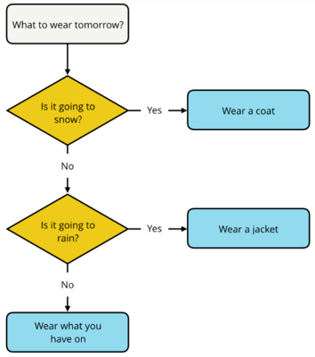
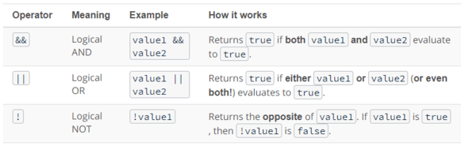
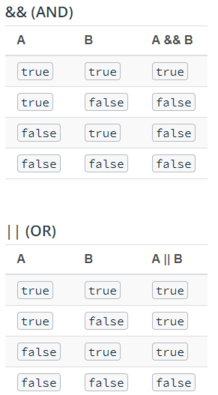

<h1>Intro to JavaScript</h1>


<h2>Conditionals</h2>

When you are writing code, the main goal is to to solve a problem. The steps your code takes to solve a problem is known as an algorithm.

A **flowchart** is a visual diagram that outlines the solution to a problem through a series of logical statements. The order in which statements are evaluated and executed is called the **control flow**.

Now, let's see how we can convert a flowchart into JavaScript code. For example,


```javascript
let price = 15.00; // price money of the hammer
let money = 20.00; // how much money I have

// If the money is >= price the we buy the hammer, or else we don't
if (money >= price) {
	console.log("Buy the Hammer");
} else {
    console.log("Don't buy the hammer");
}
```
> _**Prints:** Buy the Hammer_

<h3>If...else statements</h3>

We saw in the above example that __If...else statements__ allow you to execute certain pieces of code based on a condition, or set of conditions, being met.

```javascript
if (/* this expression is true */) {
	// run this code
} else {
	// run this code
}
```

This is extremely helpful because it allows you to choose which piece of code you want to run based on the result of an expression.

A couple of important things to notice about `if...else` statements.

The value inside the `if` statement is always converted to true or false. Depending on the value, the code inside the `if` statement is run or the code inside the `else` statement is run, but not both. The code inside the `if` and `else` statements are surrounded by **curly braces** `{...}` to separate the conditions and indicate which code should be run.

<h3>Else if statements</h3>

In some situations, two conditionals aren't enough. Consider the following situation.



We can solve this by:

```javascript
let weather = "sunny";

if (weather == "snow") {
    console.log("Bring a coat.");
} else if (weather == "rain") {
    console.log("Bring a rain jacket.");
} else {
    console.log("Wear what you have on.");
}
```
>_**Prints:** Wear what you have on_

By adding the extra `else if` statement, you're adding an extra conditional statement.

Try the following in the console and see what gets printed:

```javascript
let money = 100.50;
let price = 100.50;

if (money > price) {
    console.log("You paid extra, here's your change.");
} else if (money == price) {
    console.log("You paid the exact amount, have a nice day!");
} else {
    console.log("That's not enough, you still owe me money.");
}
```
> _**Answer:** You paid the exact amount, have a nice day!_

<h3>Quiz: Even or Odd</h3>

__Directions:__ Write an if...else statement that:

- prints `"even"` if the number is an even number
- prints `"odd"` if the number is an odd number

_**Hint**_: Use the `%` (modulo) operator to determine if a number is even or odd. The modulo operater takes two numbers and returns the remainder when the first number is divided by the second one. Eg: 12 % 3 returns 0.

Make sure to test your code with different values. For example:

- If `number` equals `1`, then `odd` should be printed to the console.
- If `number` equals `12`, then `even` should be printed to the console.

```javascript
let number = 2;

if (/* your conditional goes here */) {

} else {

}
```

<h3>Quiz: Musical Groups</h3>

Musical groups have special names based on the number of people in the group.

__Directions:__ Write a series of conditional statements that:

- Prints `"not `a group" if `musicians` is less than or equal to `0`
- Prints `"solo"` if `musicians` is equal to `1`
- Prints `"duet"` if `musicians` is equal to `2`
- Prints `"trio"` if `musicians` is equal to `3`
- Prints `"quartet"` if `musicians` is equal to `4`
- Prints `"this is a large group"` if `musicians` is greater than `4`

_**TIP**_: Test your code with different values. For example,

- If `musicians` equals `3`, then `"trio"` should be printed to the console.
- If `musicians` equals `20`, then `"this is a large group"` should be printed to the console.
- If `musicians` equals `-1`, then `"not a group"` should be printed to the console.

```javascript
// change the value of `musicians` to test your conditional statements
let musicians = 1;

// Your code goes here
```

<h3>Quiz: Murder Mystery</h3>

__Directions:__ For this quiz, you're going to help solve a fictitious murder mystery that happened at a motel! A murder mystery is a game typically played at parties wherein one of the partygoers is secretly, and unknowingly, playing a murderer, and the other attendees must determine who among them is the criminal. It's a classic case of who has done it.

Since this might be your first time playing a murder mystery, we've simplified things quite a bit to make it easier. Here's what we know! In this murder mystery there are:

- __four rooms__: the ballroom, gallery, billiards room, and dining room,
- __four weapons__: poison, a trophy, a pool stick, and a knife,
- and __four suspects__: Mr. Parkes, Ms. Van Cleve, Mrs. Sparr, and Mr. Kalehoff.

We also know that each weapon corresponds to a particular room, so...

- the `poison` belongs to the `ballroom`,
- the `trophy` belongs to the `gallery`,
- the `pool` stick belongs to the `billiards room`,
- and the `knife` belongs to the `dining room`.

And we know that each suspect was located in a specific room at the time of the murder.

- `Mr. Parkes` was located in the `dining room`.
- `Ms. Van Cleve` was located in the `gallery`.
- `Mrs. Sparr` was located in the `billiards room`.
- `Mr. Kalehoff` was located in the `ballroom`.

To help solve this mystery, write a combination of conditional statements that:

1. sets the value of `weapon` based on the `room` and
2. sets the value of `solved` to `true` if the value of `room` matches the `suspect`'s room

Afterwards, use this template to print a message to the console if the mystery was solved:
> "__________ did it in the __________ with the __________!"

What goes into the three blank spaces? You can fill in the blanks with the name of the suspect, the room, and the weapon! For example, an output string may look like:

> "Mr. Parkes did it in the dining room with the knife!"

> If `room` equals `gallery` and `suspect` equals `Ms. Van Cleve`, then `Ms. Van Cleve did it in the gallery with the trophy!` should be printed to the console.

```javascript
// change the value of `room` and `suspect` to test your code
let room = "dining room";
let suspect = "Mr. Parkes";

let weapon = "";
let solved = false;

if (/* your conditional goes here */) {

} else if (/* your conditional goes here */) {

} else if (/* your conditional goes here */) {

} else {

}

if (solved) {
	console.log(/* your message goes here*/);
}
```

<h3>More Complex Problems</h3>

Most problems are complex and there's more things to consider before you can actually solve the problem. In JavaScript we can represent more complex problems by combining logical expressions with special operators called logical operators.

It's summer, but it showers sometimes right and you also want to make plans with your friend when they are free. So let's see how you can make a slightly complex plan using logical operators,

```javascript
let alice = "not busy";
let weather = "sunny";

if (alice === "not busy" && weather === "sunny") {
	console.log("go to the park");
}
```
>_**Prints:** go to the park_

Notice the `&&` in the code above.

The `&&` symbol is the logical AND operator, and it is used to combine two logical expressions into one larger logical expression. If __both__ smaller expressions are true, then the entire expression evaluates to true. If __either one__ of the smaller expressions is false, then the whole logical expression is false.

__Logical expressions:__ are similar to mathematical expressions, except logical expressions evaluate to either _true_ or _false_.

```javascript
11 != 12
```
>_**Returns:** true_

Similar to mathematical expressions that use `+, -, *, /` and `%`, there are logical operators `&&,` `||` and `!` that you can use to create more complex logical expressions.

__Logical operators:__ can be used in conjunction with boolean values (`true` and `false`) to create complex logical expressions.

By combining two boolean values together with a logical operator, you create a logical expression that returns another boolean value. Here’s a table describing the different logical operators:



_**TIP**_: Logical expressions are evaluated from left to right. Similar to mathematical expressions, logical expressions can also use parentheses to signify parts of the expression that should be evaluated first.

Try the following in the JavaScript console and see what you get:

- true || false
- false && false
- !true
- (13 > -7) || (false == 0)
- (10 === "10") && (1 <= 2)
- (3 != 6 % 3) && !(24 > 45) && (!false)
> _**Answers:** true, false, false, true, false, true_

__Truth tables:__ are used to represent the result of all the possible combinations of inputs in a logical expression.



If you look at `A AND B`, if `A` is false, then regardless of the value `B`, the total expression will always evaluate to `false` because both `A` and `B` must be `true` in order for the entire expression to be `true`.

This behavior is called **short-circuiting** because it describes the event when later arguments in a logical expression are not considered because the first argument already satisfies the condition.

<h3>Quiz: Checking your Balance</h3>

__Directions:__ Using the flowchart below, write the code to represent checking your balance at the ATM. The yellow diamonds represent conditional statements and the blue rectangles with rounded corners represent what should be printed to the console.


Use the following variables in your solution:

- `balance` - the account balance
- `isActive` - if account is active
- `checkBalance` - if you want to check balance

_**Hint**_: The variable balance could be a value less than, greater than, or equal to 0. The variables isActive and checkBalance are booleans that can be set to true or false.

> _**TIP**_: To print out the account balance with decimal points (i.e. 325.00), use the `.toFixed()` method and pass it the number of decimal points you want to use. For example, `balance.toFixed(2)` returns 325.00.

> _**TIP**_: Make sure to test your code with different values. For example, If `checkBalance` equals `true` and `isActive` equals `false`, then `Your account is no longer active`. should be printed to the console.

```javascript
// change the values of `balance`, `checkBalance`, and `isActive` to test your code
let balance = 325.00;
let checkBalance = true;
let isActive = false;

// Your code goes here
```

<h3>Truthy and Falsy</h3>

Every value in JavaScript has an inherent boolean value. When that value is evaluated in the context of a boolean expression, the value will be transformed into that inherent boolean value.

__Falsy values:__ A value is __falsy__ if it converts to `false` when evaluated in a boolean context. For example, an empty String `""` is falsy because, `""` evaluates to `false`. You already know if...else statements, so let's use them to test the truthy-ness of `""`.

```javascript
if ("") {
    console.log("the value is truthy");
} else {
    console.log("the value is falsy");
}
```
>_**Returns:** "the value is falsy"_

Here's the list of all of the falsy values:
1. the Boolean value `false`
2. the `null` type
3. the `undefined` type
4. the number `0`
5. the empty string `""`
6. the odd value `NaN`

__Truthy values:__ A value is __truthy__ if it converts to `true` when evaluated in a boolean context. For example, the number `1` is truthy because, `1` evaluates to `true`. Let's use an if...else statement again to test this out:

```javascript
if (1) {
    console.log("the value is truthy");
} else {
    console.log("the value is falsy");
}
```
> _**Returns:** "the value is truthy"_

__If it's not in the list of falsy values, then it's truthy!__


<h3>Ternary Operator</h3>

Sometimes, you might find yourself with the following type of conditional.

```javascript
let isGoing = true;
let color;

if (isGoing) {
	color = "green";
} else {
	color = "red";
}

console.log(color);
```
> _**Returns:** "green"_

In this example, the variable `color` is being assigned to either `"green"` or `"red"` based on the value of `isGoing`. This code works, but it’s a rather lengthy way for assigning a value to a variable. Thankfully, in JavaScript there’s another way.

> _**TIP:**_: Using `if(isGoing)` is the same as using `if(isGoing === true)`. Alternatively, using `if(!isGoing)` is the same as using `if(isGoing === false)`.

The __ternary operator__ provides you with a shortcut alternative for writing lengthy if...else statements.

```javascript
conditional ? (if condition is true) : (if condition is false)
```

To use the ternary operator, first provide a conditional statement on the left-side of the ?. Then, between the ? and : write the code that would run if the condition is true and on the right-hand side of the : write the code that would run if the condition is false. For example, you can rewrite the example code above as:

```javascript
let isGoing = true;
let color = isGoing ? "green" : "red";
console.log(color)
```
> _**Prints:** "green"_

This code not only replaces the conditional, but it also handles the variable assignment for `color`.

__Multiple '?':__

A sequence of question mark operators ? can return a value that depends on more than one condition. For instance:

```javascript
let age = prompt('age?', 18);

let message = (age < 3) ? 'Hi, baby!' :
  (age < 18) ? 'Hello!' :
  (age < 100) ? 'Greetings!' :
  'What an unusual age!';

alert(message);
```

<h3>Quiz: Navigating the Food Chain</h3>

From the smallest of creatures to the largest of animals, inevitably every living, breathing thing must ingest other organisms to survive. This means that all animals will fall within one of the three consumer-based categories based on the types of food that they eat.

- Animals that eat only plants are called __herbivores__
- Animals that eat only other animals are called __carnivores__
- Animals that eat both plants and animals are called __omnivores__

__Directions:__ Write a series of ternary statements that sets the variable `category` equal to:

- `"herbivore"` if an animal eats plants
- `"carnivore"` if an animal eats animals
- `"omnivore"` if an animal eats plants and animals
- `undefined`if an animal doesn't eat plants or animals

Use the `eatsPlants` and `eatsAnimals` variables to test your code.

> _**TIP**_: Make sure to test your code with different values. For example, If `eatsPlants` equals `true` and `eatsAnimals` equals `false`, then `herbivore` should be printed to the console.

```javascript
// change the values of `eatsPlants` and `eatsAnimals` to test your code
let eatsPlants = false;
let eatsAnimals = true;

let category = /* your code goes here */

console.log(category);
```

<h3>Switch Statement</h3>

If you find yourself repeating `else if` statements in your code, where each condition is based on the same value, then it might be time to use a switch statement.

```javascript
if (option === 1) {
	console.log("You selected option 1.");
} else if (option === 2) {
	console.log("You selected option 2.");
} else if (option === 3) {
	console.log("You selected option 3.");
} else if (option === 4) {
	console.log("You selected option 4.");
} else if (option === 5) {
	console.log("You selected option 5.");
} else if (option === 6) {
	console.log("You selected option 6.");
}
```

A __switch statement__ is an another way to chain multiple `else if` statements that are based on the same value __without using conditional statements__. Instead, you just _switch_ which piece of code is executed based on a value.

```javascript
switch (option) {
    case 1:
        console.log("You selected option 1.")
    case 2:
        console.log("You selected option 2.")
    case 3:
        console.log("You selected option 3.")
    case 4:
        console.log("You selected option 4.")
    case 5:
        console.log("You selected option 5.")
    case 6:
        console.log("You selected option 6.")
}
```

Here, each `else if` statement (`option === [value]`) has been replaced with a `case` clause (`case: [value]`) and those clauses have been wrapped inside the switch statement.

When the switch statement first evaluates, it looks for the first `case` clause whose expression evaluates to the same value as the result of the expression passed to the switch statement. Then, it transfers control to that `case` clause, executing the associated statements.

Set `let options = 3` in the above code and see what happens.

> _**Prints:**_
>
> _"You selected option 3."_
>
> _"You selected option 4."_
>
> _"You selected option 5."_
>
> _"You selected option 6."_

But that’s not exactly like the original `if...else` code at the top? So what’s missing?

__Break statement:__ can be used to terminate a switch statement and transfer control to the code following the terminated statement. By adding a `break` to each `case` clause, you fix the issue of the switch statement _falling-through_ to other case clauses.

```javascript
let option = 3;

switch (option) {
	case 1:
		console.log("You selected option 1.");
		break;
	case 2:
		console.log("You selected option 2.");
		break;
	case 3:
		console.log("You selected option 3.");
		break;
	case 4:
		console.log("You selected option 4.");
		break;
	case 5:
		console.log("You selected option 5.");
		break;
	case 6:
		console.log("You selected option 6.");
		break; // technically, not needed
}
```
>_**Prints:** "You selected option 3."_

<h3>Falling-through</h3>

In some situations, you might want to leverage the "falling-through" behavior of switch statements to your advantage.

For example, when your code follows a hierarchical-type structure.

```javascript
let tier = "nsfw deck";
let output = "You’ll receive "

switch (tier) {
	case "deck of legends":
		output += "a custom card, ";
	case "collector's deck":
		output += "a signed version of the Exploding Kittens deck, ";
	case "nsfw deck":
		output += "one copy of the NSFW (Not Safe for Work) Exploding Kittens card game and ";
	default:
		output += "one copy of the Exploding Kittens card game.";
}

console.log(output);
```
> _**Prints:** You’ll receive one copy of the NSFW (Not Safe for Work) Exploding Kittens card game and one copy of the Exploding Kittens card game._

In this example, based on the successful Exploding Kittens Kickstarter campaign (a hilarious card game created by Elan Lee), each successive tier builds on the next by adding more to the output. Without any break statements in the code, after the switch statement jumps to the "nsfw deck", it continues to fall-through until reaching the end of the switch statement.

Also, notice the `default` case. You can add a `default` case to a switch statement and it will be executed when none of the values match the value of the switch expression.

Try the following in the console and see what gets printed:
If winner is equal to 3, then what will be output to the console?

```javascript
let prize = "";

switch (winner) {
    case 1:
        prize += "a trip for two to the Bahamas and ";
    case 2:
        prize += "a four piece furniture set.";
        break
    case 3:
        prize += "a smartwatch and ";
    default:
        prize += "tickets to the circus.";
}

console.log("You've won " + prize)
```
> _**Answer:** "You've won a smartwatch and tickets to the circus."_

<h3>Quiz: Back to School</h3>

In 2015, the U.S. Bureau of Labor Statistics conducted research to reveal how average salary is directly related to the number of years spent in school. In their findings, they found that people with:

- `no high school diploma` earned an average of $25,636/year,
- `a high school diploma` earned an average of $35,256/year,
- `an Associate's degree` earned an average of $41,496/year,
- `a Bachelor's degree` earned an average of $59,124/year,
- `a Master's degree` earned an average of $69,732/year,
- `a Professional degree` earned an average of $89,960/year,
- and `a Doctoral degree` earned an average of $84,396/year.

__Directions:__ Write a switch statement to set the average salary of a person based on their type of completed education.

Afterwards, print the following to the console.
> "In 2015, a person with __________ earned an average of __________/year."

Fill in the blanks with the type of education and the expected average salary.

> _**TIP:**_ To print out the average salary with commas (i.e. 59,124), use the `toLocaleString()` method and pass it the locale "en-US". For example, `salary.toLocaleString("en-US")`.

> _**TIP:**_ Make sure to test your code with different values. For example, If `education` equals `"an Associate's degree"`, then the string `"In 2015, a person with an Associate's degree earned an average of $41,496/year."` should be printed to the console.

```javascript
// change the value of `education` to test your code
let education = 'no high school diploma';

// set the value of this based on a person's education
let salary = 0;

// Your code goes here
```
