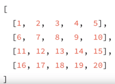

<h1>Intro to JavaScript</h1>


<h2>Arrays</h2>

Up until now, we have only worked with few pieces of data at a time, but what happens when you want to work with a lot of data all at once? Wouldn't it be nice if there were a way to keep track of all this information, a way to store it all in one place or one variable? Well we can do just that with a data structure called an __array__.

There are two syntaxes for creating an empty array:

```javascript
let arr = new Array();
let arr = [];
```

Arrays are data structures that can hold multiple data values, kind of like a list. Also, one thing that makes arrays really awesome is that the values we store in an array are ordered. You can almost think of an array like a numbered list where each item in the list has a number. And we can use that number to refer back to the item when we need it, with one big difference being that the arrays will start at 0 instead of starting at 1.

Let's look at few examples,

```javascript
// Lets say you have five different kinds of donuts, this is a poor way of holding it, think what'll happen if you have to represent 100 different donuts
let donut1 = "glazed";
let donut2 = "cookies";
let donut3 = "cinnamon";
let donut4 = "powdered";
let donut5 = "sprinkled";

// Let's see a better way of putting donuts into an array
let donuts = ["glazed", "cookies", "cinnamon", "powdered", "sprinkled"];

// But strings aren’t the only type of data you can store in an array. You can also store numbers, booleans and really anything!
let mixedData = ["abcd", 1, true, undefined, null, "all the things"];

// You can even store an array in an array to create a nested array!
let arraysInArrays = [[1, 2, 3], ["Adhiraiyan", "Mukesh"], [true, false, true, false]];

// Nested arrays can be particularly hard to read, so it's common to write them on one line, using a newline after each comma:
let arraysInArrays = [
	[1, 2, 3],
	["Adhiraiyan", "Mukesh"],
	[true, false, true, false]
];
```

__Accessing Array Elements:__ Let's get back to the donuts example, we created a donuts array where each string represents a donut, now another way of saying this is that each string or donut is an _element_ in our donuts array. Also, we have a way to access each element in an array by referencing its location in the array. The name that you used to refer to an element's location is its _index_. For example,

```javascript
let donuts = ["glazed", "cookies", "cinnamon", "powdered", "sprinkled"];
console.log(donuts[2]);
```
> _**Prints:** "cinnamon"_

Remember that elements in an array are indexed starting at the position `0`.

One thing to be aware of is if you try to access an element at an index that does not exist, a value of undefined will be returned back.

```javascript
let donuts = ["glazed", "cookies", "cinnamon", "powdered", "sprinkled"];
console.log(donuts[5]);
```
> _**Prints:** undefined_

If you want to change the value of an element in array, you can do so by setting it equal to a new value.

```javascript
let donuts = ["glazed", "cookies", "cinnamon", "powdered", "sprinkled"];
donuts[1] = "glazed cruller"; // changes the second element in the `donuts` array to "glazed cruller"
console.log(donuts);
```
> _**Prints:** ["glazed", "glazed cruller", "cinnamon", "powdered", "sprinkled"]_

<h3>Array Properties and Methods</h3>

_Properties_ are special pieces of information about a data structure. For example, there's a special property in an array called `length`. You can find the __length__ of an array by using its length property.

```javascript
let donuts = ["glazed", "powdered", "sprinkled"];
console.log(donuts.length)
```
> _**Prints:** 3_

To access the `length` property, type the name of the array, followed by a period `.` (you’ll also use the period to access other properties and methods), and the word `length`. The `length` property will then return the __number of elements__ in the array. Strings have a `length` property too! You can use it to get the length of any string.

You can think of _methods_ like special predefined functions that a data structure can call.

Some common array methods you'll see are
- _Reverse_, which reverses the order of the elements in an array.
- _Sort_, which sorts the elements in an array.

__push():__

You can use the `push()` method to add elements to the _end of an array_.

```javascript
// You can use the push() method to add elements to the end of an array.
let donuts = ["glazed", "chocolate frosted", "Boston creme", "glazed cruller"];
donuts.push("powdered"); // pushes "powdered" onto the end of the `donuts` array
```
> _**Returns:** 5_

Notice the `push()` method returns the length of the array after an element has been added.

__pop():__

Alternatively, you can use the `pop()` method to remove elements from the _end of an array_.

```javascript
let donuts = ["glazed", "chocolate frosted", "Boston creme", "glazed cruller"];
donuts.pop() // pops "glazed cruller" off the end of the `donuts` array
console.log(donuts);
```
> _**Prints:** ["glazed", "chocolate frosted", "Boston creme"]_

With the `pop()` method you don’t need to pass a value; instead, `pop()` will always remove the last element from the end of the array. Also, `pop()` returns the element that has been removed in case you need to use it.

__splice():__

`splice()` is another handy method that allows you to add and remove elements from _anywhere within an array_.

While `push()` and `pop()` limit you to adding and removing elements from the end of an array, `splice()` lets you specify the index location to add new elements, as well as the number of elements you'd like to delete (if any).

```javascript
let donuts = ["glazed", "chocolate frosted", "Boston creme", "glazed cruller"];
// removes "chocolate frosted" at index 1 and adds "chocolate cruller" and "creme de leche" starting at index 1
donuts.splice(1, 1, "chocolate cruller", "creme de leche");
```
> _**Returns:**  ["chocolate frosted"]_
>
> _**donuts array:** ["glazed", "chocolate cruller", "creme de leche", "Boston creme", "glazed cruller"]_

The first argument represents the starting index from where you want to change the array, the second argument represents the numbers of elements you want to remove, and the remaining arguments represent the elements you want to add.

We've decided to replace some of the donuts in the `donuts` array. What does the donuts array look like after the following changes?

```javascript
let donuts = ["cookies", "cinnamon sugar", "creme de leche"];
donuts.splice(-2, 0, "chocolate frosted", "glazed");
console.log(donuts);
```
> _**Answer:** ["cookies", "chocolate frosted", "glazed", "cinnamon sugar", "creme de leche"]_

Note that if the start index is negative, it will begin that many elements from the end of the array (with origin -2, meaning -n is the index of the nth last element and is therefore equivalent to the index of `array.length - n`).

JavaScript also provides a large number of built-in methods for modifying arrays and accessing values in an array, check out the [MDN Documentation](https://developer.mozilla.org/en-US/docs/Web/JavaScript/Reference/Global_Objects/Array), or type `[]`. into the JavaScript console for a list of all the available Array methods.

__shift():__

`shift()` get an element from the beginning, advancing the queue, so that the 2nd element becomes the 1st.

```javascript
let donuts = ["cookies", "cinnamon sugar", "creme de leche"];
donuts.shift(); // shifts "cookies" the first element of the array
console.log(donuts);
```
> _**Prints:** ["cinnamon sugar", "creme de leche"]_

__unshift():__

Adds the element to the beginning of the array and like `push()` `unshift()` can add multiple elements at once:

```javascript
let donuts = ["cookies", "cinnamon sugar", "creme de leche"];
donuts.unshift("chocolate frosted", "glazed");
console.log(donuts);
```
> _**Prints:** ["chocolate frosted", "glazed", "cookies", "cinnamon sugar", "creme de leche"]_

Methods `push/pop` run fast, while `shift/unshift` are slow. Why is it faster to work with the end of an array than with its beginning? It's because the `shift` operation must do 3 things:
- Remove the element with the index 0.
- Move all elements to the left, renumber them from the index 1 to 0, from 2 to 1 and so on.
- Update the `length` property.

The more elements in the array, the more time to move them, more in-memory operations. The similar thing happens with `unshift`.

<h3>Quiz: Colors of the Rainbow</h3>

__Directions:__ Well, say we are creating an array with the colors of the rainbow, and we forgot some colors. The standard rainbow colors are usually listed in this order:

```javascript
let rainbow = ["Red", "Orange", "Yellow", "Green", "Blue", "Purple"];

// But this is the list we had
let rainbow = ["Red", "Orange", "Blackberry", "Blue"];

// Your code goes here
```

Using only the `splice()` method, insert the missing colors into the array, and remove the color `"Blackberry"` by following these steps:
- Remove `"Blackberry"`
- Add `"Yellow"` and `"Green"`
- Add `"Purple"`

```javascript
let rainbow = ['Red', 'Orange', 'Blackberry', 'Blue'];

// Your code goes here
```

<h3>Quiz: Quidditch Cup</h3>

In the Harry Potter novels, children attending the Hogwarts School of Witchcraft and Wizardry belong to one of four houses: Gryffindor, Hufflepuff, Ravenclaw, or Slytherin. Each year, the houses assemble a Quidditch team of seven players to compete for the coveted Quidditch Cup.

__Directions:__ Create a function called `hasEnoughPlayers()` that takes the `team` array as an argument and returns `true` or `false` depending on if the array has at least seven players.

```javascript
let team = ["Oliver Wood", "Angelina Johnson", "Katie Bell", "Alicia Spinnet", "George Weasley", "Fred Weasley", "Harry Potter"];

// Your code goes here

console.log(hasEnoughPlayers(team));
```

<h3>Array Loops</h3>

Once the data is in the array, you want to be able to efficiently access and manipulate each element in the array without writing repetitive code for each element. To loop through an array, you can use a variable to represent the index in the array, and then loop over that index to perform whatever manipulations your heart desires.

```javascript
let donuts = ["jelly donut", "chocolate donut", "glazed donut"];

// the variable `i` is used to step through each element in the array
for (let i = 0; i < donuts.length; i++) {
	donuts[i] += "hole";
	donuts[i] = donuts[i].toUpperCase();
}
```
> _**donuts array:** ["JELLY DONUT HOLE", "CHOCOLATE DONUT HOLE", "GLAZED DONUT HOLE"]_

In this example, the variable `i` is being used to represent the index of the array. As `i` is incremented, you are stepping over each element in the array starting from `0` until `donuts.length - 1` (`donuts.length` is out of bounds).

<h3>The forEach() loop</h3>

Arrays have a set of special methods to help you iterate over and perform operations on collections of data. You can view the MDN Documentation list of Array methods [here](https://developer.mozilla.org/en-US/docs/Web/JavaScript/Reference/Global_Objects/Array), but a couple big ones to know are the `forEach()` and `map()` methods.

The `forEach()` method gives you an alternative way to iterate over an array, and manipulate each element in the array with an inline function expression.

```javascript
let donuts = ["jelly donut", "chocolate donut", "glazed donut"];

donuts.forEach(function(donut) {
	donut += "hole";
	donut = donut.toUpperCase();
	console.log(donut)
});
```
> _**Prints:**_
>
> _JELLY DONUT HOLE_
>
> _CHOCOLATE DONUT HOLE_
>
> _GLAZED DONUT HOLE_

Notice that the `forEach()` method iterates over the array without the need of an explicitly defined index. In the example above, `donut` corresponds to the element in the array itself. This is different from a `for` or `while` loop where an index is used to access each element in the array:

The function that you pass to the `forEach()` method can take up to three parameters. These can be called `element`, `index`, and `array`, but you can call them whatever you like.

The `forEach()` method will call this function once for each element in the array (hence the name `forEach`.) Each time, it will call the function with different arguments. The `element` parameter will get the value of the array element. The `index` parameter will get the index of the element (starting with zero). The `array` parameter will get a reference to the whole array, which is handy if you want to modify the elements.

```javascript
words = ["cat", "in", "hat"];
words.forEach(function(word, num, all) {
	console.log("Word " + num + " in " + all.toString() + " is " + word);
});
```
> _**Prints:**_
>
> _Word 0 in cat,in,hat is cat_
>
> _Word 1 in cat,in,hat is in_
>
> _Word 2 in cat,in,hat is hat_

<h3>Quiz: Another Type of Loop</h3>

__Directions:__ Use the array's `forEach()` method to loop over the following array and add `100` to each of the values if the value is divisible by `3`.

```javascript
let test = [12, 929, 11, 3, 199, 1000, 7, 1, 24, 37, 4,
    19, 300, 3775, 299, 36, 209, 148, 169, 299,
    6, 109, 20, 58, 139, 59, 3, 1, 139
];

// Your code goes here
```

<h3>Searching in array</h3>

__indexOf/lastIndexOf and includes:__

The methods `arr.indexOf`, `arr.lastIndexOf` and `arr.includes` have the same syntax and do essentially the same as their string counterparts, but operate on items instead of characters:

- `arr.indexOf(item, from)` – looks for item starting from index from, and returns the index where it was found, otherwise -1.
- `arr.lastIndexOf(item, from)` – same, but looks for from right to left.
-` arr.includes(item, from)` – looks for item starting from index from, returns true if found.

__find and findIndex:__

Imagine we have an array of objects. How do we find an object with the specific condition? Here the `arr.find` method comes in handy. The syntax is:

```javascript
let result = arr.find(function(item, index, array) {
    // if true is returned, item is returned and iteration is stopped
    // for falsy scenario returns undefined
});
```

The function is called for elements of the array, one after another:
- `item` is the element.
- `index` is its index.
- `array` is the array itself.

If it returns `true`, the search is stopped, the item is returned. If nothing found, undefined is returned.

For example, we have an array of users, each with the fields `id` and `name`. Let’s find the one with `id == 1`:

```javascript
let users = [
    {id: 1, name: "John"},
    {id: 2, name: "Pete"},
    {id: 3, name: "Mary"}
];

let user = users.find(item => item.id == 1);

console.log(user.name); // John
```

The `arr.findIndex` method is essentially the same, but it returns the index where the element was found instead of the element itself and -1 is returned when nothing is found.

<h3>Transform an array</h3>

__map():__

Using `forEach()` will not be useful if you want to permanently modify the original array. `forEach()` always returns `undefined`. However, creating a new array from an existing array is simple with the powerful `map()` method.

With the `map()` method, you can take an array, perform some operation on each element of the array, and return a new array.

```javascript
let donuts = ["jelly donut", "chocolate donut", "glazed donut"];

let improvedDonuts = donuts.map(function(donut) {
	donut += "hole";
	donut = donut.toUpperCase();
	return donut;
});
```
> _**donuts array:** ["jelly donut", "chocolate donut", "glazed donut"]_
>
> _**improvedDonuts array:** ["JELLY DONUT HOLE", "CHOCOLATE DONUT HOLE", "GLAZED DONUT HOLE"]_

Oh man, did you just see that? The `map()` method accepts one argument, a function that will be used to manipulate each element in the array. In the above example, we used a function expression to pass that function into `map()`. This function is taking in one argument, `donut` which corresponds to each element in the `donuts` array. You no longer need to iterate over the indices anymore. `map()` does all that work for you.

<h3>Quiz: I Got Bills</h3>

__Directions:__ Use the `map()` method to take the array of bill amounts shown below, and create a second array of numbers called `totals` that shows the bill amounts with a 15% tip added.

Print out the new `totals` array using `console.log`.

> _**TIP:** Check out the `toFixed()` method for numbers to help with rounding the values to a maximum of 2 decimal places. Note, that the method returns a string to maintain the "fixed" format of the number. So, if you want to convert the string back to a number, you can __cast__ it or convert it back to a number:_

```javascript
Number("1");
```
> _**Returns:** 1_

```javascript
let bills = [50.23, 19.12, 34.01,
    100.11, 12.15, 9.90, 29.11, 12.99,
    10.00, 99.22, 102.20, 100.10, 6.77, 2.22
];

// Your code goes here
```

<h3>Quiz: Arrays `map()`</h3>

```javascript
/*
Quiz: Array Maps

Using the musicData array and map():
  - Return a string for each item in the array in the following format:
    <album-name> by <artist> sold <sales> copies
  - Store the returned data in a new albumSalesStrings variable

Note:
  - Do not delete the musicData variable
  - Do not alter any of the musicData content
  - Do not format the sales number; leave it as a long string of digits
 */

const musicData = [
    { artist: 'Adele', name: '25', sales: 1731000 },
    { artist: 'Drake', name: 'Views', sales: 1608000 },
    { artist: 'Beyonce', name: 'Lemonade', sales: 1554000 },
    { artist: 'Chris Stapleton', name: 'Traveller', sales: 1085000 },
    { artist: 'Pentatonix', name: 'A Pentatonix Christmas', sales: 904000 },
    { artist: 'Original Broadway Cast Recording',
      name: 'Hamilton: An American Musical', sales: 820000 },
    { artist: 'Twenty One Pilots', name: 'Blurryface', sales: 738000 },
    { artist: 'Prince', name: 'The Very Best of Prince', sales: 668000 },
    { artist: 'Rihanna', name: 'Anti', sales: 603000 },
    { artist: 'Justin Bieber', name: 'Purpose', sales: 554000 }
];

const albumSalesStrings = 'Replace this message with your code!';

console.log(albumSalesStrings);
```

__filter():__

The `find` method looks for a single (first) element that makes the function return `true`. If there may be many, we can use `arr.filter(fn)`. The syntax is similar to `find`, but `filter` returns an array of all matching elements:

```javascript
let results = arr.filter(function(item, index, array) {
    // if true item is pushed to results and the iteration continues
    // returns empty array if nothing found
});
```

Just like with `map()`, the function that's passed to `filter()` gets called _for each item_ in the `names` array. The first item (i.e., `'David'`) is stored in the `name` variable. Then the test is performed and this is what's doing the actual filtering. First, it checks the length of the name. If it's `6` or greater, then it's skipped (and not included in the new array!). But, if the length of the name is less than `6`, then `name.length < 6` returns true and the name is included in the new array!

And lastly, just like with `map()`, the `filter()` method returns a new array instead of modifying the original array.

<h3>Quiz: Arrays `filter()`</h3>

```javascript
/*
Quiz: Arrays filter()

 Using the musicData array and filter():
   - Return only album objects where the album's name is
     10 characters long, 25 characters long, or anywhere in between
   - Store the returned data in a new `results` variable

 Note:
   - Do not delete the musicData variable
   - Do not alter any of the musicData content
*/

const musicData = [
    { artist: 'Adele', name: '25', sales: 1731000 },
    { artist: 'Drake', name: 'Views', sales: 1608000 },
    { artist: 'Beyonce', name: 'Lemonade', sales: 1554000 },
    { artist: 'Chris Stapleton', name: 'Traveller', sales: 1085000 },
    { artist: 'Pentatonix', name: 'A Pentatonix Christmas', sales: 904000 },
    { artist: 'Original Broadway Cast Recording',
      name: 'Hamilton: An American Musical', sales: 820000 },
    { artist: 'Twenty One Pilots', name: 'Blurryface', sales: 738000 },
    { artist: 'Prince', name: 'The Very Best of Prince', sales: 668000 },
    { artist: 'Rihanna', name: 'Anti', sales: 603000 },
    { artist: 'Justin Bieber', name: 'Purpose', sales: 554000 }
];

const results = 'Replace this message with your code!';

console.log(results);
```

<h3>Arrays in Arrays</h3>

So we mentioned earlier that you can store pretty much any data in an array. You can even store arrays inside of an array. An array of arrays can be represented as a grid like structure, where each element of the array corresponds to a row of cells.



Iterating over a 2 dimensional array can be tricky. So, it's helpful to think of the whole thing as a grid, where each row of the grid is an array.

You can use a single loop to access each row of the grid, and you can use nested loops, or a loop inside of a loop, to loop over each elements of each of those rows. The outer loop will cycle through each row and then in the row that's currently being iterated over, the inner loop will iterate over each cell.

```javascript
let donutBox = [
	["glazed", "chocolate glazed", "cinnamon"],
	["powdered", "sprinkled", "glazed cruller"],
	["chocolate cruller", "Boston creme", "creme de leche"]
];

for (let row = 0; row < donutBox.length; row++) {
	for (let column = 0; column < donutBox[row].length; column++) {
		console.log(donutBox[row][column]);
	}
}
```
> _**Prints:**_
>
> _"glazed"_
>
> _"chocolate glazed"_
>
> _"cinnamon"_
>
> _"powdered"_
>
> _"sprinkled"_
>
> _"glazed cruller"_
>
> _"chocolate cruller"_
>
> _"Boston creme"_
>
> _"creme de leche"_

<h3>Quiz: Nested Numbers</h3>

__Directions:__ Use a nested `for` loop to take the `numbers` array below and replace all of the values that are divisible by `2` (even numbers) with the string "even" and all other numbers with the string "odd".

```javascript
let numbers = [
    [243, 12, 23, 12, 45, 45, 78, 66, 223, 3],
    [34, 2, 1, 553, 23, 4, 66, 23, 4, 55],
    [67, 56, 45, 553, 44, 55, 5, 428, 452, 3],
    [12, 31, 55, 445, 79, 44, 674, 224, 4, 21],
    [4, 2, 3, 52, 13, 51, 44, 1, 67, 5],
    [5, 65, 4, 5, 5, 6, 5, 43, 23, 4424],
    [74, 532, 6, 7, 35, 17, 89, 43, 43, 66],
    [53, 6, 89, 10, 23, 52, 111, 44, 109, 80],
    [67, 6, 53, 537, 2, 168, 16, 2, 1, 8],
    [76, 7, 9, 6, 3, 73, 77, 100, 56, 100]
];

// Your code goes here
```
